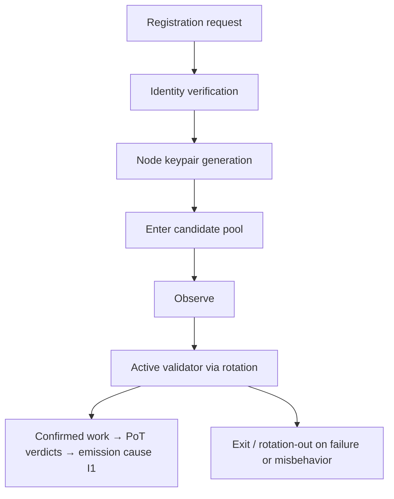

# AST Node Infrastructure Specification

**Stands on:** I1 (PoT-gated origin), I3 (payment for confirmed work), I5 (determinism), I6 (no speculative surface), I7 (Eye veto), I8 (append-only causality). See `README.md` §1.

## Purpose

Define the node infrastructure that executes, validates, and records the transactional work of AST. This layer matters to the Coin Engine for one reason: **nodes perform the work whose PoT confirmation is the sole cause of emission (I1).** Everything about a node — how it joins, how it is weighted, how it is removed — is derived from that single fact. A node's standing is a function of confirmed work, never of capital held (I6).

---

## 1. Node types

| Node type | Role | Relation to the causal chain |
|---|---|---|
| **Validator Node** | Processes transactions and confirms them under PoT | Produces the confirmed work that causes emission (I1) |
| **Observer Node** | Monitors network health; rotates into active duty | Standby capacity; earns only when it confirmably works (I3) |
| **Bootstrap Node** | Cold-starts the network | Establishes the first processes; not a privileged issuer (I1) |
| **Audit Node** | Verifies records and invariant compliance | Surfaces violations to the All-Seeing Eye; authors no mint/payment (I7) |

There is no node type whose standing derives from holdings or from a governance token. Governance actions in AST are **role-based**, decided by committee and recorded on-chain (I8); a held ARO balance confers no vote (I6). "Voting by stake" has no object here and therefore no node embodies it.

---

## 2. Node requirements

### a. Base software

- AST Node Daemon (`astd`)
- Encrypted transport layer (mutual TLS)
- ARO ledger integration module (read/append to NodeChain; no minting authority — I1)
- Optional: audit/observation plugin interface

### b. Hardware (minimum)

| Resource | Minimum |
|---|---|
| CPU | 4 vCores |
| RAM | 16 GB |
| Storage | 512 GB SSD |
| Network | > 100 Mbps, IPv6 |

---

## 3. Node lifecycle

Note what the lifecycle does **not** contain: no "post a security deposit," no "lock stake to validate." Admission is by verified identity and delivered capacity, because participation standing must track work, not capital (I3, I6).

---

## 4. Registration (identity, not deposit)

- A node registers by proving **identity** and generating a node keypair; the node ID is recorded in NodeChain (I8).
- The node enters the **candidate pool** and becomes eligible to be rotated into active duty.
- There is **no minimum stake and no locked deposit** to register or to validate. *Because* I3 ties standing and payment to confirmed work and I6 leaves no held-capital surface, a "stake to participate" step would gate participation on possession — a cause the model does not admit.

---

## 5. Rotation logic

- Rotation interval: reference 15 minutes (configurable, operational).
- Rotation inputs — all measures of *work and reliability*, not capital:
  - uptime,
  - fault rate,
  - reliability/latency history,
  - recent confirmed activity.
- Implemented via `NodeRotationContract`, whose decisions are recorded on-chain and thus reproducible (I5, I8).

Rotation exists to keep active duty on the nodes currently doing reliable work, which keeps the emission-causing work honest (I1).

---

## 6. Security model

- Mutual TLS for transport; token-signed payloads.
- Two-key infrastructure: identity key + signing key.
- Tamper logging through the All-Seeing Eye, which observes and **can veto** an operation that would violate an invariant (I7) — but never itself mints, burns, or pays.

---

## 7. Misbehavior handling (removal by evidence, not confiscation)

| Violation | Consequence | Why (invariant) |
|---|---|---|
| Downtime > threshold | temporary suspension / rotation-out | no work ⇒ no confirmed cause ⇒ no payment (I3) |
| Malicious tampering | exclusion + forfeiture of *pending* (unearned) payment; evidence recorded | payment requires confirmed honest work; there is none (I1, I3) |
| Collusion | Audit-node flag → All-Seeing-Eye review → committee (role-based) decision on-chain | invariants defended by veto + role governance (I6, I7, I8) |

A removed node keeps whatever it **already earned and retained** (I3, P6); it loses only payments it had not yet earned. There is **no stake to slash**, because no stake is held (I6). Removal is the withdrawal of the opportunity to cause more emission, recorded and reproducible — not the seizure of a balance.

---

## 8. Observability hooks

- All nodes stream logs to the observer mesh.
- Monitored: uptime, load, anomalies, protocol-version drift, unauthorized packet patterns.
- Anomalies are surfaced to the All-Seeing Eye for possible veto (I7).

---

## 9. Summary

The node network is modular, zero-trust, auditable, and dynamically rotated. Its single tie to the Coin Engine is causal and exclusive: **confirmed node work is the only cause of emission (I1), and node standing and payment track that work and nothing else (I3, I6).** Everything a node can gain, it gains by working; everything it can lose, it loses by ceasing to work honestly — never by the movement of held capital, of which there is none.
