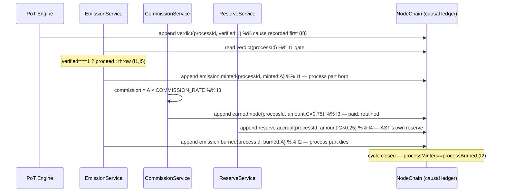

# aro_emission_protocol.md

**Stands on:** I1 (PoT-gated origin), I2 (born-and-burned), I3 (payment), I4 (AST reserve), I5 (determinism), I7 (Eye veto), I8 (append-only causality). See `README.md` §1.

## I. Purpose

Define the canonical emission cycle of ARO — how a unit is caused to exist, how the earned part is paid, and how the process part is destroyed — as one closed causal chain in which every step is the necessary consequence of the step before it. Nothing here is a policy choice; each rule is derived from an invariant and labelled with it.

---

## II. The single cause

There is exactly one thing that can cause emission: a **confirmed process**.

> A process `P` carries an amount `A`. PoT examines `P` and issues a verdict. Emission is authorized **iff** that verdict is `verified === 1`.

Because I1 admits no other trigger, the following are impossible by construction, not by prohibition:

- pre-mining — there is no process before genesis, so there is no cause;
- scheduled/idle emission — a clock is not a confirmed process, so it causes nothing;
- mint-on-deposit — a deposit is not confirmed work, so it causes nothing;
- discretionary issuance — no operator is a cause; only a verdict is.

**Therefore** the EmissionService reads the recorded PoT verdict *before* any mint. If no verdict exists, or `verified ≠ 1`, the call throws and the ledger is unchanged (I1, I5).

---

## III. The cycle, step by step (each step caused by the previous)



Read the arrows as implications:

1. **PoT verdict recorded (I8) ⇒ mint is now permitted (I1).** The cause is on-chain and immutable before the effect is even attempted.
2. **Mint of the process part `A` (I1) ⇒ the value moved by `P` now has a representation.** It is bound to `processId`; it is not free-floating supply.
3. **The same confirmed work (I3) ⇒ commission `C = A × COMMISSION_RATE` is charged as the earned part.** Because the work is real and confirmed, payment for it is *owed*; that is the whole reason commission exists.
4. **Commission split (I3, I4):** `node payment = C × 0.75` is retained by the contributing nodes; `reserve accrual = C × 0.25` accrues to AST's own reserve. Neither is burned — payment that vanished would not be payment (I3).
5. **Cycle completion ⇒ burn of the process part `A` (I2).** The process is over; its value representation has no further referent, so it is destroyed. `A` was born for `P` and dies with `P`.

**All five effects execute atomically** within one database transaction. Atomicity is not a nicety; it is required by I2 and I5: a state in which `A` was minted but not burned, or paid-without-mint, is a broken causal chain and must never be observable.

---

## IV. Canonical formula (the arithmetic of the chain)

```
Emission (process part)  = A                       (1:1 with the process amount — I1, I2)
Commission (earned part) = A × COMMISSION_RATE      (default 0.005 — I3)
  node payment           = Commission × NODE_SHARE     (0.75 → nodes, retained — I3)
  reserve accrual        = Commission × RESERVE_SHARE  (0.25 → AST reserve — I4)
Burn                     = A                       (mirror of the mint — I2)

per completed cycle:
  Δ process supply       = +A − A = 0             (I2)
  Δ lasting supply       = +Commission            (only the retained earned part survives — I3)
```

The reserve **index** (capitalization) is a separate function and is defined in `coin_emission_model.md`; note here only its causal boundary: it is driven by **confirmed process volume**, never by the accrual balance (I4 / I‑RS‑1). The 25% accrual is *recorded* value, not an *input* to the index — otherwise volume would be double-counted, breaking I5.

---

## V. Roles in the cycle (each is a cause or a check, never a discretion)

| Component | What it causes / checks | Invariant |
|---|---|---|
| PoT Engine | Produces the *only* cause of emission — the verdict. | I1 |
| EmissionService | Executes mint and burn as consequences of the verdict; source of truth for the process part. | I1, I2, I5 |
| CommissionService | Turns confirmed work into the earned part and splits it. | I3 |
| ReserveService | Accrues the reserve share to AST's own reserve; computes the volume-driven index. | I4 |
| NodeChain | Records every cause before its effect; makes the chain reproducible. | I8, I5 |
| All-Seeing Eye | Observes each step; **vetoes** any step that deviates. Creates nothing. | I7 |

---

## VI. Allocation, as retained/destroyed value

```
1. On verdict, EmissionService MINTS A (process part), bound to processId.        [I1]
2. CommissionService charges C = A × rate and credits:
     • node payment  C×0.75 → retained by contributing nodes                       [I3]
     • reserve accrual C×0.25 → SYSTEM_RESERVE (AST's own)                          [I4]
3. On completion, EmissionService BURNS A (process part).                          [I2]
```

Every address named here is internal to AST (`SYSTEM_RESERVE`, `SYSTEM_NODE_POOL`, `SYSTEM_BURN_VAULT`). No external destination exists, because I1/I4 give the value no external cause or owner.

---

## VII. Supply-snapshot invariants (the chain's fixed points)

For every completed process cycle, the following hold *by construction* and are asserted in tests:

- `totalMinted` increases by `A`, then `totalBurned` increases by `A` → **process part nets to zero** (I2).
- `earnedRetained` increases by `C` → **the only lasting change** (I3).
- `totalSupply = (processMinted − processBurned) + earnedRetained` → **converges to `earnedRetained`** (I2), i.e. all lasting supply is paid-for confirmed work. There is no other origin of supply (I1).

---

## VIII. Halting (the negative power)

Emission can be stopped, never forged:

- **Eye veto (I7):** on detecting a step that would violate I1–I6, the Eye halts that step before its effect is acknowledged. It cannot mint a "corrective" unit — its authority is strictly to stop.
- **`KILL_SWITCH=true`:** read-only mode; any process part minted-but-unburned is burned to restore I2, then no new cause is accepted.
- **Committee halt:** a role-based node/oracle committee decision, recorded in NodeChain (I8). Not a holder vote (I6), not a single privileged authority (I1).
