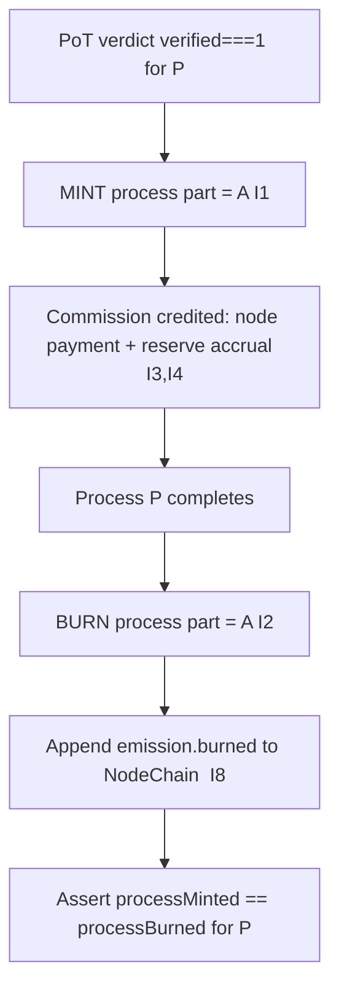

# burn_mechanism.md

**Stands on:** I2 (born-and-burned), I1 (PoT-gated origin), I5 (determinism), I6 (no speculative surface), I8 (append-only causality). See `README.md` §1.

## I. Purpose

Define precisely what the burn is, why it happens, and why it happens *exactly once, for exactly the minted amount, at exactly cycle completion* — with no other burn of any kind anywhere in the model. The burn is not a lever; it is the second half of a single born-and-burned event whose first half was the mint.

## II. Scope

Burn logic lives in the transaction processing path and acts on the **process part** minted for a confirmed process. It is entirely internal to the AST NodeChain and has no external dependency.

⸻

## III. The burn, derived

**Cause.** A process `P` (amount `A`) completes. **Effect.** Its process part `A` is burned. That is the whole mechanism.

Why it must be so:

1. **A process part exists only in flight (I2).** The minted `A` is the representation of value moving through `P`. When `P` completes, that value has arrived; the representation has no remaining referent.
2. **A representation with no referent must not persist (I5).** If it lingered, `totalSupply` would carry value that names no live process — an amount not reproducible from any current cause. So completion *necessitates* destruction, it does not merely permit it.
3. **The burn equals the mint (I2).** Burning more or less than `A` would leave the process part non-zero, i.e. a residue with no cause. Symmetry is forced: `burn = mint = A`.

```
mint(A)  on verdict verified===1   →   process part born      [I1]
   … process P in flight …
burn(A)  on completion of P         →   process part dies      [I2]
Σ over the cycle: +A − A = 0
```

⸻

## IV. What the burn is **not** (and why it cannot be)

These are excluded not as policy but because I6 removes their object — there is no market price for ARO, so there is nothing for any of them to act on:

- **Not a deflationary lever.** There is no "burn a fee percentage to raise value per ARO." ARO's value is process-bound (`reserveIndex` from confirmed volume, I4), not a price responding to scarcity. Burning to move a price presupposes a price to move; there is none.
- **Not a velocity throttle.** There is no "extra burn when velocity falls." Velocity of a speculative float is undefined here because there is no speculative float (I2 keeps process parts transient; I6 forbids held speculation).
- **Not an overflow/ceiling burn.** There is no `target_ceiling` and no "burn when total supply exceeds X," because I6 leaves no supply cap to enforce.
- **Not a correction burn.** There is no discretionary programmatic burn on any market condition (I5: no discretionary movement).

A single burn exists: the mirror of the mint. Naming others would require inventing a market surface the model explicitly does not have.

⸻

## V. Mechanics and record

| Property | Value | Invariant |
|---|---|---|
| Trigger | completion of the same process that minted | I2 |
| Amount | equal to the minted `A` | I2 |
| Destination | `SYSTEM_BURN_VAULT` (unspendable, internal) | I5 |
| Record | `emission.burned { processId, burned: A }` appended before acknowledgement | I8 |
| Atomicity | mint, commission credit, and burn commit in one transaction | I2, I5 |

`SYSTEM_BURN_VAULT` is a verifiable unspendable sink; the burn is auditable from NodeChain like any other event. There is no external "dead wallet," no external audit dependency, and no burn that is not the completion of a born-and-burned pair.

⸻

## VI. Execution flow



There is no branch in this flow — no "burn enabled?", no "overflow?", no "wait for stability." A born process part is always burned, once, for its full amount, on completion. The absence of branches *is* the unbreakable logic.

⸻

## VII. Monitoring and audit

Auditing the burn is auditing I2:

- For every `processId`, the NodeChain record must contain exactly one `emission.minted` and exactly one `emission.burned`, with equal amounts.
- Any `processId` with a mint and no matching burn, or mismatched amounts, is an invariant violation — surfaced to the All-Seeing Eye, which **vetoes** the offending cycle before acknowledgement (I7) rather than allowing a residue to persist.
- Because `SYSTEM_BURN_VAULT` is unspendable and on-chain, total burned is independently reconstructable at any time.
