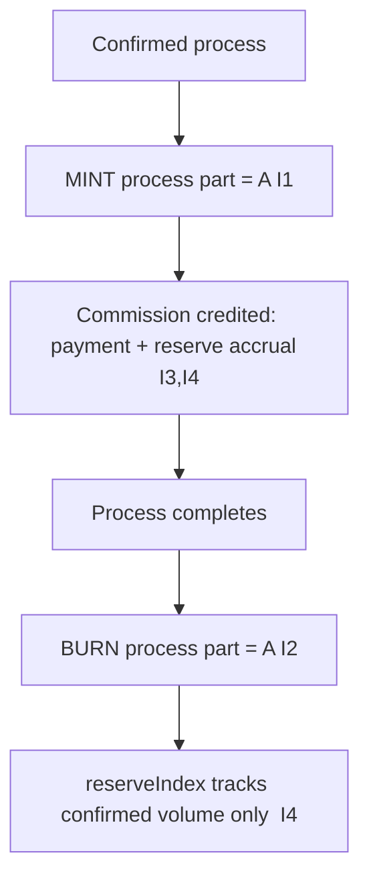

# coin_volatility_controls.md

**Stands on:** I6 (no speculative surface), I2 (born-and-burned), I4 (AST reserve), I1 (PoT-gated origin), I5 (determinism). See `README.md` §1.

## I. Purpose

State the canonical position on price volatility in the Coin Engine, and why the honest answer is not a set of controls but a **structural absence of the thing controls would act on**. A file with this name exists in the skeleton because the question "how do you handle volatility?" is natural. The answer, derived below, is that ARO has no market price to be volatile, so there is nothing to freeze, throttle, or correct — and that the integrity a volatility mechanism *pretends* to provide is instead provided, unconditionally, by the invariants.

This is the strongest guarantee available: not "we react to instability," but "the state that instability names cannot arise."

## II. Why there is no price to stabilize

A volatility control presupposes a **market price** — a number that a crowd of holders bids up and down, which the system then defends. Trace whether ARO has such a number:

1. **ARO is not held to speculate (I6, I2).** The large flows — process parts — are born and burned per process; they never accumulate into a tradable float. The only persistent ARO is earned, retained payment for confirmed work (I3). Neither is a speculative position.
2. **ARO's value is process-bound, not quoted (I4).** AST reports `reserveIndex = log10(1 + totalProcessVolume)` — a monotone summary of confirmed work, computed, never bid (I‑RS‑1, I‑RS‑2). Its value reference is *how much confirmed work has occurred*, not *what someone will pay*.
3. **Therefore there is no market price.** With no speculative float and a computed, work-derived valuation, the quantity a volatility control would monitor — a bid/ask price delta — has no referent in the model.

**Conclusion:** "price volatility" is undefined for ARO. A control for it would monitor a variable that does not exist.

## III. Why the old controls cannot be reintroduced

Each classic mechanism is excluded not by policy but because its input is absent:

| Mechanism | What it needs | Why it has no object here |
|---|---|---|
| Price-delta freeze | a market price and its rate of change | no market price (§II) |
| Reject/delay high-volume sells or swaps | a speculative sell/swap surface | no speculative float (I2, I6) |
| Correction burn (`delta > Z%`) | a price to correct toward | no price (§II); the only burn is the born-and-burned mirror (I2) |
| Velocity throttle | a circulating speculative supply whose velocity matters | process parts are transient; no such supply (I2) |
| Supply ceiling / overflow burn | a `target_ceiling` for supply | no cap exists; supply tracks confirmed work (I6) |

Reintroducing any of them would first require inventing a market surface the model is defined to exclude — which would break I6 and, through it, the closure of the whole layer.

## IV. What actually guarantees integrity (structural, unconditional)

The assurance a volatility mechanism *reaches for* — that the unit stays sound — is delivered here by construction, and it holds every cycle, not only under stress:

- **Supply cannot outrun activity (I1).** A unit exists only as the consequence of confirmed work. There is no idle emission to inflate away value.
- **Value-in-flight never accumulates (I2).** Process parts are born and burned; they cannot pile into an overhang that later dumps.
- **Lasting supply equals paid-for work (I3).** The only persistent ARO is earned commission — proportional to confirmed work, never to a market mood.
- **The valuation index only tracks work (I4).** It rises with confirmed volume and cannot be set, pumped, or defended (I‑RS‑1/2/4).
- **Everything is reproducible (I5).** No discretionary movement can distort the state behind the scenes.

Integrity is thus a *property of the state space*, not an intervention: the unstable states a control would fight are not reachable states.

## V. Execution flow (there is no branch to control)

There is no "check price delta," no "freeze," no "correction burn," no "wait for stability." The flow has no volatility branch because it has no volatility input. The **absence of the branch is the guarantee**: a system that never reads a market price cannot be destabilised by one.

## VI. Notes

- This behavior is internal to the AST NodeChain and has no external dependency.
- It is part of the tokenomics/security posture — expressed as an invariant, not a reactive control.
- If a future layer ever introduces an external, quoted representation of ARO, volatility handling belongs **in that layer and its jurisdiction**, never inside the Coin Engine, whose ARO has no price by construction (I6).
