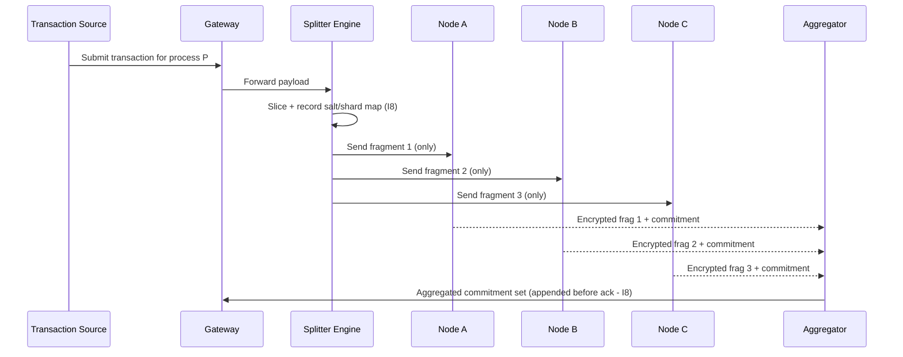

# Encryption Protocol (NodeChain)

**Stands on:** I3 (payment for confirmed work), I5 (determinism), I6 (no speculative surface), I7 (Eye veto), I8 (append-only causality). See `README.md` §1.

## Purpose of this document

Describe the encryption model that lets many nodes process one transaction without any of them holding the full payload. Its two derived goals: **isolate each node to the fragment it processes** (zero-trust; no node sees the whole transaction), and **commit to each fragment deterministically** so the confirmation is reproducible (I5). Every encryption commitment is appended before the fragment is acknowledged (I8).

---

## 1. Core principles

1. **Partial fragment encryption.** Each transaction is split into N fragments (see `transaction_sharding_logic.md`); each fragment is encrypted by a different node. *Because* no node receives more than its fragment, no node can reconstruct the transaction — the privacy guarantee is structural, not promised.

2. **Trustless isolation.** A node holds only the fragment it is responsible for and the key material scoped to it. It never receives the plaintext of the whole transaction. This is the zero-trust surface the security model depends on (`nodechain_security_model.md`).

3. **Deterministic assignment and commitment.** Node selection and the fragment commitment are pure functions of recorded inputs (fragment id, recorded salt, node eligibility snapshot). *Because* I5 requires reproducibility, selection cannot use node-local randomness; given the same recorded inputs, any auditor re-derives the same assignment and the same commitment.

4. **No permanent fragment storage.** Encrypted fragments are held only for the duration of confirmation, then flushed; only the **hash commitment** is appended to NodeChain (I8). The chain retains the *cause* (the commitment) permanently; it does not retain the plaintext. This keeps the causal record complete (I8) without holding recoverable payload.

---

## 2. Why the commitment is deterministic — derived

*Because* the fragment's hash commitment is one of the canonical inputs the Coin Engine's later movements depend on (I5), and *because* an effect is valid only if its cause is reproducible from the record (I8), **therefore** the commitment must be a deterministic function `commit = H(fragment_plaintext ‖ shard_id ‖ recorded_salt)`. Two honest nodes encrypting the same fragment with the same recorded salt must produce the same commitment; a mismatch is not "noise" — it is a recorded, vetoable divergence (I7) handled by the validation protocol.

The salt is time-bound and recorded, so replay of an old fragment against a new salt fails deterministically (an anti-replay property, `nodechain_security_model.md` §4).

---

## 3. Encryption workflow (simplified)



No node in this diagram ever holds more than one fragment. The aggregator combines commitments, not plaintext.

---

## 4. Encryption stack

| Layer | Description | Serves |
|---|---|---|
| Payload split | Deterministic pre-encryption segmentation by field partition | Privacy; I5 |
| Bound salt | Time-bound, recorded salt per fragment | Anti-replay; I8 |
| Node cipher | Authenticated symmetric encryption with per-fragment scoped keys | Isolation |
| Aggregation | Hash commitment + timestamped append to NodeChain | I8, audit |

Cipher choice is a bounded operational parameter (a role-based committee may upgrade it — e.g. to a PQ-safe scheme — with the change recorded before effect, I8); it is never decided by ARO holdings (I6).

---

## 5. Node eligibility for encryption duty

A node is eligible to encrypt a fragment when, by the **recorded eligibility snapshot** (reproducible, I5):

- its confirmed-work standing and reputation are above the current threshold (I3; see `node_registration_and_auth.md` §4);
- it did not participate in the immediately prior round for this transaction (rotation, to spread visibility and prevent one node accumulating fragments);
- its NodeAuth scope includes encryption duty for the shard's region/type.

Eligibility is a function of confirmed work and recorded state — never of capital held (I6). Because the snapshot is recorded, the selection is reproducible and auditable.

---

## 6. Example encrypted-payload metadata (appended to NodeChain)

```json
{
  "process_id": "P-00392",
  "fragments": 3,
  "nodes_used": ["node_314", "node_442", "node_127"],
  "salt_ref": "salt-00392-1",
  "fragment_commitments": [
    "0x98fa...",
    "0xab76...",
    "0xc310..."
  ],
  "final_transaction_commitment": "0xf94cd3..."
}
```

Only commitments and references are stored — never fragment plaintext (§1.4). This record is the reproducible cause (I5) that the shard-validation and consensus stages consume.

---

## 7. Repository location

```
02_nodechain_engine/
└── encryption_protocol.md
```
