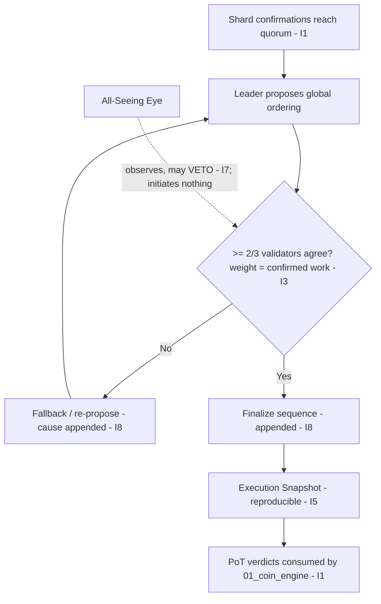

# Network Consensus Model

**Stands on:** I1 (PoT-gated origin), I3 (payment for confirmed work), I5 (determinism), I6 (no speculative surface), I7 (Eye veto), I8 (append-only causality). See `README.md` §1.

## Purpose of this document

Define how the NodeChain turns many independent shard confirmations into **one deterministically-ordered global sequence** of processes. Consensus here does not "decide truth by vote of the wealthy"; it *orders* already-confirmed work so that every node reconstructs the identical chain (I5), with each ordering decision appended before it takes effect (I8).

---

## 1. Document structure

1. Consensus overview
2. Node roles and types
3. Quorum logic
4. Time-sync and leader rotation
5. Shard-level consensus
6. Attack mitigation
7. Fault tolerance and recovery
8. Extensibility and forkability
9. Appendix: diagrams

---

## 2. Consensus overview

The Aros consensus model is a **delegated, asynchronous proof-of-processing protocol** over a multi-shard architecture. Its unit is a **verified transaction-processing result** — a shard confirmation that already reached quorum (`shard_quorum_protocol.md`). *Because* I1 makes confirmed work the sole cause of emission and I5 requires that emission be reproducible, **therefore** consensus has exactly one job: fix the *order* of confirmed processes into a single sequence that every honest node computes identically. Payment for the work in that sequence is allocated by confirmed computational contribution (I3), not by holdings (I6).

---

## 3. Node roles and types

- **Validator nodes** — confirm shards under PoT and participate in ordering. Their confirmations are the input to consensus.
- **Shard nodes** — process specific partitions of the ledger; produce the shard confirmations.
- **Observer nodes** — audit chain state and contribute to reputation scoring; they author no confirmation and no ordering (they watch and record).

Each node holds a verifiable identity and is admitted on confirmed work and reputation, never on capital (I6; `node_registration_and_auth.md`). Admission, onboarding, and identity attestation are recorded before a node acts (I8).

---

## 4. Quorum logic

Ordering decisions are reached by **weighted quorum agreement**, where the weight is a reproducible function of the record — never of capital:

- An ordering proposal is accepted iff **≥ 2/3 of active validators** agree (the Byzantine bound; see `shard_quorum_protocol.md` §2). Below 2/3, two honest nodes could diverge, breaking I5.
- A validator's **weight is derived from confirmed participation and historical consistency** (both computed deterministically from the append-only record, I5) — i.e. from work it has confirmably done (I3). **A held ARO balance carries no weight (I6);** there is no stake-weighted vote, because staking-to-vote has no object in this model.

All agreement messages are cryptographically signed and appended to the Shard Signature Log before the ordering is acknowledged (I8; `shard_signature_model.md`).

---

## 5. Time-sync and leader rotation

- A deterministic **clock-sync protocol** aligns validator windows to the epoch (`POT_EPOCH_SECS = 600`), so confirmations are comparable and orderable (I5).
- **Leader rotation** proceeds round-robin every `R` epochs. The leader only *proposes* an ordering of already-confirmed work; it cannot confirm work alone and it cannot mint, burn, or pay (those are the Coin Engine's effects, gated on recorded causes — I1, I8). Leadership is not a privilege bought with holdings (I6).
- If a leader is non-responsive or its clock drifts beyond threshold, a **fallback leader swap** fires; the swap's cause is appended before the new leader acts (I8), so the rotation is reproducible (I5).

---

## 6. Shard-level consensus

Each shard confirms semi-independently, then escalates:

- **Local shard level** — quorum-based confirmation of the shard (`shard_quorum_protocol.md`).
- **Global finalization layer** — asynchronous commitment agreement that orders the locally-confirmed shards into one sequence.

Cross-shard propagation flows through the **InterShard Gateway**, which carries confirmations (and their commitments), never plaintext payload (privacy; `encryption_protocol.md`). Each escalation is appended before finalization is acknowledged (I8).

---

## 7. Attack mitigation

| Vector | Mitigation | Basis |
|---|---|---|
| **Sybil** | Identity + confirmed-work standing + reputation admission — never a capital gate | I6; `node_registration_and_auth.md` §4 |
| **Double-processing** | A process id can be finalized once; a second finalization is a recorded, rejected replay | I5, I8 |
| **Consensus stall** | On lock timeout the system enters a recorded emergency mode (read-only ordering) rather than guessing | I5, I8 |
| **Erratic / dishonest validators** | Reputation, computed deterministically from the record, lowers their weight; the Eye may veto | I5, I7 |

Sybil resistance is stated positively: influence is proportional to confirmed work, so identities without work buy no influence.

---

## 8. Fault tolerance and recovery

- The system tolerates up to **⌊(K−1)/3⌋ Byzantine faults** per shard of size `K` (the 2/3 bound, §4).
- On node failure, weights are recomputed by the **Quorum Rebalancer** from the recorded participation set (deterministic, I5).
- A **Checkpointing / Execution-Snapshot** protocol persists finalized state every `N` snapshots, enabling replay-based recovery — the recovered state is reproducible from the appended causes (I5, I8). See `nodechain_fault_tolerance.md`.

---

## 9. Extensibility and forkability

The model supports future evolution *within the invariants*:

- pluggable per-shard confirmation algorithms, provided each remains deterministic and appends before effect (I5, I8);
- PQ-safe signature upgrades (a bounded, recorded parameter change — I8);
- AI-augmented ordering under role-based governance and the Eye's veto (I7).

No fork may introduce a stake-weighted vote, a market price, or discretionary issuance — those have no object in the model (I1, I6).

---

## 10. Appendix: consensus flow

