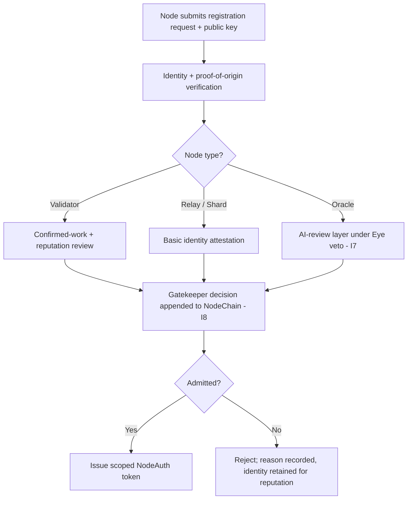

# Node Registration and Authorization

**Stands on:** I1 (PoT-gated origin), I3 (payment for confirmed work), I5 (determinism), I6 (no speculative surface), I7 (Eye veto), I8 (append-only causality). See `README.md` §1.

## Purpose of this document

Define the lifecycle by which a node establishes an identity, is admitted to the NodeChain, and is suspended or removed. It fixes the **single admission condition** — a verifiable identity, and standing earned by confirmed work — and derives every rule of onboarding, authorization, and revocation from the invariants. A node's right to participate is a function of *who it verifiably is* and *what it has confirmably done* (I3), never of capital it has pledged (I6).

---

## 1. Core objectives

1. Establish a **verifiable cryptographic identity** for every node, so that every appended cause names its author (I8) and the record is reproducible (I5).
2. Admit nodes on **identity + confirmed-work + reputation**, deriving Sybil resistance from those alone — because a capital pledge as an entry gate is *security-deposit-to-participate*, which I6 leaves with no object.
3. Define the **authorization token** that scopes what a node may do, so no node can act outside the work it is admitted for.
4. Specify **suspension and revocation** as consequences of failed or fraudulent work, recorded before they take effect (I8).
5. Support future **AI-oracle nodes** under the same admission logic and under the Eye's veto (I7).

---

## 2. Why there is no stake, deposit, or bond at the gate — derived

A common admission gate elsewhere is a pledged deposit: to join or to earn, a node locks capital that is slashed on misbehavior. *Because* I6 leaves no object for staking-for-yield or security-deposit-to-participate, and *because* a held ARO balance confers no standing of any kind (I6), **therefore** AST cannot and does not gate admission on a pledge. This is not a relaxed rule; it is the absence of an object. Sybil resistance is achieved instead by the three mechanisms of §4, none of which is capital.

Consequently there is also nothing to *slash*: penalties in AST act on a node's **standing and its stream of payment for confirmed work** (I3), not on a pledged balance — because there is no pledged balance to seize.

---

## 3. Node identity & registration flow

Nodes are not anonymous. Each participant must:

- **Register a verifiable cryptographic identity** (ECDSA over secp256k1, or a configured PQ-safe scheme). The public key is the node's on-chain name; every cause the node appends is signed by it (I8).
- **Prove origin** — a proof-of-origin attestation binding the identity to a distinct operator, so that one operator cannot cheaply mint many identities (the Sybil surface — §4).
- **Declare node type** — validator, relay/shard, observer, or oracle — which scopes the token (§5).
- **Pass admission review** by the Gatekeeper, whose decision is appended before the token is issued (I8) and is reproducible from the recorded inputs (I5).



Note the validator path: admission weight comes from a **record of confirmed work and reputation (I3)**, not from a deposit. A brand-new identity with no history is admitted at the lowest standing and *earns* higher standing only by confirmably doing work — which is exactly the causal order I3 requires (standing follows confirmed work, never precedes it).

---

## 4. Sybil resistance — the three non-capital mechanisms

Because admission cannot rest on capital (§2), Sybil resistance is derived from these, each traceable to an invariant:

1. **Verifiable identity + proof-of-origin.** One operator cannot cheaply spawn many independent identities, because each must present a distinct, attestable origin. The cost of a fake identity is identity work, not seized capital.
2. **Confirmed-work standing (I3).** A fresh identity earns nothing and decides nothing until it has *confirmably done work*. A swarm of empty identities has no standing, because standing is a pure function of recorded confirmed work — so flooding the network with identities buys no influence.
3. **Reputation from the record (I5, I8).** Every confirmation, timeout, and mismatch a node produces is appended (I8) and reputation is recomputed deterministically from that append-only record (I5). Because reputation is reproducible from the chain, it cannot be forged or bought; it can only be earned by consistent confirmed work.

Together these make an identity's influence proportional to the confirmed work it has actually contributed — the same quantity that governs its payment (I3) — with no capital gate anywhere.

---

## 5. Authorization token (NodeAuth)

On admission a node receives a **NodeAuth** token, signed by the Gatekeeper authority, whose fields *scope* the node to the work it was admitted for. The token grants no economic right on its own — payment still follows only from confirmed work (I3).

```json
{
  "node_id": "0xAE9F...",
  "role": "validator",
  "issued": "2026-01-04T00:00:00Z",
  "expires": "2026-12-01T00:00:00Z",
  "signature": "sig<...>",
  "limits": {
    "region": "eu-west-1",
    "tx_per_min": 240,
    "shard_scope": "partial"
  }
}
```

- **Scoped access** to sharding/encryption/validation routines by role.
- **Bounded load** (`tx_per_min`, region, shard scope) so no single node can dominate a batch — an anti-monopoly bound, not a capital bound.
- **Expiry and revocation triggers** so authorization is continuously re-earned, not permanently owned.

Every issuance, renewal, and revocation of a NodeAuth token is appended before it takes effect (I8), so the set of authorizations in force at any past moment is reproducible (I5).

---

## 6. Suspension and revocation

A node's standing is reduced or removed as a **consequence of its recorded work**, never arbitrarily:

| Condition | Consequence | Invariant |
|---|---|---|
| Repeated timeout / dropped shard | Soft suspension; reputation decays; payment stream for the missed work is not earned (never was) | I3 |
| Invalid or mismatched signature | Shard rejected and reassigned; identity flagged in the record | I5, I8 |
| Fraudulent confirmation attempt | Hard revocation; the Eye may veto the offending step outright | I7 |

- **Soft suspension is recoverable**: a suspended node regains standing only by resuming confirmed work (I3) — standing follows work, as always.
- **Hard revocation is durable**: the identity remains on-chain (its history is immutable, I8) so it cannot re-enter with a clean slate under the same key.
- There is **no stake to slash** in any of these (§2); the penalty is loss of standing and of future payment for work not done — both derived from I3.

Every suspension/revocation cause is appended before its effect is acknowledged (I8) and is reproducible from the record (I5).

---

## 7. Future layer: AI-oracle integration

Future oracle nodes join under the same admission logic and additionally:

- run sandboxed in a dedicated processing scope defined by their NodeAuth;
- receive dynamic scoping through role-based governance, recorded before effect (I8);
- operate under the All-Seeing Eye, which observes their outputs and **can veto** any that would violate I1–I6 but **initiates nothing** (I7).

An oracle's standing, like any node's, is a function of confirmed work (I3), not of capital (I6).

---

## 8. Repository location

```
02_nodechain_engine/
└── node_registration_and_auth.md
```
