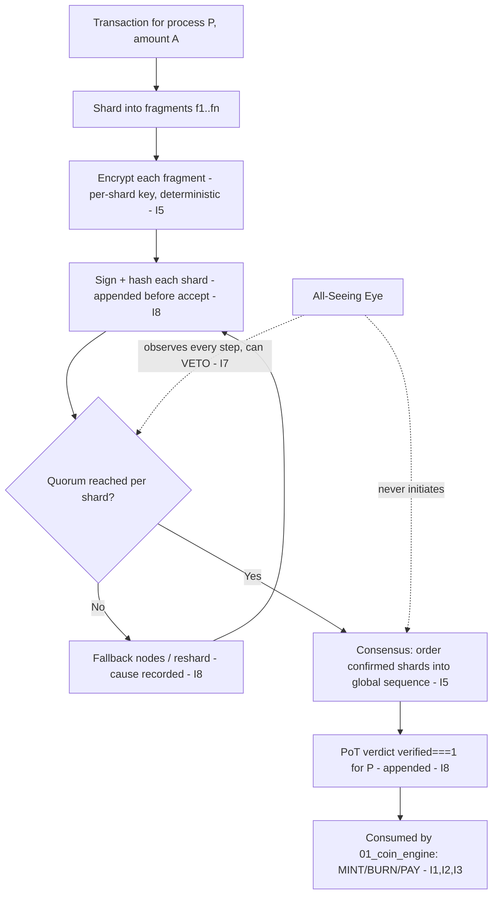

# NodeChain Engine — Overview

**Stands on:** I1 (PoT-gated origin), I3 (payment for confirmed work), I5 (determinism), I6 (no speculative surface), I7 (Eye veto), I8 (append-only causality). See `README.md` §1.

## Purpose of this document

Describe the functional design and architectural principle of the NodeChain Engine — the subsystem that produces and records the confirmed work whose PoT verdict is the sole cause of ArosCoin emission (I1). It explains how nodes participate, how encrypted transactional work is processed, and *why* the engine is built the way it is: not as a stylistic choice, but because I8 (record the cause before the effect) and I5 (reproduce the effect from the recorded cause) admit only this shape.

---

## 1. The one thing this engine exists to do

Two invariants must hold for the Coin Engine to act lawfully on any process:

- **I8** — the cause of every effect is on-chain *before* the effect is acknowledged.
- **I5** — the effect is reproducible from those recorded causes, identically, on every node.

*Because* both must hold for **every** unit of confirmed work, and *because* a single machine cannot be trusted to record its own cause honestly (that would be implicit trust, which I6/security forbids), **therefore** the confirmation of work must be produced by a distributed mesh whose every step is appended before it is acted on. The NodeChain Engine is that mesh, and NodeChain is its **append-only causal ledger**. Everything else in the layer is an elaboration of getting one confirmed unit of work onto that ledger *in causal order, exactly once, verifiably.*

---

## 2. Core objectives

1. Serve as the **primary distributed task ledger** of AST: the append-only record where every cause is written before its effect (I8), so downstream emission has immutable inputs (I5).
2. Define **Proof-of-Transaction (PoT)** as the confirmation of *executed work*, not the winning of a lottery (PoW) and not the pledging of capital (PoS). A node's standing and its payment derive from work it confirmably did (I3), never from holdings (I6).
3. Detail the **transaction sharding and per-shard encryption** model that lets many nodes process one transaction without any of them seeing all of it — preserving privacy while producing parallel, independently-verifiable confirmations.
4. Establish **identity-gated node admission** whose entry condition is a verifiable identity plus a record of confirmed work and reputation — never a capital pledge (I6).
5. Prepare the reader for the deeper documents: registration, sharding, encryption, shard validation/signature/quorum, consensus, fault tolerance, security, and node payment.

---

## 3. Why not PoW / PoS — derived, not asserted

| System | Its origin trigger | Why AST cannot use it |
|---|---|---|
| **PoW** | First to solve a hash puzzle mints. | The cause of issuance would be *luck + energy*, not confirmed work. I1 admits only a PoT verdict for a specific process as the cause of a unit. |
| **PoS** | Largest/luckiest stake mints; capital is locked to participate. | Participation-by-capital-pledge is *staking / security-deposit-to-participate*, which I6 leaves with no object. A held balance confers no standing (I6) and no vote (governance is role-based, not by holding). |
| **PoT (AST)** | A process's work is executed, sharded, confirmed by quorum, and its verdict appended. | The cause of every unit is confirmed work, recorded before its effect (I1, I8), reproducible from the record (I5). |

*Therefore* PoT is not "a better PoW/PoS"; it is the only shape that satisfies I1, I5, I6, and I8 simultaneously.

---

## 4. Execution model — snapshots and task batches

NodeChain does not produce mined blocks. It produces two append-only artifacts:

- **Task Batch** — a set of confirmed transactional processes grouped for one settlement epoch (`POT_EPOCH_SECS = 600`). A batch is the unit over which node payment is allocated (I3) and commission is split.
- **Execution Snapshot** — the deterministic state of NodeChain after a batch is finalized. *Because* a snapshot is a pure function of the appended causes in the batch (I5), any node can recompute it and any two honest nodes must agree; disagreement is itself a recorded, vetoable event (I7).

Both artifacts are appended before their effects are acknowledged (I8). The snapshot is what makes the whole model *reproducible*: to audit any past state, replay the snapshots.

---

## 5. Data flow (one process, end to end)



Each arrow appends its cause before the next is acknowledged (I8). The verdict `PV` is exactly the cause the Coin Engine requires (I1); this layer produces nothing else that reaches the Coin Engine.

---

## 6. Related subdocuments

- `node_registration_and_auth.md` — identity + confirmed-work admission (no capital pledge — I6).
- `transaction_sharding_logic.md` — how a transaction is fragmented and routed.
- `encryption_protocol.md` — per-shard cryptographic isolation, deterministic commitments (I5).
- `shard_validation_protocol.md` — how a shard becomes confirmed work.
- `shard_signature_model.md` — how each shard fragment is signed and bound to its transaction.
- `shard_quorum_protocol.md` — quorum thresholds and fallback for shard acceptance.
- `network_consensus_model.md` — local shard confirmations → one deterministic global order.
- `nodechain_fault_tolerance.md` — surviving failure without breaking I8/I5.
- `nodechain_security_model.md` — zero-trust surface and Eye-veto wiring (I7).
- `node_payment_allocation.md` — node share of commission split by confirmed contribution (I3).

---

## 7. Repository location

```
02_nodechain_engine/
├── nodechain_overview.md          # This file
├── node_registration_and_auth.md
├── transaction_sharding_logic.md
├── encryption_protocol.md
├── shard_validation_protocol.md
├── shard_signature_model.md
├── shard_quorum_protocol.md
├── network_consensus_model.md
├── nodechain_fault_tolerance.md
├── nodechain_security_model.md
└── node_payment_allocation.md
```
