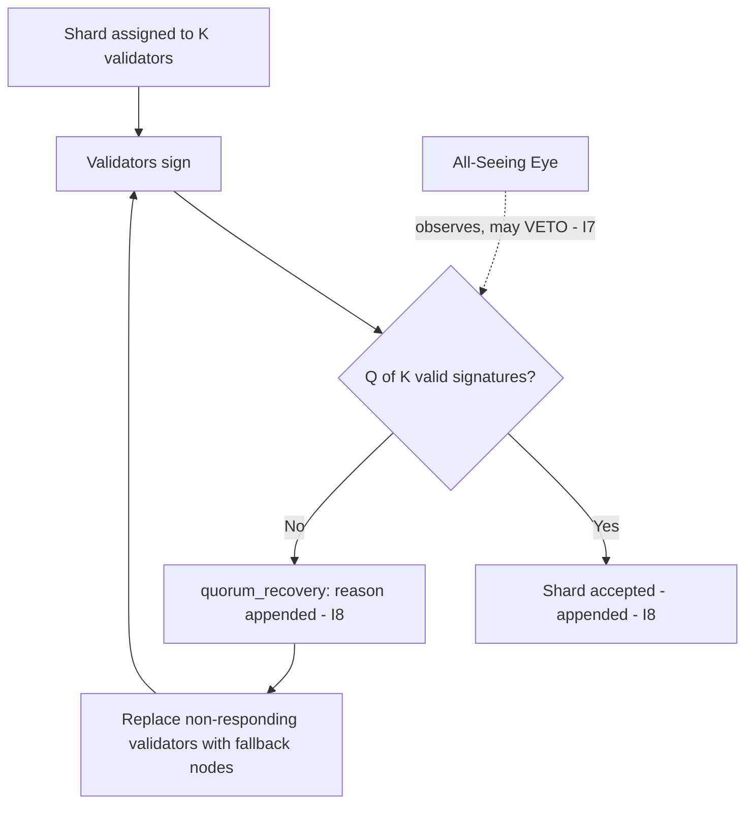

# Shard Quorum Protocol

**Stands on:** I1 (PoT-gated origin), I5 (determinism), I7 (Eye veto), I8 (append-only causality). See `README.md` §1.

## Purpose of this document

Define the quorum by which a set of shard signatures becomes an accepted shard confirmation. Quorum is the threshold that turns independent signatures (`shard_signature_model.md`) into the single, reproducible confirmation the validation protocol treats as PoT-confirmed work (`shard_validation_protocol.md`). Quorum status is appended before the shard is acknowledged (I8) and is a pure function of the recorded signatures (I5).

---

## 1. Core objectives

1. Establish **minimum quorum rules** for shard acceptance.
2. Handle **node faults** and dynamic reallocation without inventing state (I5).
3. Ensure **consensus is reached and recorded before inclusion** (I8).
4. Provide **fallback routing** when quorum is not reached, reproducibly.

---

## 2. Why the threshold is 2/3 — derived

*Because* I5 requires that a shard's confirmation be the *same* on every honest node, the confirmation must survive up to the maximum tolerated fraction of Byzantine (arbitrarily-faulty) validators. The Byzantine bound tolerates up to `⌊(K−1)/3⌋` faulty validators out of `K`, which is safe **iff** acceptance requires more than two-thirds agreement. **Therefore** quorum is `Q = ceil(2/3 · K)`: below it, two honest nodes could disagree and the confirmation would not be reproducible (violating I5); at or above it, a single reproducible verdict is guaranteed. The threshold is not a tuning knob — it is the boundary that I5 forces.

---

## 3. Quorum threshold definition

- **Minimum validators per shard:** `K_min = 3` (so `Q_min = 2`).
- **Recommended maximum:** `K_max = 7` (to bound latency).
- **Dynamic adjustment** of `K` within `[K_min, K_max]` based on recorded inputs — network load, node health snapshot, process priority — with the chosen `K` appended before signing begins (I8), so the quorum in force for any shard is reproducible (I5).

`K` is a bounded operational parameter set by role-based committee, never by ARO holdings (I6).

---

## 4. Node roles in quorum

- **Validator node** — signs the shard; its signature counts toward `Q`.
- **Fallback node** — a pre-selected standby that signs only if a validator fails, keeping `K` intact.
- **Quorum manager** — tracks the signature set and evaluates the `Q` predicate; authors no signature and no verdict of its own (it computes, it does not confirm).

A node earns only for shards it confirmably signs (I3); standby status alone earns nothing.

---

## 5. Shard acceptance conditions

A shard is accepted into the transaction body iff, over the **recorded** signature set:

- at least `Q = ceil(2/3 · K)` **valid** signatures are present;
- all signatures are cryptographically valid and agree on the shard hash (I5; `shard_validation_protocol.md` §6);
- all timestamps fall within the allowed window `ΔT`;
- no signatory is flagged for an active violation in the record.

Because acceptance is a deterministic predicate over recorded data, the acceptance decision is reproducible on any node (I5) and its inputs are immutable (I8).

---

## 6. Fallback mechanism

If quorum is not reached within the window `X`:



1. `quorum_recovery()` fires; its cause (which validators failed) is appended before recovery acts (I8).
2. Non-responding validators are replaced with fallback nodes, preserving `K`.
3. Signing restarts; the retry is reproducible from the recorded recovery inputs (I5).

Recovery never lowers `Q` below `ceil(2/3·K)` — doing so would break the reproducibility guarantee of §2 (I5).

---

## 7. Example quorum matrix

| Shard | Node_01 | Node_02 | Node_03 | Node_04 | K | Q=ceil(2/3·K) | Accepted |
|---|---|---|---|---|---|---|---|
| A | ✅ | ✅ | ❌ | ✅ | 4 | 3 | ✅ (3 ≥ 3) |
| B | ✅ | ❌ | ✅ | ❌ | 4 | 3 | ❌ (2 < 3) |

---

## 8. Handling node misbehavior

| Behavior | Consequence | Basis |
|---|---|---|
| Repeated non-response | Temporary suspension; replaced by fallback; reputation decays | I3, I5 |
| Invalid signature | Shard rejected/reassigned; event recorded | I5, I8 |
| Fallback-quota abuse | Logged to the security record; standing reduced | I8 |

Every consequence acts on **standing and payment for confirmed work** (I3) and is recorded before it takes effect (I8). There is no held stake to slash (`node_registration_and_auth.md` §2). The Eye may veto any step that would violate an invariant (I7).

---

## 9. Repository location

```
02_nodechain_engine/
└── shard_quorum_protocol.md
```
