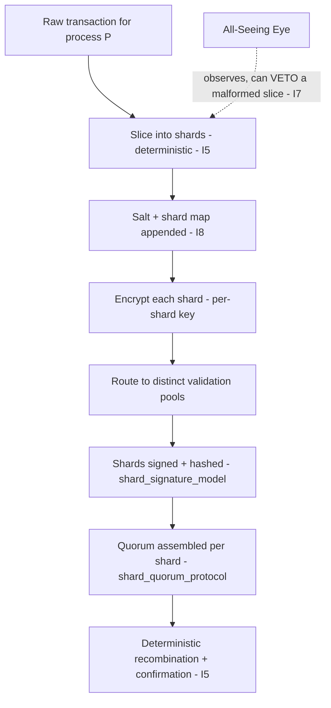

# Transaction Sharding Logic

**Stands on:** I5 (determinism), I6 (no speculative surface), I7 (Eye veto), I8 (append-only causality). See `README.md` §1.

## Purpose of this document

Define how one incoming transaction is split into discrete, independently-processable shards, routed to distinct validation pools, and reassembled after confirmation. Sharding exists for two derived reasons: **no single node may see a whole transaction** (privacy/zero-trust), and **shards must be confirmable in parallel and reproducibly** (I5). Every shard's slicing and routing is appended before the shard is acted on (I8).

---

## 1. Core objectives

1. Establish **deterministic sharding rules** — the same transaction always slices into the same shards on any node (I5), so the confirmation is reproducible.
2. Slice with **privacy preservation** — the field partition guarantees no one pool holds enough of the payload to reconstruct it (zero-trust surface; see `nodechain_security_model.md`).
3. Enable **parallel validation and deterministic recombination** — shards confirm independently, then reassemble in a fixed order (I5).
4. Ensure every slice/route/reassemble step is **recorded before it is acknowledged** (I8).
5. Minimize any single node's visibility of the full transaction.

---

## 2. Why sharding is deterministic — derived

*Because* I5 requires that every token movement be reproducible from the recorded canonical inputs, and *because* the shard set is one of those inputs, **therefore** the mapping `transaction → shards` must be a pure, deterministic function of the transaction and a recorded salt — never of node-local randomness or wall-clock timing. Two nodes given the same transaction and the same recorded salt must produce byte-identical shards; otherwise the confirmation could not be replayed. The salt itself is appended to NodeChain (I8) so the slicing is reproducible after the fact.

---

## 3. Input transaction format

Raw transactional payload before sharding (denominated in ARO; amounts resolve to integer `arx`, `1 ARO = 10^9 arx`):

```json
{
  "tx_id": "trx-00392",
  "process_id": "P-00392",
  "from": "node_or_account_a1b2",
  "to": "node_or_account_c3d4",
  "amount": "210.000000000",
  "symbol": "ARO",
  "timestamp": "2026-06-23T18:10:00Z",
  "memo": "service process",
  "auth_token": "0x6f...9e"
}
```

`process_id` binds the transaction to the process whose eventual PoT verdict the Coin Engine consumes (I1). Sharding never mints, burns, or pays; it only prepares work for confirmation.

---

## 4. Sharding scheme

Fields are assigned to logical partitions by sensitivity, so that no partition alone reveals the transaction:

| Shard | Contents | Sensitivity | Hash-linked |
|---|---|---|---|
| A | `from`, `amount` | High | Yes |
| B | `to`, `symbol` | Medium | Yes |
| C | `timestamp`, `memo` | Low | No |
| D | `auth_token`, derived hash pointer | High | Yes |

Each shard is encoded, assigned a shard id derived deterministically from `(tx_id, partition, salt)`, encrypted (see `encryption_protocol.md`), and routed to a distinct validation pool. *Because* the id and encryption are deterministic (I5), any auditor can re-derive the exact shard set from the recorded transaction and salt.

---

## 5. Processing flow



Each stage appends its cause before the next is acknowledged (I8). Recombination is a fixed-order operation, so the reconstructed transaction is reproducible (I5).

---

## 6. Privacy and isolation

- Each shard is **independently encrypted** with a per-shard key (see `encryption_protocol.md`).
- **No validation pool holds enough shards to reconstruct the transaction** — the field partition (§4) is chosen so that high-sensitivity fields are split across pools.
- **Hash stitching at the gateway** verifies that the reassembled shards are exactly the ones that were sliced and appended (I8), before recombination is acknowledged.

Because visibility is partitioned and every partition boundary is recorded, no node can accumulate a full-transaction view, and any attempt to route two high-sensitivity shards to one pool is a recorded, vetoable deviation (I7).

---

## 7. Fault handling

If any shard fails validation:

- The affected shard is **re-sharded with a new recorded salt** and re-routed; the failure and the new salt are appended before retry (I8), so the retry is reproducible (I5).
- The offending node is **flagged in the record** and may be excluded from quorum temporarily (its standing follows its confirmed work — I3; see `node_registration_and_auth.md` §6).
- The gateway logs a full causal trace for the audit layer; the Eye may veto the step outright if it would violate an invariant (I7).

No effect (payment, confirmation) is acknowledged for a transaction whose shards have not all confirmed, because the confirmation is the cause the Coin Engine requires and it must be on-chain first (I1, I8).

---

## 8. Repository location

```
02_nodechain_engine/
└── transaction_sharding_logic.md
```
