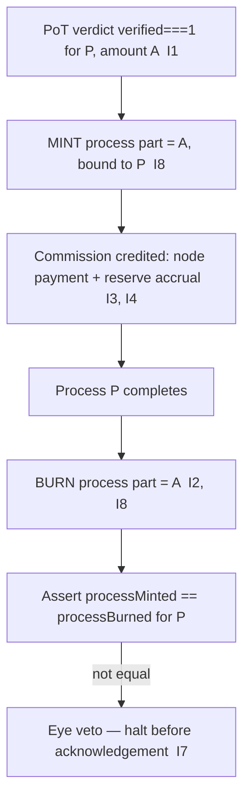

# burn_mechanism.md

**Stands on:** I2 (born-and-burned), I1 (PoT-gated origin), I3 (payment), I5 (determinism), I7 (Eye veto), I8 (append-only causality). See `README.md` §1.

## I. Purpose

Define the burn in AST: what causes it, what it acts on, and why it is the exact mirror of the mint. There is exactly one burn in this model — the destruction of a process part at the close of its own cycle — and it is not a lever for scarcity, deflation, or price. It is the second half of a conservation law.

## II. Scope

The burn acts on the **process part** only — the units minted for a process in flight (I1). It never acts on the **earned part** (commission), which is retained payment for confirmed work (I3) and burning it would contradict I3. The burn is embedded in the emission cycle recorded on NodeChain and is caused by cycle completion, not by any external trigger.

⸻

## III. Burn logic — the mirror of the mint

The process part minted for process `P` (amount `A`) is burned **immediately on cycle completion, within the same confirmed process that produced the mint** (I2). Because I2 says the process part exists *only while the process is in flight*, completion does not present an *opportunity* to decide to burn — it is the cause that *necessitates* the burn.

- **Amount:** exactly the amount minted for `P`. The burn call takes the minted value: `burn(minted)`. No rate, no percentage, no fraction — the whole process part, and only the process part.
- **Recorded as:** `emission.burned { processId, burned: A }` in NodeChain (I8).
- **Ledger effect:** `processBurned += A`, giving `processMinted == processBurned` for every completed cycle.

```
mint process part = A   →   (process in flight)   →   burn process part = A
net process supply Δ per completed cycle = 0        [I2]
```

The earned part is untouched by the burn; it lives in `earnedRetained` (I3).

⸻

## IV. Why there is no deflationary / fee / velocity burn

The old model burned a percentage of every fee, added an "overflow burn" above a supply ceiling, and threw a "velocity throttle" burn when token velocity dropped. Each presupposes something the model does not contain:

| Old mechanism | What it needs | Why it has no object here |
|---|---|---|
| Fixed % fee burn for scarcity | a market value to raise by shrinking supply | ARO has no market price (I6) |
| Overflow burn above `target_ceiling` | a supply cap to enforce | no cap; supply tracks confirmed work (I6, `aroscoin_supply_model.md`) |
| Velocity throttle burn | a circulating speculative float whose velocity matters | process parts are transient and never accumulate (I2) |
| Fraud/penalty burn of a held stake | a security-deposit stake to slash | no stake to participate or slash (I6) |
| Burn-to-a-dead-wallet + independent burn audit | an address holding "burned" tokens | a burn removes units from existence; there is no wallet that holds them |

*Because* none of these inputs exists, none of these burns has an object. The soundness they reach for — that supply cannot inflate away value — is delivered structurally: process parts net to zero each cycle (I2) and lasting supply equals confirmed, paid-for work (I1, I3). Adding a discretionary burn would introduce a supply movement with no PoT cause, contradicting I1 and I5.

⸻

## V. Execution flow



There is no "calculate burn rate," no "check overflow," no "send portion to burn wallet, remainder to nodes." The burn is unconditional in amount (it equals the mint) and unconditional in timing (it fires at cycle close). The Eye vetoes any burn that is asymmetric to its mint or that targets the earned part (I7).

⸻

## VI. Guards and failure codes

| Guard / Code | Condition | Invariant defended |
|---|---|---|
| Cycle symmetry | burn amount must equal mint amount for the same `processId` | I2 |
| `E_MINT_BURN_ASYM` | burn amount ≠ mint amount for the same process | I2 |
| `E_EARNED_BURNED` | an attempt to burn the earned part (commission) | I3 |
| Append-only | every burn appended to NodeChain before acknowledgement | I8 |
| `E_REPLAY` | a recorded burn applied a second time | I5, I8 |
| Eye veto | any burn without a matching in-flight mint is halted | I1, I7 |

⸻

## VII. Monitoring and audit

The burn record is audited as a restatement of I2 over NodeChain (see `token_audit_trail.md`): for every completed process, `processMinted == processBurned`. Any anomaly — a mint with no matching burn, or a burn with no matching mint — is not "flagged for later review"; it is a state the Eye vetoes before acknowledgement (I7). There is no separate burn-audit agent watching a dead wallet, because there is no wallet and no discretionary burn to watch.
