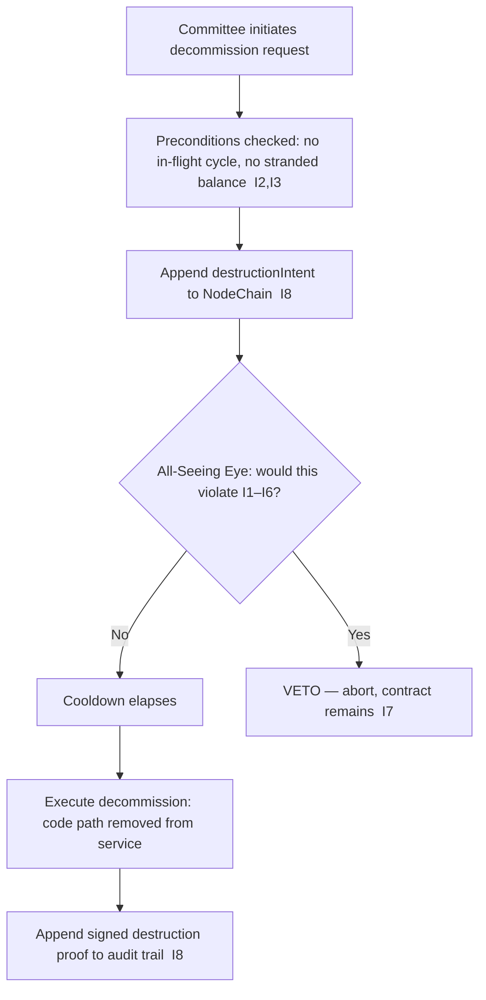

# contract_self_destruct_policy.md

**Stands on:** I5 (determinism), I8 (append-only causality), I7 (Eye veto), I2 (born-and-burned), I3 (payment), I1 (PoT-gated origin). See `README.md` §1.

## Purpose

Define the conditions and procedure under which a smart contract in AST may be **decommissioned** (self-destructed). Decommissioning is a legitimate part of the contract lifecycle — a deprecated implementation must be able to stop being routable — but it is constrained so that it can never destroy a causal record, orphan an in-flight cycle, or remove value. Every decommission is a cause appended before effect (I8), reviewed by the Eye (I7).

Destroying a *contract* never destroys *history*: the NodeChain record of everything that contract did is append-only and survives it (I8).

---

## 1. Overview

This policy governs the retirement of a contract's executable code. It applies only to contracts in the registry's canonical set (`smart_contract_registry.md`). A decommission removes a *code path* from service after it has been superseded; it is the terminal step of the versioning lifecycle, not an economic action.

---

## 2. Scope

Applies to all AST supply-logic contracts: `EmissionService`, `CommissionSplitter`, `PoTVerdictReader`, `ReserveIndex`, `AuditTrail`, `UpgradeProxy` implementations. It does **not** apply to bridge, staking, or vault contracts — those have no object in the model (I6) and are not present to decommission.

---

## 3. Justification for decommissioning

- an implementation has been superseded and its address must stop being routable;
- an irreversible defect requires the code path be taken out of service (the fix ships as a new version, `smart_contract_upgrade_policy.md`);
- a contract type is retired because the mechanic it computed has been folded into another.

Decommissioning is never used to alter supply, seize balances, or bypass the PoT gate — none of those is a representable effect of destroying code (I1, I3).

---

## 4. Preconditions (each guards an invariant)

- the contract is explicitly marked decommissionable in the registry;
- **no process part is in flight through it** — a minted-but-unburned unit must first complete its born-and-burned pair, so decommissioning cannot orphan a half-open cycle (I2);
- **no retained earned balance depends on it** — payment is retained (I3); destruction must not strand a credit;
- a role-based AI committee has authorized the decommission (never a token-weighted quorum — I6);
- the Eye has been given the decommission request and has **not vetoed** it (I7);
- a `contract.destructionIntent { contractId, hash, timestamp }` event is appended to NodeChain before execution (I8).

---

## 5. Procedure



The Eye can veto but cannot initiate a decommission; its power is strictly negative (I7). The committee authorizes; the Eye clears or halts.

---

## 6. Constraints

- Contracts whose destruction would remove access to a causal record are **not eligible** — history is append-only and must remain re-derivable (I5, I8). Only the code path is retired; its recorded effects persist.
- Execution is delayed by a **cooldown** (default 72 hours) after clearance, during which the Eye may still veto (I7).
- After execution, a signed destruction proof (address, code `hash`, block/position) is appended to the audit trail (I8), so the decommission is itself reproducible.

---

## 7. Reference decommission guard

```solidity
function decommission() external onlyRoleCommittee {
    require(block.timestamp > cooldownTimestamp, "Cooldown not elapsed");
    require(noInFlightProcessPart(), "In-flight cycle must complete first"); // I2
    require(noStrandedEarnedBalance(), "Retained payment must not be stranded"); // I3
    require(eyeCleared(address(this)), "Eye has not cleared this decommission"); // I7
    emit ContractDecommissioned(address(this), codeHash, block.timestamp); // I8
    // remove from service; NodeChain history persists append-only
}
```

The guard rejects any decommission that would violate I2, I3, or I7 — the impossible states are named and refused, not merely improbable.

---

## 8. Retention & logging

Every decommission appends, before and after execution (I8):

- the contract address, code `hash`, and NodeChain position of execution;
- the committee identity and human-readable justification;
- the Eye's clearance (or, on abort, its veto);
- an immutable back-reference to the successor version, if any (`supersedes`).

Because the record is append-only, a decommissioned contract's full history remains auditable indefinitely (I5, I8).

---

## Linked Documents

- `smart_contract_registry.md`
- `contract_versioning_policy.md`
- `smart_contract_upgrade_policy.md`
- `token_audit_trail.md`
