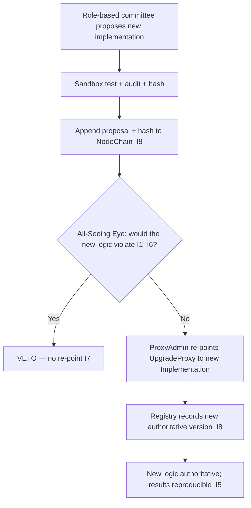

# contract_upgrade_proxy.md

**Stands on:** I5 (determinism), I8 (append-only causality), I7 (Eye veto), I2 (born-and-burned), I1 (PoT-gated origin). See `README.md` §1.

## Purpose

Define the **Contract Upgrade Proxy** — the pattern that lets AST replace a contract's *logic* without changing the *address* dependents hold or the *state* it has accumulated. The proxy serves determinism: dependents and auditors reference one stable address, while the authoritative implementation behind it is versioned and recorded (I5, I8). Every re-point is a cause appended before effect (I8), reviewed by the Eye (I7).

The proxy changes no supply rule. It swaps the code that computes a mechanic, within the bounds the invariants already fix; it can never move the PoT gate (I1) or the born-and-burned symmetry (I2).

---

## Proxy pattern overview

AST uses a **transparent proxy pattern**:

- **business logic is upgradeable independently of data** — state stays in the proxy;
- **the proxy always points to the current authoritative implementation** named in the registry;
- **the external interface is stable across upgrades** — dependents keep the same address.

This directly supports I5: a stable address plus a recorded implementation `hash` means "which code ran for process P?" resolves to one answer at any historical point.

---

## Key components

| Component | Role | Serves |
|---|---|---|
| `ProxyAdmin` | Executes the authorized re-point of the implementation slot; holds no value | I5, I8 |
| `UpgradeProxy` | The persistent address dependents interact with; holds the state | I5 |
| `Implementation` | The logic contract, replaceable without changing the proxy address | I5 |
| `All-Seeing Eye` | Observes every proposed and executed re-point; **can veto** any that would let the code violate I1–I6; initiates none | I7 |

The Eye's role is strictly negative: it does not propose, authorize, or execute an upgrade — it can only halt one (I7).

---

## Upgrade process

1. **Proposal** — a role-based AI committee proposes the new implementation (never a token-weighted vote — I6).
2. **Audit & simulation** — the candidate is exercised in a sandbox with re-derivation checks against recorded causes.
3. **Eye review** — the Eye reviews and may veto (I7).
4. **Re-point** — if not vetoed, `ProxyAdmin` updates the implementation slot in `UpgradeProxy`; the change is appended before effect (I8).
5. **Registry** — the new version is recorded and the prior one deprecated (see `contract_versioning_policy.md`).

---

## Upgrade safety measures

- **State stays in `UpgradeProxy`**, never in the implementation — so an upgrade cannot lose or fork accumulated state, preserving reproducibility (I5).
- **Initialization logic is disabled in implementations** to prevent re-initialization attacks on the shared state.
- **Only registry-listed, Eye-cleared implementations may be pointed to** — the allowlist is the registry itself (`smart_contract_registry.md`).
- **Every re-point is recorded on-chain before effect** (I8) and observed by the Eye (I7).

---

## Reentrancy and timing

- The proxy carries reentrancy guards: no re-point may occur while the implementation is mid-execution, so an upgrade cannot interleave with an in-flight process part and break its born-and-burned symmetry (I2).
- A re-point is delayed until after any in-flight cycle acknowledges, so no process is split across two implementations.

---

## Emergency recovery

If an implementation is found to produce a result inconsistent with the invariants:

- the Eye **vetoes further use** of it (I7) — a halt, not a correction;
- the role-based committee re-points `UpgradeProxy` back to a prior cleared version;
- both the veto and the re-point are appended to NodeChain before effect (I8), so recovery is itself reproducible (I5).

An in-flight process part that was minted but not yet burned when a halt occurs is burned to satisfy I2 before the engine goes read-only — no cycle is left half-open. The Eye never authors the recovery deployment; it only halts the offending step.

---

## Linked Documents

- `smart_contract_registry.md`
- `contract_versioning_policy.md`
- `smart_contract_upgrade_policy.md`
- `contract_self_destruct_policy.md`
