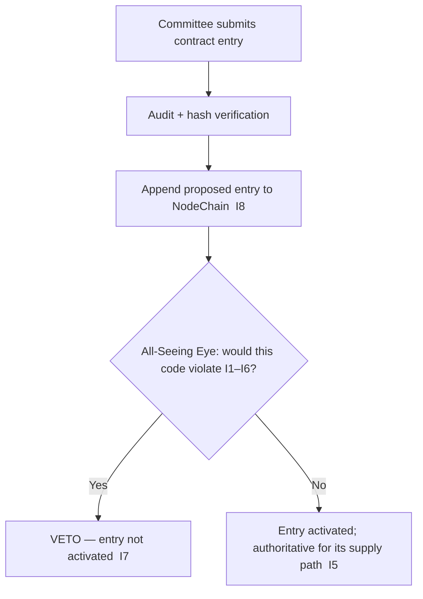

# smart_contract_registry.md

**Stands on:** I5 (determinism), I8 (append-only causality), I7 (Eye veto), I1 (PoT-gated origin), I2 (born-and-burned), I4 (AST reserve). See `README.md` §1.

## Purpose

Define the **Smart Contract Registry** — the single, append-only source of truth for every contract that executes AST's supply logic. The registry exists so that the *code path* behind any recorded token movement is itself recorded and reproducible: given a `processId`, an auditor can find exactly which contract version produced its mint, burn, or payment, and re-derive the result (I5).

The registry does not govern supply and does not hold value. It governs *which code is authoritative*, and every change to that authority is a cause appended before effect (I8), observed and vetoable by the Eye (I7).

---

## Goals (each derived)

- **Single source of truth (I5):** determinism requires that everyone compute with the same code; the registry names that code so re-derivation is unambiguous.
- **Recorded lifecycle (I8):** every registration, version bump, and decommission is appended to NodeChain before it takes effect, so the authoritative code at any past instant is reproducible.
- **Auditable dependencies (I8):** each entry names the modules it links, so the full code path behind a token movement is traceable.
- **Integrity of the supply path (I7):** the Eye can veto registering or activating any contract whose logic would violate I1–I6.

---

## Core structure

Each registry entry is a signed record with the following metadata:

```json
{
  "contract_id": "string",
  "name": "string",
  "version": "vX.Y.Z",
  "address": "on-chain address",
  "hash": "keccak256 hash of the deployed code",
  "deployed_by": "role-based committee identity",
  "linked_modules": ["module_a", "module_b"],
  "audit_status": "verified | pending | rejected",
  "eye_review": "cleared | vetoed",
  "supersedes": "prior contract_id | null",
  "last_updated": "ISO 8601 timestamp"
}
```

`hash` binds the entry to exact bytes, so the registry answers "what code ran?" deterministically (I5). `supersedes` records lineage (I8). `eye_review` records the Eye's veto decision (I7).

---

## Contract types (the canonical set)

The registry holds only contracts that carry out the invariant-derived lifecycle. Each maps to a specific mechanic:

| Contract type | Role | Bound to |
|---|---|---|
| `EmissionService` | Mints the process part against a `verified === 1` verdict, burns it at cycle close | I1, I2 |
| `CommissionSplitter` | Charges commission; credits node payment and reserve accrual | I3, I4 |
| `PoTVerdictReader` | Reads the recorded PoT verdict that gates every mint | I1, I8 |
| `ReserveIndex` | Computes `reserveIndex = log10(1 + totalProcessVolume)` from confirmed volume only | I4 |
| `AuditTrail` | Appends and exposes the read-only audit record | I8, I5 |
| `UpgradeProxy` | Persistent address; points to the authoritative implementation | I5 |

Absent, because each names a concept with no object here: `GovernanceEngine` for token-weighted proposals/votes (no governance-by-holding, I6); `NodeRegistry` for stakers/security-deposits (no staking, I6); `Vaults` for treasury holdings (no pre-decided allocation, I1); `SwapGate`/`Bridge` for token swaps or external ingestion (no external surface, I6). The registry cannot hold a contract whose type has no invariant to justify it.

---

## Access layer

The registry is queryable via `contractRegistryService`:

- `GET /contracts` — list all registered contracts;
- `GET /contract/{id}` — fetch one entry (including `hash` and lineage);
- `POST /contract` — register a new contract (role-based committee action, Eye-reviewed);
- `PATCH /contract/{id}` — update metadata (append-only: a change is a new recorded state, not an in-place edit of history);
- `POST /contract/verify` — submit the audit hash and status.

Reads are pure. Writes are causes: each is appended to NodeChain before effect (I8) and reproducible (I5).

---

## Access control (role-based, Eye-vetoed — never by holding)

- Registration and updates are authorized by a **role-based AI committee**, not by an "admin" and not by a token-weighted vote (I6 leaves no object for governance-by-holding).
- Every write carries the committee identity and is appended before effect (I8).
- The **All-Seeing Eye reviews** every registration and activation and can **veto** any entry whose code would violate I1–I6 (I7). The Eye cannot itself register, activate, or revoke — its power is strictly negative; a revocation it deems necessary is executed as a committee action that the Eye merely declined to veto.



---

## Linked Documents

- `contract_versioning_policy.md`
- `contract_upgrade_proxy.md`
- `smart_contract_upgrade_policy.md`
- `contract_self_destruct_policy.md`
- `token_audit_trail.md`
