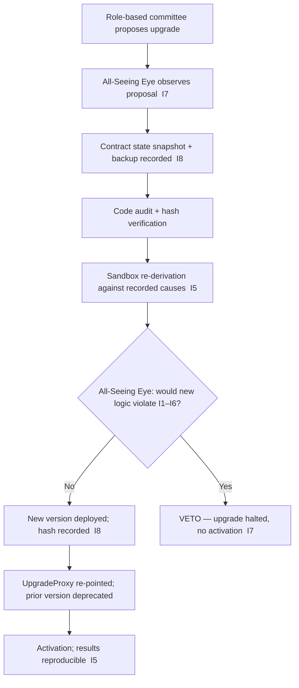

# smart_contract_upgrade_policy.md

**Stands on:** I5 (determinism), I8 (append-only causality), I7 (Eye veto), I2 (born-and-burned), I1 (PoT-gated origin), I3 (payment). See `README.md` §1.

## Purpose

Define the **procedure and guards** for upgrading a contract in AST — the ordered steps every upgrade must pass, and the conditions each step enforces. Where `contract_upgrade_proxy.md` describes the *mechanism* (how the code is swapped) and `contract_versioning_policy.md` describes the *labeling* (how versions are named), this document is the *procedure*: the sequence of causes, each appended before the next is acknowledged (I8), that carries a contract from proposal to authoritative.

An upgrade may change how a mechanic is computed within the invariant bounds; it may never introduce a new supply cause, remove the PoT gate (I1), or break born-and-burned symmetry (I2).

---

## Scope

Covers every upgradeable contract in the registry's canonical set (`smart_contract_registry.md`): `EmissionService`, `CommissionSplitter`, `PoTVerdictReader`, `ReserveIndex`, `AuditTrail`, `UpgradeProxy`. It does **not** cover — because they have no object in the model (I6) — bridge/inter-chain wrappers, staking logic, or KYC/AML compliance contracts; those are not present to upgrade.

---

## Upgrade justifications

An upgrade may be initiated to:

- fix a defect in how a mechanic is computed;
- improve performance of a computation while preserving its result;
- adapt to a new NodeChain or PoT interface version;
- tighten a guard so an already-forbidden state is caught earlier.

An upgrade may **not** be initiated to change a supply rule, add an issuance mode, introduce a cap, or grant governance to holders — each names a concept with no object here (I1, I6), so there is nothing for such an upgrade to target.

---

## Upgrade flow (role-based, Eye-vetoed)

Authorization is a **role-based AI committee** decision, not a token-weighted quorum (I6 leaves no object for governance-by-holding). The Eye observes every step and can veto; it never proposes, authorizes, or deploys (I7).

---

## Constraints (each closes an unsafe transition)

- **No upgrade may modify a recorded ledger state.** Correction is only ever a new appended cause, never an edit of history (I8).
- **No upgrade may alter accumulated balances or the retained earned part** — payment is retained (I3); an upgrade that reached into balances would contradict I3.
- **No upgrade may run mid-cycle.** It waits for any in-flight process part to complete its born-and-burned pair, so no cycle is split across versions (I2).
- **Every upgrade emits a recorded intent** (`contract.upgradeIntent { oldHash, newHash, timestamp }`) appended before the re-point (I8).
- **Eye clearance is mandatory** before activation (I7).

---

## Compatibility layering

Each upgraded contract must:

- preserve interface compatibility or provide a version-specific wrapper;
- anchor a back-reference to the prior contract `hash` and version tag (`supersedes`);
- remain retroactively re-derivable — the prior version is retained (deprecated), never erased (I8, I5).

---

## Post-upgrade verification

- Every activated upgrade is re-derived against a sample of recorded causes to confirm identical results where results must be identical (I5).
- The prior version is archived and marked `deprecated` in the registry — kept for re-derivation, disabled for new routing.
- The upgrade lineage (intent, hashes, committee identity, Eye decision, timestamps) is appended to the audit trail (I8) so the whole procedure is itself auditable.

---

## Emergency handling

If a newly activated version produces a result inconsistent with the invariants, the Eye **vetoes further use** of it (I7) and the engine can be placed read-only; an in-flight minted-but-unburned process part is burned to satisfy I2 before halt. The role-based committee then re-points to a prior cleared version. The Eye authors none of this; it only halts the offending step.

---

## Linked Documents

- `contract_upgrade_proxy.md`
- `contract_versioning_policy.md`
- `smart_contract_registry.md`
- `contract_self_destruct_policy.md`
