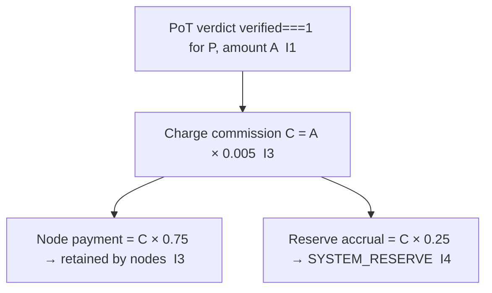

# token_distribution_model.md

**Stands on:** I3 (payment for confirmed work), I4 (AST reserve), I1 (PoT-gated origin), I5 (determinism), I8 (append-only causality). See `README.md` §1.

## Purpose

Define how the **earned part** of a confirmed process — the commission — is split. There are exactly two destinations, and each is caused by an invariant. This document is the truth table of that split. It concerns the earned part only; the process part is born and burned and is never "distributed" (I2, see `burn_mechanism.md`).

There is no distribution of *new supply* to pools. The only value that lasts past a cycle is the commission, and it goes to exactly the two parties the invariants name.

---

## 1. The two destinations (the complete set)

Upon a confirmed verdict `verified === 1` for process `P` with amount `A`, commission `C = A × COMMISSION_RATE` is charged (I3) and split:

| Destination | Share | Amount | Cause |
|---|---|---|---|
| **Nodes** (payment for confirmed work) | `NODE_SHARE = 0.75` | `C × 0.75` | I3 |
| **`SYSTEM_RESERVE`** (AST's own reserve) | `RESERVE_SHARE = 0.25` | `C × 0.25` | I4 |

These two shares sum to `1.0`. There is no third destination. *Because* I3 makes payment the effect of confirmed work and I4 makes the reserve AST's own, the split has exactly two legs; a pool with any other purpose would have no invariant to cause it.

Excluded, each because its premise is a concept with no object here:

- no **governance pool** — governance is not funded by a supply cut and is not exercised by holding (I6);
- no **ecosystem/grants/partnership fund** — that is a pre-decided allocation, which I1 forbids;
- no **emergency buffer / stabilization fund** — there is no market price to stabilize (I6); integrity is structural, not a funded reserve for intervention;
- no **treasury** to accumulate discretionary supply — supply is a record of work, not a reservoir (I1).

---

## 2. Flow of the earned part



The process part (amount `A`) is *not* on this diagram: it is minted and burned within the same cycle (I2) and never enters distribution.

---

## 3. Node payment (the `NODE_SHARE` leg)

- **Cause:** confirmed, executed work (I3). Payment is post-factum — it follows the verdict, never precedes it.
- **Weighting:** the `NODE_SHARE` is split among the nodes that processed `P`, in proportion to each node's confirmed contribution to that process, computed by the PoT weighting recorded in NodeChain (I5). Per-node weighting detail is in `01_coin_engine/node_participation_payments.md`.
- **Retention:** the paid amount is retained by the earner (P6). It is not locked, not vested, and not subject to forfeiture — there is no held stake to forfeit (I6).
- **No payment without confirmation:** a node that did not contribute to a confirmed process receives nothing; there is no advance, no bonus, and no payment absent a verdict (I3).

---

## 4. Reserve accrual (the `RESERVE_SHARE` leg)

- **Cause:** I4 — the reserve share of commission accrues to AST's own reserve, `SYSTEM_RESERVE`, which belongs to no external party and funds no external obligation.
- **Governance of the reserve:** the reserve capitalization is summarized by `reserveIndex = log10(1 + totalProcessVolume)`, derived from confirmed process volume only (I‑RS‑1), monotone non-decreasing in volume (I‑RS‑4), and never set as a free authority (I‑RS‑2).
- The reserve share is never routed outside `SYSTEM_RESERVE`; a route to any external party is a rejected state (`E_RESERVE_EXTERNAL`, see `01_coin_engine/burn_and_mint_rules.md`).

---

## 5. Auditability

Every split is a recorded effect of a recorded cause (I8) and is reproducible (I5):

- the node payment credits and the reserve accrual for `P` are each appended to NodeChain, keyed to `P`'s verdict;
- `node payment + reserve accrual == C` for every completed cycle (the split conserves the commission);
- replaying the verdict produces no second credit (I5, I8).

Distribution is thus not "enforced by checkpoints at mint time" as a discretionary control — it is the deterministic consequence of the verdict, checkable by re-derivation from NodeChain.

---

## 6. Canonical values

```
Commission C     = A × 0.005            (bounds [0, 0.01])   [I3]
Node payment     = C × NODE_SHARE       = C × 0.75           [I3]
Reserve accrual  = C × RESERVE_SHARE    = C × 0.25           [I4]
Node payment + Reserve accrual = C      (split is exhaustive)
```

---

## Linked Documents

- `token_issuance_protocol.md`
- `aroscoin_supply_model.md`
- `01_coin_engine/node_participation_payments.md`
- `01_coin_engine/payment_distribution.md`
