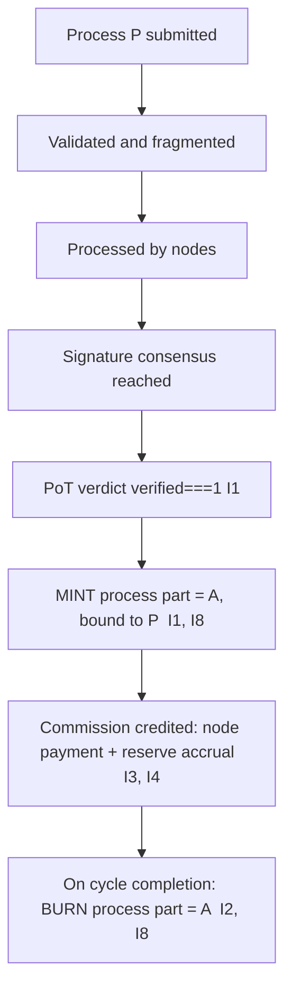

# token_issuance_protocol.md

**Stands on:** I1 (PoT-gated origin), I2 (born-and-burned), I3 (payment), I5 (determinism), I7 (Eye veto), I8 (append-only causality). See `README.md` §1.

## Purpose

Define the *only* way a unit of ARO comes into existence: as the recorded consequence of a PoT verdict for one specific process. This document is the closure statement of issuance — it names the single cause and shows that no other cause exists in the model, so that every unit is traceable to confirmed work.

Issuance here is not a policy that *decides* to create supply. It is the mechanical effect that *follows* a confirmed verdict. The protocol has no discretion to exercise.

---

## 1. The single cause of a unit (I1)

A mint is authorized **iff** PoT has recorded a verdict `verified === 1` for a specific process `P` with amount `A`. Because I1 gives emission exactly one cause, the issuance guard is not "check a flag" — it is "confirm the recorded cause exists" (I8: the cause is on-chain before the effect). If no verdict exists, or `verified ≠ 1`, the call throws and the ledger is unchanged.

*Because* I1 recognises no cause but a PoT verdict, the following are **not** issuance modes — each would be a unit with no cause and therefore cannot be represented:

- no scheduled or periodic mint (no emission curve);
- no genesis mint, pre-mine, or initial allocation;
- no mint-on-deposit and no mint against external value;
- no discretionary or governance-vote mint (I6 leaves no object for governance-by-holding);
- no minting to a treasury, development fund, or grant pool.

If the system is idle — no confirmed process — no unit is minted, because there is no cause.

---

## 2. Trigger conditions (all must be recorded, in order)

Issuance for process `P` proceeds **only** when NodeChain records, in causal order (I8):

1. `P` was submitted and entered the PoT pipeline;
2. `P` passed validation, fragmentation, and node processing;
3. the participating node set reached signature consensus;
4. PoT wrote a verdict `verified === 1` for `P`.

Only after (4) is the mint of the process part authorized. The Eye observes each step and vetoes any mint whose cause chain is incomplete or out of order (I7).

---

## 3. Issuance mechanics



- **Amount:** the minted process part equals the process amount `A` exactly (1:1 — no multiplier, no emission ratio, no `node_weight` factor applied to the process part itself). Forced by I2: the mint must be exactly mirrorable by a burn at cycle close.
- **Bound to:** the `processId` of the confirmed process. A minted process part is never free supply; it names its cause.
- **Recorded as:** `emission.minted { processId, minted: A }` in NodeChain (I8).
- **Ledger effect:** `processMinted += A`.

The **earned part** (commission `C = A × COMMISSION_RATE`) is credited by the same confirmed verdict as retained value — node payment (I3) and reserve accrual (I4) — and is **never** part of the born-and-burned process part. Its split is defined in `token_distribution_model.md`.

---

## 4. Safeguards (each closes one impossible state)

| Safeguard | Rule | Invariant defended |
|---|---|---|
| Single-cause gate | No mint without a recorded `verified === 1` verdict; the call throws otherwise. | I1 |
| Double-mint lock | Once a verdict has caused its mint, that `processId` cannot cause a second mint (a recorded cause applied twice is rejected as replay). | I5, I8 |
| Cause-before-effect | The verdict is appended to NodeChain before the mint is acknowledged. | I8 |
| Mirror obligation | Every minted process part carries the obligation to be burned at cycle close for the same amount. | I2 |
| Eye veto | The Eye halts any mint whose cause chain is incomplete, out of order, or would exceed `A`. | I7 |

There is no security-deposit, no stake, and therefore no slashing of a stake to deter over-issuance — over-issuance is not deterred by penalty, it is *impossible*, because a unit without a `verified === 1` cause cannot be represented (I1). The concept a slashing penalty would defend has no reachable state to defend against.

---

## 5. Canonical values

```
Process part minted = A                 (1:1)                    [I1, I2]
Commission (earned) = A × 0.005         (0.5%, bounds [0,0.01])  [I3]
  Node payment      = Commission × 0.75  (→ nodes, PoT weight)   [I3]
  Reserve accrual   = Commission × 0.25  (→ SYSTEM_RESERVE)      [I4]
Net supply Δ        = + Commission per completed cycle
                      (process part minted then burned → 0; earned part retained)
```

---

## Linked Documents

- `aroscoin_supply_model.md`
- `token_distribution_model.md`
- `burn_mechanism.md`
