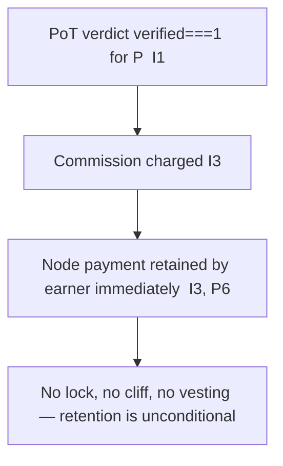

# token_lock_unlock_rules.md

**Stands on:** I6 (no speculative surface), I1 (PoT-gated origin), I3 (payment), I2 (born-and-burned), I5 (determinism). See `README.md` §1.

## Purpose

State the canonical position on locking, unlocking, and vesting ARO. A file with this name exists because "what are the lock/vesting schedules?" is a natural question for a token. The derived answer is that **there is nothing to lock**: the two forms ARO takes — the born-and-burned process part and the earned, retained payment — leave no allocation that a lock or vesting schedule could act on. Locks, cliffs, vesting, and relocking-for-voting-weight are concepts with no object in this model.

This is a stronger guarantee than a fair schedule: not "we lock allocations honestly," but "there is no pre-decided allocation to lock."

---

## 1. Why there is nothing to lock

A lock/vesting regime presupposes a **pre-decided allocation held before it is earned** — a founder grant, an investor tranche, a treasury reserve — that must be immobilized and released over time. Trace whether AST has any such allocation:

1. **No unit exists before its cause (I1).** A unit of ARO comes into being only as the consequence of a `verified === 1` verdict for a process. There is no genesis mint, pre-mine, or allocation table (`aroscoin_supply_model.md` §3). So there is no founder/advisor/investor/public tranche to lock.
2. **The process part cannot be locked (I2).** It is born and burned within one cycle; it exists only in flight. A lock would have to hold it past its burn, contradicting I2.
3. **The earned part is retained, not locked (I3).** Payment for confirmed work is retained by the earner the instant it is confirmed (P6). It is already the earner's; there is no cliff before it vests, because it was never a promise — it is compensation for work already done.

**Therefore lock/unlock/vesting has no object.** Every lock category in the old model (Founders 24-month cliff, Advisors, Private Round, Public Sale, ecosystem vesting) names an allocation that cannot exist under I1.

---

## 2. Why relocking-for-voting-weight has no object

The old model let holders "relock" tokens to gain governance weight (e.g. 1.5× per 12-month cycle) and to stake in a DAO. Each piece is excluded because its premise is a concept with no object:

| Old mechanism | What it needs | Why it has no object here |
|---|---|---|
| Vesting cliff / linear release | a pre-earned allocation to release | no allocation exists (I1) |
| Relock for extra voting weight | governance-by-holding | a balance confers no vote (I6) |
| DAO staking payment | staking-for-yield | no staking surface (I6) |
| Strategic liquidity freeze | a circulating float to freeze | process parts are transient; no float (I2) |
| Lock-violation burn (5–20%) | a held stake to slash | no stake to slash (I6) |

Making a retained balance confer voting weight would create governance-by-holding (forbidden, I6); freezing it for "liquidity" would presuppose a market the model excludes (I6).

---

## 3. Why no emergency system-wide lock

The old "Emergency Lock Protocol" froze all tokens on detecting market manipulation. This presupposes a market to be manipulated. ARO has no market price (I6), so "market manipulation" has no referent, and there is no float to freeze. The integrity such a freeze reaches for is instead structural and continuous:

- supply cannot outrun confirmed work (I1);
- value-in-flight never accumulates into a seizable overhang (I2);
- lasting supply equals paid-for work (I3);
- every movement is reproducible and none originates from discretion (I5).

The correct response to a would-be integrity violation is not a global freeze but the Eye's **veto** of the specific offending step before its effect is acknowledged (I7) — a targeted stop, never a substitution or a blanket lock.

---

## 4. The only thing resembling "unlock": retention

The single lifecycle event for the earned part is **retention at confirmation** (I3): the moment PoT confirms the work, the payment is the earner's, unconditionally and immediately. There is no schedule, no cliff, no milestone gate, and no oracle exception — because retention is caused by confirmation itself, and confirmation is already recorded on NodeChain (I8) and reproducible (I5).

---

## 5. Summary

| Concept | Status here | Invariant |
|---|---|---|
| Founder/investor/advisor lockup | no object (no allocation exists) | I1 |
| Vesting cliff / linear release | no object | I1, I3 |
| Relock for voting weight | no object (no governance-by-holding) | I6 |
| DAO staking / liquidity freeze | no object (no speculative surface) | I6 |
| Lock-violation slashing burn | no object (no stake to slash) | I6 |
| Emergency system-wide lock | no object (no market to freeze); replaced by targeted Eye veto | I6, I7 |
| Retention of earned payment | the only real event; unconditional at confirmation | I3 |

---

## Linked Documents

- `aroscoin_supply_model.md`
- `token_supply_governance.md`
- `token_distribution_model.md`
