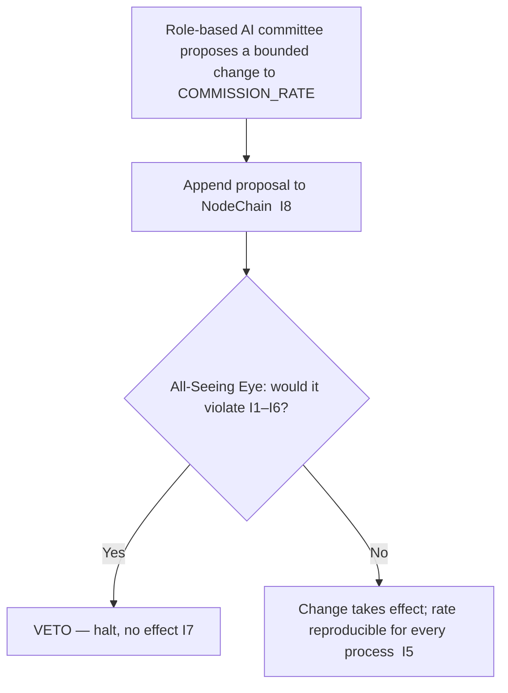

# token_supply_governance.md

**Stands on:** I1 (PoT-gated origin), I2 (born-and-burned), I3 (payment), I6 (no speculative surface), I7 (Eye veto), I8 (append-only causality), I5 (determinism). See `README.md` §1.

## Purpose

State the canonical position on "supply governance." A file with this name exists because the question "who governs the supply?" is natural. The derived answer is that **supply is not governed** — it is *derived* from confirmed work (I1) and *conserved* per cycle (I2). There is no supply variable for a governor to set, and therefore no supply vote, no mint-by-proposal, and no cap to administer. What little *is* governed here — the single bounded parameter `COMMISSION_RATE` — is set by a role-based AI committee under Eye veto, never by holding.

This is the strongest form of the guarantee: not "we govern the supply wisely," but "the supply is not a governable object — it is a consequence."

---

## 1. Why supply cannot be governed as a quantity

Supply governance presupposes a **free supply variable** — a `max_supply` to cap, a `mintable_pool` to release by vote, a `supply_floor` to defend. Trace whether AST has any of these:

1. **No `max_supply`.** A cap bounds a schedule of pre-decided units. AST has no schedule; each unit is caused one at a time by a `verified === 1` verdict (I1). Nothing accumulates toward a ceiling (I2). A cap has no object.
2. **No `mintable_pool`.** A mintable reserve is supply that exists to be released by decision. Under I1 no unit exists without its verdict; there is no reserve of unissued units to release. A "mint by proposal + quorum" function would mint units with no PoT cause — an unrepresentable state (I1).
3. **No `supply_floor`.** A floor defends a circulating amount against shrinking. Process parts net to zero by construction (I2) and lasting supply only grows with confirmed work (I3); there is no shrinking float to floor.
4. **No `burnable_ratio` per epoch.** The only burn is the born-and-burned mirror (I2); there is no discretionary epoch burn to ration (see `burn_mechanism.md` §IV).

**Therefore every classic supply-governance parameter names a quantity the model does not contain.** Supply is `(processMinted − processBurned) + earnedRetained` (`aroscoin_supply_model.md` §1) — a derived read, not a set of dials.

---

## 2. Why there is no supply vote and no holder franchise

Governance-by-holding presupposes that a held ARO balance confers power over the protocol. I6 leaves no object for this: ARO has no speculative surface, no staking, and no vote-weight. Consequently:

- there is **no weighted node vote** over supply, and **no token-weighted quorum**;
- a held balance confers **no** governance power — holding more ARO gives no say over any parameter;
- there is **no external overseer** and no human quorum-by-stake.

A held balance is the retained record of confirmed work (I3); it is payment, not a ballot. Making it a ballot would create governance-by-holding, which I6 forbids.

---

## 3. What *is* governed here (bounded, role-based, recorded)

Exactly one economic parameter is adjustable, and it is not free in the sense of discretion:

- **`COMMISSION_RATE`**, the earned-part share, may move **only within bounds `[0, 0.01]`**. The bound is not a preference: a rate above it would let commission exceed the process amount, contradicting I3. Below `0` is meaningless. So the causal chain constrains the value before any committee does.
- A change is a **role-based AI committee** decision, observed by the Eye. It is **not** decided by ARO holdings (I6).
- Every change is appended to NodeChain **before** it takes effect (I8), so the rate in force for any process is reproducible (I5).
- The Eye can **veto** any proposed change that would violate I1–I6 (I7), but initiates none.

Nothing else — `SYMBOL`, `DECIMALS`, `BASE_UNIT`, the born-and-burned mechanism, the `NODE_SHARE`/`RESERVE_SHARE` split, the invariants — is changeable: `changeDecimals: false`, `changeSymbol: false`.

---

## 4. The oversight hierarchy (roles, not stakes)

Governance is a hierarchy of AI oversight with the Eye at the apex holding veto (I7) and initiating nothing. It acts only on the one bounded parameter above; it has no reach over supply, because supply is not a parameter.

---

## 5. Monitoring & reporting (reads, not controls)

Supply figures are derived reads of NodeChain (I5), reproducible on any node:

| Reported | Definition | Cause |
|---|---|---|
| Live process part | `processMinted − processBurned` (→ 0 at rest) | I2 |
| Lasting supply | `earnedRetained` | I1, I3 |
| Burned process parts | `processBurned` | I2 |
| Reserve accrual / `reserveIndex` | cumulative `RESERVE_SHARE`; `log10(1 + totalProcessVolume)` | I4 |
| `COMMISSION_RATE` history | committee changes appended before effect | I5, I8 |

None of these endpoints exposes a control that mints, caps, or rebalances supply — because no such control exists.

---

## Linked Documents

- `aroscoin_supply_model.md`
- `token_issuance_protocol.md`
- `burn_mechanism.md`
- `token_lock_unlock_rules.md`
