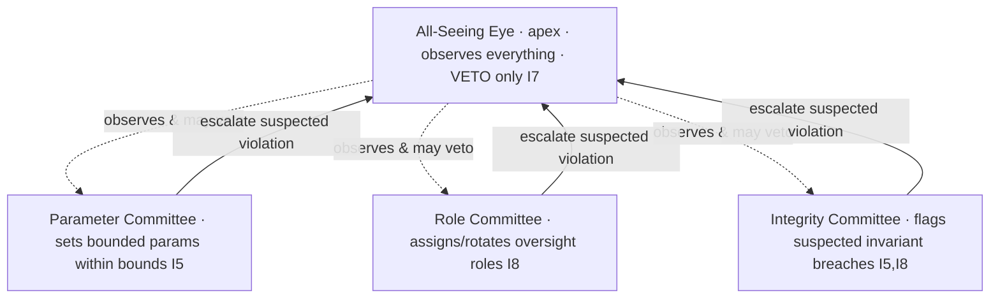

# AST Governance Layer

**Path: AROS-PARADIGM-AST/06_governance_layer/README.md**

Core documentation for governance in AST (Aros Studio Tokenomics). Governance here is a **role-based hierarchy of AI oversight** — an apex observer with a veto (the All-Seeing Eye) and a set of narrow role committees beneath it, each with one bounded remit. It is described entirely on AST's own terms: NodeChain, PoT (Proof-of-Transaction), nodes, ArosCoin (ARO), commission, reserve, and the All-Seeing Eye. It depends on no external system and names none.

⸻

## 0) How to read this layer

Every rule in the Governance Layer is a **consequence**, not a preference. Each document states which invariants it stands on and derives its mechanics from them by an explicit *because → therefore* chain, labelled with the invariant id, e.g. `(I7)`. If a rule cannot be traced back to an invariant, it does not belong here.

The single question this layer answers is: *in a system whose every unit has exactly one cause (a PoT verdict, I1) and whose every movement is reproducible from recorded causes (I5), what is left for governance to do?* The answer is narrow and almost entirely **negative**: governance may bound, assign, and halt — it may never create. This layer is the elaboration of that answer.

⸻

## 1) Invariants this layer stands on

Governance is defined chiefly by I5, I6, I7, I8, and is constrained by I1 and I3. See `01_coin_engine/README.md` §1 for the full spine; the load-bearing ones here are:

- **I1 — PoT-gated origin.** A unit of ARO exists only as the consequence of a PoT verdict `verified === 1` for one specific process. *Therefore governance has no power to mint:* no committee, and not the Eye, is a cause of a unit.
- **I3 — Payment for confirmed work.** Nodes are paid, post-factum, for PoT-confirmed work. *Therefore governance has no power to pay:* a decision is not confirmed work, so it can cause no payment.
- **I5 — Determinism.** Every token movement is reproducible from canonical inputs recorded in NodeChain. *Therefore every governance decision must itself be recorded and reproducible;* a decision that could not be replayed to the same result would be a discretion outside the causal chain, which the model does not admit.
- **I6 — No speculative surface.** ARO has no market price and no speculative object. Among the concepts with no object here is **governance-by-holding/voting**. *Therefore a held ARO balance confers no governance power,* and there is no governance token, no franchise, and no quorum-by-stake.
- **I7 — All-Seeing Eye: observe and VETO, never initiate.** The Eye observes every step and can halt (veto) any step that would violate I1–I6, but initiates nothing. *Therefore the apex of governance is a power to stop, not a power to decide.*
- **I8 — Append-only causality.** Every cause is appended to NodeChain *before* its effect is acknowledged. *Therefore every governance decision is recorded before it takes effect;* a decision is valid only because its record already exists.

⸻

## 2) What AST governance is, and is not

**It is** a hierarchy of AI oversight roles whose authority is *bounded* (it may move a parameter only inside protocol-defined bounds) and largely *negative* (its strongest act is to halt). Concretely, governance may do exactly three kinds of thing:

1. **Set bounded parameters** strictly within protocol-defined bounds — e.g. `COMMISSION_RATE` only within `rateBounds = [0, 0.01]` (`parameter_governance.md`).
2. **Assign and rotate roles** — place an oversight role with an identity, and rotate it, recorded before effect (`governance_roles_and_permissions.md`).
3. **Halt** — the apex Eye's veto withholds acknowledgement of a step that would violate an invariant (`ai_oversight_hierarchy.md`, `emergency_governance_procedures.md`).

**It is not**, and contains no object for:

- **Minting, burning, or paying.** Only a PoT verdict causes emission (I1); the born process part is burned by the cycle that made it (I2); only confirmed work causes payment (I3). Governance is not any of these causes, so it has **no generative power** whatsoever.
- **Token-weighted voting / a governance token / a holder franchise / quorum-by-stake.** These are the object *governance-by-holding*, which I6 leaves with no referent. A held balance is not a ballot.
- **A human quorum, a founder override, or any external overseer.** No single privileged authority exists, because I1 and I5 admit no privileged issuer and no discretion outside the recorded chain. Oversight is a hierarchy of *roles*, evaluated against invariants, not a person or an outside body.

Each absence above is derived, not decreed: it is a concept with **no object** in a system closed under I1–I8.

⸻

## 3) The hierarchy at a glance



The Eye sits at the apex but *initiates nothing* (I7): its edges to the committees are observation and veto only. The committees sit below, each with one bounded remit, and their only upward act is to **escalate** a suspected violation to the Eye — never to grant themselves power. No box in this diagram can create a unit, burn a unit, or pay a node (§2).

⸻

## 4) Canonical constants (cited, not redefined)

Governance never redefines an economic constant; it may only move the one bounded parameter, and only inside its bounds. The constants are fixed in `01_coin_engine/README.md` §3 and `AROS_Coin_TokenSpec.json`:

| Constant | Value | Governable? |
|---|---|---|
| `SYMBOL` | `ARO` | No — `changeSymbol: false`. |
| `DECIMALS` | `9` | No — `changeDecimals: false`. |
| `BASE_UNIT` | `arx` (1 ARO = 10^9 arx) | No — fixed and immutable. |
| `COMMISSION_RATE` | `0.005` | **Yes, bounded** — only within `rateBounds = [0, 0.01]` (`parameter_governance.md`). |
| `NODE_SHARE` | `0.75` | No — split fixed with `RESERVE_SHARE`. |
| `RESERVE_SHARE` | `0.25` | No — split fixed with `NODE_SHARE`. |
| `POT_EPOCH_SECS` | `600` | Operational only; not an economic authority. |

There is no `governanceToken`, no `quorum`, no `proposalStake`, and no `voteWeight` in this layer — because I6 leaves governance-by-holding with no object (§2).

⸻

## 5) How a bounded change happens (the shape of every decision)

Every governance act, from a rate change to a role rotation to a veto, has the **same shape**, forced by I5 and I8:

```
proposed bounded act  (e.g. set COMMISSION_RATE = r, by the responsible role committee)
      │
      ├─▶ CHECK: is r within rateBounds [0, 0.01]?  no ⇒ rejected, nothing recorded   [I5]
      │
      ├─▶ Eye observes the recorded intent in the pre-acknowledgement window          [I7, I8]
      │        └─▶ would it violate I1–I6?  yes ⇒ VETO — acknowledgement withheld      [I7]
      │
      ├─▶ APPEND governance.paramSet { param, from, to, by, at } to NodeChain          [I8]
      │
      └─▶ ONLY THEN does the new value take effect                                     [I8]
```

The record precedes the effect (I8); the act is bounded so it can break no causal chain (I5); the Eye may stop it but never authors it (I7). The same three guards — **bounded, recorded-before-effect, vetoable** — govern every act in this layer.

⸻

## 6) Directory layout (skeleton)

```
06_governance_layer/
├── README.md                             # This file — governance invariant spine + map
├── governance_layer_overview.md          # The layer in narrative: bounded, negative, recorded-first
├── ai_oversight_hierarchy.md             # The apex Eye + subordinate role committees; escalation path
├── governance_roles_and_permissions.md   # The oversight roles and each one's enumerated permissions
├── parameter_governance.md               # How a bounded parameter is changed, recorded before effect
├── emergency_governance_procedures.md    # Halt / circuit breaker via Eye veto + role committee
└── governance_auditability.md            # Governance decisions restated as NodeChain records
```

⸻

## 7) What auditing checks (the invariants restated over the record)

Auditing governance is not a separate policy; it is the restatement of the invariants as tests over the NodeChain record (see `governance_auditability.md`):

- **No generative act (I1, I3):** the governance log contains no `mint`, `burn`, or `payment` authored by any committee or by the Eye.
- **Bounded change (I5):** every `governance.paramSet` has its `to` value inside the parameter's protocol bounds.
- **Recorded before effect (I8):** for every parameter in force over a process, the `paramSet` that set it is recorded at an earlier point than the process it governed.
- **Reproducibility (I5):** replaying the recorded governance decisions yields exactly the parameter and role state that was in force.
- **Eye discipline (I7):** the Eye's log contains only observations and vetoes — never a created value.
