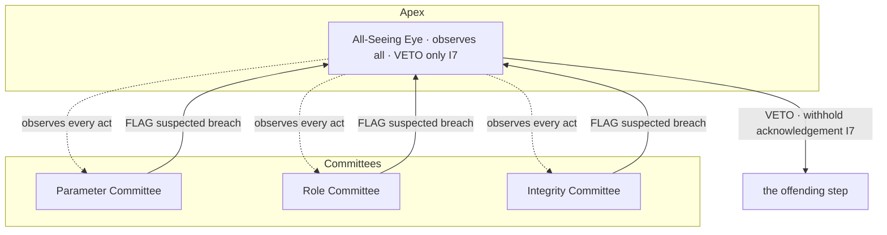

# ai_oversight_hierarchy.md

**Stands on:** I1 (PoT-gated origin), I3 (payment for confirmed work), I5 (determinism), I6 (no speculative surface), I7 (Eye: observe and veto), I8 (append-only causality). See `README.md` §1.

## 1. Purpose

Define the shape of the oversight hierarchy: an apex observer (the All-Seeing Eye) with a veto and nothing else, and a set of subordinate role committees, each with one bounded remit. Establish the escalation path — *observe → flag → veto* — and show, invariant by invariant, why no box in this hierarchy can create value.

---

## 2. The two tiers

Governance in AST is a hierarchy of AI oversight *roles*, not a chamber of voters. It has exactly two tiers.

**Apex — the All-Seeing Eye (I7).** The Eye observes every step of every cycle and can veto (halt) any step that would violate I1–I6. It initiates nothing. It is the subject of layer 13 (`13_extra_supervisory_layer/`); here it appears only in its governance role: the top of the hierarchy, whose authority is a *power to stop*, never a power to decide.

**Subordinate — the role committees.** Below the Eye sit narrow committees, each holding exactly one bounded remit:

| Committee | Its one remit | Bounded by |
|---|---|---|
| Parameter Committee | Set `COMMISSION_RATE` within `rateBounds = [0, 0.01]`. | I5 (`parameter_governance.md`) |
| Role Committee | Assign and rotate oversight roles, recorded before effect. | I8 (`governance_roles_and_permissions.md`) |
| Integrity Committee | Flag a suspected invariant breach and escalate it to the Eye. | I5, I8 |

No committee holds two remits, and no committee holds the Eye's veto. The separation is not administrative tidiness — it is what keeps each act individually checkable against the invariant it stands on.

---

## 3. Why the apex is a veto and not a throne

The Eye's apex position could be misread as supreme decision-making power. It is the opposite, and this is forced.

- **Possible to stop — because of I8.** Every step exists first as a cause appended to NodeChain and only afterward as an acknowledged effect. In the window between the two, the Eye evaluates the cause against I1–I6. *Therefore* the Eye can prevent an effect by withholding acknowledgement, without authoring anything.
- **Only able to stop — because of I1 and I5.** A unit has exactly one cause (I1) and every movement is reproducible from recorded causes (I5). If the apex could *initiate* a mint, burn, or payment, it would be a second, discretionary cause, contradicting I1 and I5. *Therefore* the apex is constructed with no primitive that appends an economic cause; it can only assert a **veto**, whose sole effect is "the vetoed step is not acknowledged."

So the top of the hierarchy is the *least* generative position in it: it can stop any committee's act, and can start none of its own.

---

## 4. The escalation path: observe → flag → veto

The hierarchy has one upward pathway, and it carries no power to create — only to halt.

1. **Observe.** The Eye observes every recorded cause in the pre-acknowledgement window (I8). Observation is continuous and passive — it changes no state.
2. **Flag.** Any committee, or the Eye itself, may **flag** a suspected invariant breach by appending an `governance.flag` record to NodeChain (I8). A flag is an observation, not an action; it authors no economic effect. The Integrity Committee's entire remit is to produce flags.
3. **Veto.** Only the Eye may act on a flag, and its only act is the **veto**: it withholds acknowledgement of the offending step (I7). A veto appends a `governance.veto` record whose sole effect is that the vetoed step's effect is never acknowledged.

There is no fourth step in which power is *granted upward* or value is *created*. A committee cannot escalate itself into the Eye's seat, because role assignment is the Role Committee's bounded remit and is itself vetoable (§5).

---

## 5. No box in this hierarchy can create value

State the closure explicitly, invariant by invariant, so it is checkable.

- **No committee mints (I1).** A unit exists only as the consequence of a PoT verdict. A committee decision is not a PoT verdict, so it is not a cause of a unit. No committee, and not the Eye, has a minting primitive.
- **No committee burns (I2).** The process part is burned by the cycle that minted it, atomically. A committee does not close cycles; it has no burning primitive.
- **No committee pays (I3).** A node is paid only for PoT-confirmed work, post-factum. A committee decision is not confirmed work, so it causes no payment. No committee has a paying primitive.
- **No committee sets a value outside bounds (I5).** The Parameter Committee's only reachable outputs are within `rateBounds`; a value outside is rejected before it is recorded (`parameter_governance.md`).
- **No box derives authority from a holding (I6).** Authority attaches to an oversight *role*, not to an ARO balance. A held balance is retained payment for past work (I3); it is not a seat and not a ballot.
- **The apex initiates nothing (I7).** The Eye's only outputs are observations, flags, and vetoes — never a created value.

Together these make the hierarchy *closed*: every act it can perform is bounding, assigning, flagging, or halting, and none of these creates, destroys, or pays.

---

## 6. Role identity and rotation (assignment is itself bounded)

An oversight role is bound to a service identity, not to a person and not to a holding. The Role Committee may assign a role to an identity or rotate it to another, and each such act:

- is **recorded before it takes effect** (I8) as `governance.roleSet { role, from, to, at }`;
- is **observed by the Eye**, which may veto it if the assignment would violate an invariant — for example, assigning a committee a remit that is not one of the enumerated bounded remits (§2), which would grant it undefined power and so threaten I5 (`governance_roles_and_permissions.md`);
- is **reproducible** (I5): replaying the `roleSet` records yields exactly the role state in force.

Rotation exists so that no identity is permanently fused to a remit; it changes *who holds* a bounded role, never *what the role may do*. The remit set is fixed by §2 and is not itself a governable parameter.

---

## 7. What this document establishes

- The hierarchy has two tiers: an apex that can only stop (§3) and narrow committees that can only bound, assign, or flag (§2).
- The one upward pathway is *observe → flag → veto* (§4); it carries no power to create.
- No box in the hierarchy can mint, burn, or pay (§5), because none is the invariant-defined cause of any of those effects.

---

## 8. Next

- `governance_roles_and_permissions.md` — each oversight role's concrete, enumerated permissions, and the explicit statement that no role mints, burns, or pays.
