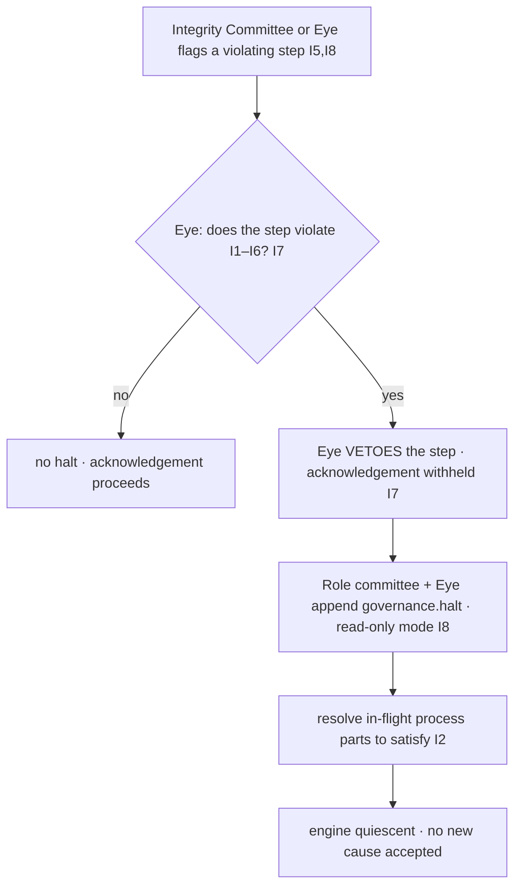

# emergency_governance_procedures.md

**Stands on:** I1 (PoT-gated origin), I2 (born-and-burned), I3 (payment for confirmed work), I5 (determinism), I6 (no speculative surface), I7 (Eye: observe and veto), I8 (append-only causality). See `README.md` §1.

## 1. Purpose

Define the emergency response: how AST **halts** — enters a read-only mode and stops accepting new causes — when a step would violate an invariant, and how any in-flight process is resolved to satisfy I2. The halt is engaged by the Eye's veto together with the responsible role committee, **never by a single founder authority**, because I1 and I5 admit no privileged issuer. Emergency governance, like all governance here, is *negative*: its strongest act is to stop.

---

## 2. What an emergency is (and is not)

An emergency is a condition in which a step *about to be acknowledged* would violate an invariant, or in which the integrity of the recorded chain is in doubt. Concretely:

- a mint whose PoT verdict is absent or `verified ≠ 1` (I1);
- a cycle closing with `processMinted ≠ processBurned` (I2);
- a payment whose confirmation is not already recorded (I3);
- a reserve movement outside the derivation from confirmed process volume (I4);
- a step whose effect is not reproducible from its recorded cause (I5);
- an attempt to introduce a speculative object — a cap, a staking-for-yield claim, external-crypto ingestion, a governance-by-holding franchise (I6).

An emergency is **not** a market event, a price movement, or a run on a token — ARO has no market price (I6), so those conditions have no object here. There is nothing to defend a price against; there is only the causal chain to keep intact.

---

## 3. The halt is negative and never unilateral

Two facts fix the shape of every emergency act.

- **Negative (I7).** The response to a violating step is to **withhold acknowledgement** of it — a veto. It is never to "correct" by minting, burning, or paying, because the Eye and the committees have no such primitive (`governance_roles_and_permissions.md` §7). A halt stops; it does not substitute.
- **Never unilateral (I1, I5).** No single privileged authority — no founder, no admin, no external overseer — can issue an emergency action, because I1 fixes the one cause of a unit and I5 forbids discretion outside the recorded chain. A single-authority override would be exactly such a discretion. *Therefore* the circuit breaker is engaged by the **Eye's veto together with the responsible role committee**, each act recorded (I8), and by no one alone.

---

## 4. The circuit breaker

The breaker places the engine in **read-only mode**: no new cause is accepted, so no new mint, burn, or payment can begin.



- **Trigger.** A flag (from the Integrity Committee or the Eye, `ai_oversight_hierarchy.md` §4) identifies a step that would violate an invariant.
- **Veto (I7).** The Eye withholds acknowledgement of that step. This alone stops the offending effect.
- **Engage (I8).** The responsible role committee and the Eye append `governance.halt { by, reason, at }` to NodeChain *before* read-only mode takes effect. `KILL_SWITCH=true` names this state (`01_coin_engine/README.md` §6). The record names *both* the committee and the Eye — never a single authority (§3).
- **Read-only mode.** No new cause is accepted. Observation and audit continue; the record remains fully readable.

---

## 5. Resolving in-flight process parts (satisfying I2)

A halt must not leave the supply in a state that violates born-and-burned (I2).

*Because* I2 requires the process part minted for a process to be burned by the close of that same cycle, a process that was minted but not yet burned when the halt engaged is an **open** obligation. *Therefore* the breaker resolves it deterministically:

- any process part that was **minted but not yet burned** is **burned** so that `processMinted == processBurned` for that process (I2), and the burn is recorded (I8);
- the **earned part** (node payment, reserve accrual) that was already caused by a recorded `verified === 1` verdict is **retained** — it is never clawed back, because I3 requires payment for confirmed work to be retained;
- no **new** process part is minted, because read-only mode accepts no new cause (I1).

After resolution, the supply identity `totalSupply = (processMinted − processBurned) + earnedRetained` holds with the process term at zero (`01_coin_engine/burn_and_mint_rules.md` §3), so the halt leaves the ledger in a canon-valid state.

---

## 6. The record

Every emergency act is a NodeChain record appended before effect (I8). There is no separate "emergency log contract" and no off-chain justification store — the causal ledger is the record.

```json
{
  "type": "governance.halt",
  "reason": "E_NO_VERDICT: mint attempted with no recorded PoT verdict",
  "vetoedStep": "<nodechain-ref>",
  "by": ["role:IntegrityCommittee", "eye"],
  "at": "<nodechain-sequence>"
}
```

- `by` is a **pair** — the committee and the Eye — making the non-unilateral requirement (§3) checkable in the record itself.
- `reason` cites the failure code of the violated invariant (`parameter_governance.md` §6, `01_coin_engine/burn_and_mint_rules.md` §6).
- `vetoedStep` points at the withheld step; the record authors no economic value of its own (I7).

---

## 7. Recovery (return to acceptance)

Leaving read-only mode is itself a bounded, recorded, non-unilateral act.

- The condition that caused the halt must be resolved and the resolution recorded (I8) — e.g. the absent verdict is confirmed absent and the offending step remains vetoed.
- A `governance.resume { by, at }` is appended by the **role committee together with the Eye** (never one alone, §3) *before* acceptance resumes (I8).
- No state is silently rolled back: recovery is forward-only, adding records, because NodeChain is append-only (I8). Replaying the halt and resume records reproduces the exact pause interval (I5).

There is no cooldown-by-vote and no community quorum on recovery, because there is no voting body (I6); resume is a single recorded, vetoable act.

---

## 8. Failure codes

| Code | Condition | Invariant defended |
|---|---|---|
| `E_UNILATERAL_HALT` | a halt whose `by` names a single authority, not committee + Eye | I1, I5 |
| `E_OPEN_PROCESS_PART` | halt completed with a minted-but-unburned process part unresolved | I2 |
| `E_EARNED_CLAWBACK` | an attempt to reverse retained payment during a halt | I3 |
| `E_EFFECT_BEFORE_RECORD` | read-only mode or resume takes effect before its record exists | I8 |
| `E_CORRECTIVE_MINT` | an attempt to "correct" by minting/burning/paying rather than vetoing | I7 |

---

## 9. What auditing checks

- **Non-unilateral (I1, I5):** every `halt` and `resume` has a `by` naming both a committee and the Eye.
- **I2 preserved (I2):** after any halt, every process satisfies `processMinted == processBurned`.
- **Retained (I3):** no `earned` credit is reversed by a halt.
- **Recorded before effect (I8):** every read-only transition is preceded by its record.
- **Negative (I7):** the emergency record set contains only vetoes, halts, and resumes — never a created value.

---

## 10. Next

- `governance_auditability.md` — every governance decision restated as a NodeChain record, and the guarantee that each is reproducible.
