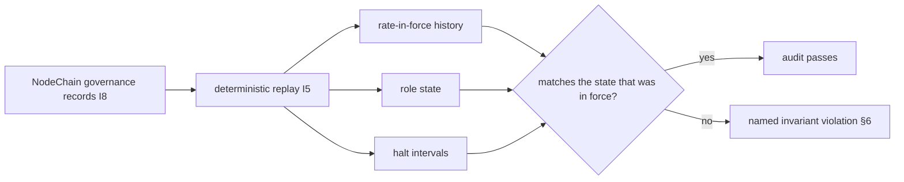

# governance_auditability.md

**Stands on:** I1 (PoT-gated origin), I3 (payment for confirmed work), I5 (determinism), I6 (no speculative surface), I7 (Eye: observe and veto), I8 (append-only causality). See `README.md` §1.

## 1. Purpose

Show that governance auditability is not a separate apparatus bolted onto the layer — it *is* the layer restated as records. Every governance decision is a NodeChain record appended before its effect (I8); every decision is reproducible from those records (I5); and the Eye's own log holds only observations and vetoes, **never a created value** (I7). Auditing governance is therefore the same act as replaying the record and checking it against the invariants.

---

## 2. The audit principle

Auditability here follows directly from I5 and I8 and needs no additional machinery.

- *Because* I8 appends every cause before its effect, every governance decision already exists as a record at the moment it takes effect. There is no decision that predates its own record, so there is nothing to reconstruct after the fact — the trail is the mechanism, not a copy of it.
- *Because* I5 makes every movement reproducible from recorded causes, replaying the governance records must yield exactly the parameter and role state that was in force. An auditor does not trust a summary; they replay the causes.

This replaces the old apparatus of Merkle snapshots, IPFS content hashes, off-chain export APIs, and vote-inclusion proofs. Those exist to prove that a mutable store was not tampered with. Here the store is append-only and every effect is derived from it (I8), so the proof is the replay itself.

---

## 3. The governance record set

Every governance act is one of a small, closed set of NodeChain record types. There are no others, because §2 of `governance_layer_overview.md` admits only bounding, assigning, and halting.

| Record | Emitted by | Effect | Stands on |
|---|---|---|---|
| `governance.paramSet` | Parameter Committee | Sets `COMMISSION_RATE` (within bounds) as the rate in force. | I5, I8 |
| `governance.roleSet` | Role Committee | Binds/rotates an oversight role to an identity. | I8 |
| `governance.flag` | any committee or the Eye | Records a suspected invariant breach (an observation). | I5, I8 |
| `governance.veto` | Eye only | Withholds acknowledgement of a step. | I7 |
| `governance.halt` / `governance.resume` | role committee **and** Eye | Enters/leaves read-only mode. | I2, I7, I8 |

None of these is a mint, a burn, or a payment; the governance record set contains no economic-emission record at all, because no role is a cause of a unit (I1) or of a payment (I3).

---

## 4. Every decision reproducible

The audit of governance is a deterministic replay (I5). Given the ordered governance records:

```
rateInForce(process P) = paramSet.to of the latest governance.paramSet recorded before P     [I5, I8]
roleState(at t)        = fold of governance.roleSet records recorded before t                 [I5, I8]
haltIntervals          = paired (governance.halt, governance.resume) records                  [I5, I8]
```

Each is a pure function of the recorded causes. Two independent auditors replaying the same NodeChain prefix compute the same rate history, the same role state, and the same halt intervals — because I5 guarantees the same causes yield the same effects on every node, every time. A discrepancy is not a matter of opinion; it is a broken invariant, and it is nameable (§6).



---

## 5. The Eye's log holds only observations and vetoes

The apex of governance is audited by the same rule that constrains it (I7): the Eye's log must contain **only** observations, flags, and vetoes — never a mint, a burn, a payment, or any created value.

*Because* the Eye has no primitive that appends an economic cause (`ai_oversight_hierarchy.md` §3), any economic record attributed to the Eye would be evidence of a violation, not of a legitimate act. *Therefore* the audit of the Eye is a simple exclusion test: scan the Eye's records; if any is a `mint`, `burn`, or `payment`, the invariant is broken. In a canon-valid history the test always passes, because the Eye can author none of those.

---

## 6. Integrity guarantees (each an invariant restated over the record)

| Guarantee | What the auditor checks | Invariant |
|---|---|---|
| No generative governance | No governance record is a mint, burn, or payment. | I1, I3 |
| Bounded parameter | Every `paramSet.to` is within the parameter's protocol bounds. | I5 |
| Recorded before effect | Every effect (rate in force, role bound, read-only mode) is preceded by its record. | I8 |
| Role-issued authority | Every acting `by` is a role, never an ARO holder. | I6 |
| Non-unilateral halt | Every `halt`/`resume` names a committee **and** the Eye. | I1, I5 |
| Eye discipline | The Eye's log contains only observations, flags, and vetoes. | I7 |
| Reproducibility | Replaying the records reconstructs the exact governance state. | I5 |

Each guarantee is the enforcement of one invariant over the recorded history; together they make the governance record *closed* — no reachable record set describes an act the invariants forbid.

---

## 7. What an auditor cannot find (because it has no object)

The audit will never surface a vote tally, a quorum count, a governance-token balance, a delegation link, or a proposal ballot — not because they are hidden, but because I6 leaves governance-by-holding with no object, so no such record is ever emitted (§3). An auditor searching for a `voteWeight` field finds none, and its absence is itself a canon check: a governance history that contained one would be describing a mechanism the model does not have.

---

## 8. Summary

Governance auditability is the invariant spine read backward over the record: every decision is a NodeChain record appended before its effect (I8), every decision replays to the same state (I5), authority is a role and never a holding (I6), no decision is generative (I1, I3), and the apex authors nothing but observations and vetoes (I7). The governance history is therefore as reproducible, and as closed, as the economic history it oversees.
