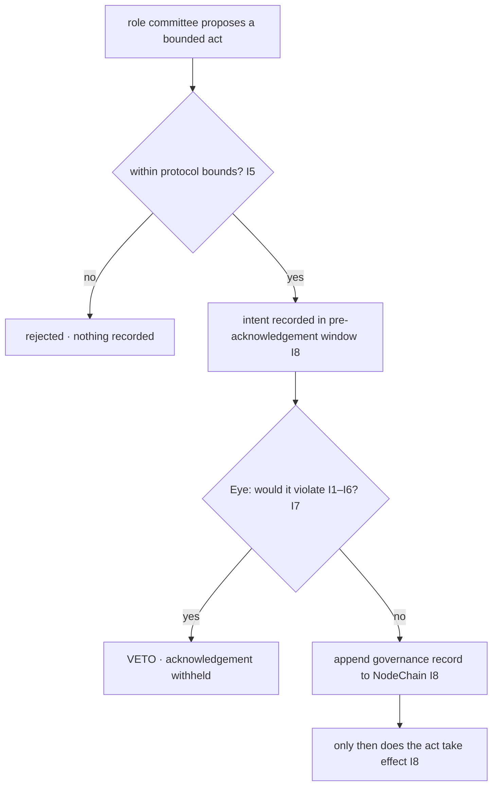

# governance_layer_overview.md

**Stands on:** I1 (PoT-gated origin), I3 (payment for confirmed work), I5 (determinism), I6 (no speculative surface), I7 (Eye: observe and veto), I8 (append-only causality). See `README.md` §1.

## 1. Purpose

Describe, in narrative, what governance *is* in AST once the system is closed under I1–I8: an authority that is **bounded** and **almost entirely negative**, whose every act is **recorded before it takes effect**, and which contains no object for a vote, a holding-based franchise, or a quorum. This document does not add mechanics; it states the position from which the other documents derive theirs.

---

## 2. The starting point: what is left for governance to do?

Begin from the invariants and ask what decisions remain.

- A unit of ARO has exactly one cause — a PoT verdict (I1). *Therefore* governance cannot decide a unit into existence; there is nothing to vote on that would create supply.
- A node is paid only for PoT-confirmed work, post-factum (I3). *Therefore* governance cannot decide a payment; a decision is not confirmed work.
- Every movement is reproducible from recorded causes (I5). *Therefore* governance cannot introduce a discretionary movement; anything it decides must itself be a recorded, replayable cause.

What remains is small and precise. Three kinds of act survive the invariants:

1. **Bounding** — choosing a value for the one free parameter, `COMMISSION_RATE`, but only *within* protocol-defined bounds (`parameter_governance.md`).
2. **Assigning** — placing and rotating oversight *roles* (`governance_roles_and_permissions.md`).
3. **Halting** — the apex Eye withholding acknowledgement of a step that would violate an invariant (`ai_oversight_hierarchy.md`).

Everything in this layer is one of these three. None of them is generative: none creates, destroys, or pays. This is the sense in which AST governance is **negative** — its strongest act is *stop*.

---

## 3. Bounded authority

Governance authority is bounded in two ways, both derived.

- **Bounded in range.** The only economic parameter it may move is `COMMISSION_RATE`, and only inside `rateBounds = [0, 0.01]`. *Because* a rate above bounds would let commission exceed the process amount and so contradict I3, the bound is not a policy preference — it is the outer edge of what keeps a causal chain intact. Nothing outside the bound is reachable, so no bounded act can break an invariant.
- **Bounded in kind.** It may not touch `DECIMALS`, `SYMBOL`, `BASE_UNIT`, the `NODE_SHARE`/`RESERVE_SHARE` split, the emission mechanism, or the invariants themselves. *Because* I1 fixes the one cause of a unit and I5 fixes reproducibility, changing any of these would not be a "parameter change" — it would be a change of the axioms, which governance has no standing to make.

---

## 4. Negative authority

The apex of the hierarchy is the All-Seeing Eye, and its power is *strictly negative* (I7): it observes every step and can veto (halt) any step that would violate I1–I6, but it initiates nothing — no mint, no burn, no payment, no parameter set.

*Because* I8 records every cause before its effect is acknowledged, there is a window between "cause recorded" and "effect acknowledged." In that window the Eye evaluates the cause against the invariants. *Therefore* the Eye can prevent an effect simply by refusing acknowledgement — it needs no power to author anything. Its apex position is not a casting vote; it is a veto and nothing else. The committees below it are likewise negative in the sense that none can create value; their positive acts are confined to bounding and assigning (§2).

---

## 5. Recorded before effect

Every governance decision — a bounded parameter set, a role assignment or rotation, a veto — is **appended to NodeChain before it takes effect** (I8) and is **reproducible** (I5).

- *Because* I8 requires the cause before the effect, a parameter cannot silently change: the `governance.paramSet` record exists first, and only then is the new value in force. The rate applied to any process is therefore always traceable to a record that predates that process.
- *Because* I5 requires reproducibility, replaying the recorded governance decisions must yield exactly the parameter and role state that was in force. A decision that could not be replayed to the same result would be a discretion outside the chain, which the model does not admit.

This is what replaces the old idea of an "immutable log" bolted onto a mutable process: here the record *is* the mechanism. There is no state that predates its own cause.

---

## 6. Why there is no vote, no holding-franchise, and no quorum

Each of these is not forbidden by fiat; each is a concept with **no object** in a system closed under I6.

- **No token-weighted vote.** I6 leaves *governance-by-holding/voting* with no referent. A vote weighted by holdings would make a held balance into a ballot — but a held balance is only retained payment for past confirmed work (I3), carrying no franchise. *Therefore* there is nothing for a vote to weigh, and no vote.
- **No governance token.** A separate governance asset would be a second speculative or franchise-bearing object. I6 admits no such object, and I1 admits no cause that could mint one. *Therefore* the token has no origin and no purpose here.
- **No holder franchise.** Ownership of ARO confers a claim to nothing but the value already earned; it grants no say over parameters or roles. Governance authority attaches to an *oversight role*, evaluated against invariants — not to an amount held.
- **No quorum.** Quorum is the threshold at which a body of voters becomes decisive. With no voters and no votes, there is no body to reach a threshold. A bounded parameter change is instead validated *deterministically* — is the value within bounds? — not by counting participants (`parameter_governance.md`).
- **No human quorum, founder override, or external overseer.** No single privileged authority exists, because I1 and I5 admit no privileged issuer and no discretion outside the recorded chain. A halt is engaged by the Eye's veto together with the responsible role committee, never by one person and never by an outside body.

---

## 7. The governance decision has one shape

Because §3–§5 apply to *every* act, every governance decision has the same three-guard shape:

**Bounded** (B), **vetoable** (D), **recorded-before-effect** (E→F). A rate change, a role rotation, and an emergency halt all pass through this same figure; the later documents only specialise it.

---

## 8. What this layer guarantees

- **Governance can break no causal chain.** Every act is bounded (§3), so no reachable governance state contradicts I1–I6.
- **Governance creates nothing.** No committee and not the Eye is a cause of a unit (I1) or of a payment (I3); the layer's authority is bounding, assigning, and halting only (§2, §4).
- **The record is complete and reproducible.** Every decision is appended before effect (I8) and replays to the same state (I5), so the governance history is as auditable as the economic history it oversees (`governance_auditability.md`).

---

## 9. Next

- `ai_oversight_hierarchy.md` — the apex Eye and the subordinate role committees, and the escalation path between them.
