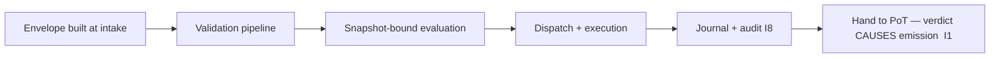

# TX Structure & Metadata

**Stands on:** I5 (determinism), I8 (append-only causality), I6 (no speculative surface), I1 (PoT-gated origin). See `README.md` §1.

## Purpose

This chapter defines the **single canonical shape** of a candidate-process record — the object every other document in this layer moves, validates, orders, executes, journals, and hands to PoT. A "transaction" (`tx`) in AST is precisely this: the record of one **candidate process** travelling the pipeline. When PoT renders `verified === 1` for it, that same record becomes a **confirmed process** whose verdict *causes* emission (I1). Until then it is a candidate and nothing has been minted, burned, or paid.

*Because* determinism (I5) requires that the same recorded inputs produce the same effects on every node, the representation of those inputs must be **uniform and unambiguous**. Therefore a candidate process is carried in one fixed envelope, regardless of which internal source raised it. This is the standard that makes reproducibility, replay-protection, and causal ordering (I8) possible at all.

---

## 1. The transaction envelope

Every candidate process is wrapped, at intake, into a normalized **envelope** with a strict schema. One envelope shape serves all internal action types (token operation, governance-committee decision, internal contract call, scheduled task). There is no separate shape for "external" actions because I6 admits no external ingestion — no bridge, cross-chain, or crypto-in envelope exists in this model.

```json
{
  "tx_id": "0x…",                     // globally unique id of this candidate process
  "channel": "token_ops",             // one of the fixed internal channels (§4)
  "source": "contract_emitter",       // a pre-registered internal source (§3)
  "received_at": "2026-01-14T03:14:52Z",
  "header": { … },                    // §2
  "meta_flags": { … },                // §3 of this doc / tx metadata flags
  "payload": {
    "type": "invoke",
    "target": "internal_contract.lock",
    "args": { "amount": "1000000", "token": "ARO" }
  },
  "auth_path": {
    "type": "internal_digest",        // service-identity signature, not an end-user key
    "digest": "b2c8fa0…"
  },
  "fingerprint": "0x…"                // §5 replay-proof identity
}
```

The envelope carries **only** internal, service-to-service identity (`auth_path`). *Because* AST has no public submission surface (`README.md` §6), there is no end-user key, wallet address, or external signature in the envelope.

---

## 2. The transaction header

The header holds the fields that ordering and determinism depend on. Each is derived from an invariant:

| Field | Meaning | Derived from |
|---|---|---|
| `tx_id` | Unique identity of the candidate process. | I8 — a cause must be uniquely nameable to be recorded before its effect. |
| `channel` | Which internal channel the candidate belongs to (§4). | I5 — channels make ordering deterministic per domain. |
| `priority_index` | Computed ordering key (never user-set). | I5 — ordering must be reproducible, so priority is computed from recorded factors, not asserted. |
| `ttl` | Bounded lifespan in the queue (see `tx_ttl_expiration.md`). | I5, I8 — a candidate cannot linger indefinitely and desynchronize replay. |
| `snapshot_ref` | The frozen state view the candidate is evaluated against. | I5 — deterministic evaluation requires a fixed baseline. |
| `nonce` | Monotone per-source counter. | I5, I8 — prevents re-application of a recorded cause (replay). |

No header field carries a market price, gas price, bid, or fee-market hint. *Because* I6 gives ARO no market price, there is nothing of that kind to record; the only charge that ever applies is the fixed `COMMISSION_RATE`, and it is applied by the Coin Engine at emission (I3), not carried in the envelope as a negotiable fee.

---

## 3. Meta-flags

`meta_flags` are additive, non-authoritative markers set by the pipeline (never by an external caller):

- `isolated` — the candidate must not co-execute with others touching the same state (I5: prevents non-deterministic races).
- `hold_before_exec` — the candidate depends on another candidate's completion.
- `emission_ready` — set **only** after validation completes; a required precondition for PoT hand-off, and by itself **not** an authorization to mint (I1 requires the verdict, not the flag).
- `trace` — mark this candidate for elevated audit retention (see `tx_trace_flags.md`).

`emission_ready` deserves emphasis: it means "the pipeline has done its part," not "emit." *Because* I1 makes the PoT verdict the sole cause of a unit, no flag the Processing Layer sets can substitute for that verdict.

---

## 4. Channels (fixed, internal)

A candidate is assigned exactly one **channel** by its internal source. The channel set is fixed and internal:

| Channel | Contains |
|---|---|
| `token_ops` | ARO transfers and the process-part mint/burn requests that a confirmed process will trigger. |
| `internal_contracts` | Deterministic internal contract calls (`emit_tx()` from one contract to another). |
| `governance` | Decisions of the **role-based AI oversight committee** (bounded-parameter changes), recorded before effect (I8). Not token-weighted voting — a held ARO balance confers no vote (I6). |
| `normalized_tx` | Internal, already-normalized candidate processes from other AST subsystems. |

There is **no** `bridge_io`, `cross_chain`, `swap`, or `vault`/`collateral` channel. *Because* I6 admits no external value and no mint-on-deposit, a channel for ingesting it would have no object — it is not omitted by policy, it is undefined by the model.

---

## 5. Fingerprint & replay-proof

Every envelope carries a **fingerprint**: a canonical hash of its identity-bearing fields.

```
fingerprint = H(channel ‖ source ‖ nonce ‖ canonical(payload))
```

*Because* I5 requires that a recorded cause is never applied twice (a second application would produce an effect with no fresh cause) and I8 records each cause exactly once, the fingerprint is the object the duplicate filter and replay guard key on (`tx_queue_handler.md`, `tx_hash_map_index.md`). A candidate whose fingerprint matches an already-recorded cause is rejected before it can produce a second effect.

---

## 6. Relationship to the rest of the layer



Every downstream document consumes this one envelope shape:

- `tx_validation_pipeline.md` proves the envelope well-formed and deterministic.
- `tx_queue_handler.md` orders envelopes by `priority_index` within `channel`.
- `tx_journal_writer.md` and `tx_audit_log_format.md` record the envelope's every step before acknowledgement (I8).
- `tx_hash_map_index.md` indexes the envelope's `fingerprint` and, once confirmed, its PoT hash.

The envelope is the vocabulary of the layer: fix it once here, and every other causal chain resolves against one representation.
