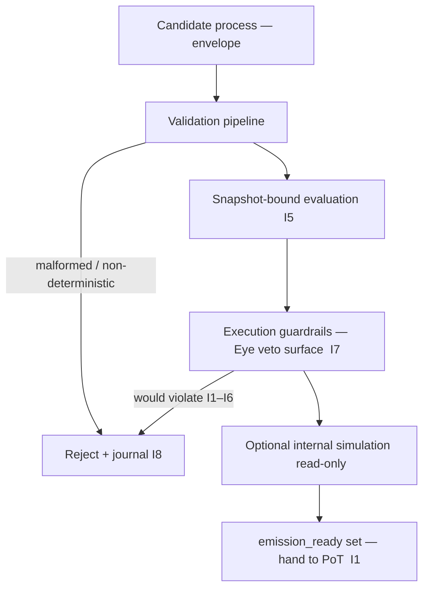

# TX Validation & Safety

**Stands on:** I5 (determinism), I7 (Eye observes and vetoes), I8 (append-only causality), I1 (PoT-gated origin), I6 (no speculative surface). See `README.md` §1.

## Purpose

This chapter states the **safety contract** of the Processing Layer: the complete set of proofs a candidate process must pass before it is allowed to reach PoT, where a verdict `verified === 1` will *cause* emission (I1). It is the overview that ties together the four safety documents — validation, guardrails, simulation, and failure modes — into one causal argument.

The argument is: *because* emission has exactly one cause (I1) and *because* every effect must follow a recorded cause (I8), the pipeline must guarantee that anything reaching PoT is (a) well-formed, (b) deterministic against a fixed state view, (c) free of any step that would violate I1–I6, and (d) fully recorded. Safety is not a filter bolted on; it is the precondition that makes a PoT verdict meaningful.

---

## 1. The safety pipeline (order of proofs)

Each stage either advances the candidate or **stops** it. A stop is never a substitution: no stage mints, burns, or pays. This is the Processing-Layer expression of I7 — every safety check is negative in power (it can halt), never positive (it cannot create).

---

## 2. Structural safety (validation)

Handled by `tx_validation_pipeline.md`. A candidate must present a well-formed envelope (`TX STRUCTURE & METADATA.md`), a valid internal service identity, and a nonce that has not been seen (replay-proof, §5 there). *Because* I5 requires reproducibility, any field that could make execution depend on something not recorded in the envelope or snapshot is rejected. Structural safety is the guarantee that **the same candidate means the same thing on every node**.

---

## 3. Determinism safety (snapshot binding)

Handled by `tx_state_snapshot_hook.md`. Every candidate is evaluated against a **read-only, frozen** view of state. *Because* I5 forbids any movement that is not reproducible from recorded inputs, evaluation may read only the snapshot — never a live clock, live entropy, or live mutable state. Determinism safety is the guarantee that **replaying the candidate yields the identical result**.

---

## 4. Invariant safety (guardrails — the Eye's veto surface)

Handled by `tx_execution_guardrails.md`. Guardrails run just before state mutation and **halt** any candidate whose next step would violate I1–I6. This is the operational placement of the All-Seeing Eye (I7) inside the pipeline. Guardrails are strictly negative: they reject, delay, or reroute-to-dry-run; they never author an emission or a payment.

There is no "emission quota" guardrail. *Because* I1 makes the PoT verdict the sole gate on emission and I6 leaves no object for a supply cap, a quota check would be a second discretionary gate that the invariants forbid. The guardrail that protects emission is therefore not "is the candidate under a quota?" but "does this step preserve I1–I6?".

---

## 5. Predictive safety (internal simulation)

Handled by `tx_simulation_mode.md`. Before a costly or state-sensitive candidate is executed for real, the pipeline may run it as an internal, read-only **dry-run** against a cloned snapshot. *Because* I5 guarantees determinism, a dry-run predicts the real execution exactly. Simulation touches no state, produces no PoT verdict, and authorizes nothing (I1) — it only informs the pipeline. It is internal-only: there is no external "preview API," because AST has no end-user surface (`README.md` §6).

---

## 6. Recorded safety (failure modes + journal)

Handled by `tx_failure_modes.md`, `tx_journal_writer.md`, `tx_audit_log_format.md`. Every rejection, veto, and abort is a **named** state and is appended to NodeChain *before* the candidate is acknowledged as failed (I8). *Because* the impossible states are named and rejected, they are auditable rather than merely improbable. Recorded safety is the guarantee that **a broken chain is visible, not silent**.

---

## 7. What "safe" is defined against

| Property proven safe | By | Invariant |
|---|---|---|
| No external value enters | Intake source registry (`tx_queue_handler.md`) | I6 |
| No candidate emits without a verdict | Validation → PoT hand-off | I1 |
| No non-reproducible execution | Snapshot binding + isolated contexts | I5 |
| No step violating I1–I6 proceeds | Guardrails (Eye veto) | I7 |
| No effect acknowledged before its cause | Journal / audit append-before-ack | I8 |
| No payment before confirmation | Payment happens only at emission, downstream | I3 |

Anything a candidate process could do that is *not* on this list has no object in the model. Notably, there is no batching or sharding "for jurisdiction," no "gas fee market," and no "collateral safety" — because I6 gives none of those a referent (see `tx_batching_and_sharding.md` for the canonical, namespace-based partitioning that replaces jurisdictional sharding).

---

## 8. Summary

Validation and safety together are the **precondition of a meaningful PoT verdict**. They ensure that when a candidate process reaches PoT, the only remaining question is the one PoT is designed to answer — was the work done? — and that whatever verdict follows, every cause behind it is already recorded (I8) and reproducible (I5). Safety here does not create trust; it removes every path by which an unconfirmed, non-deterministic, or invariant-violating candidate could reach emission.
