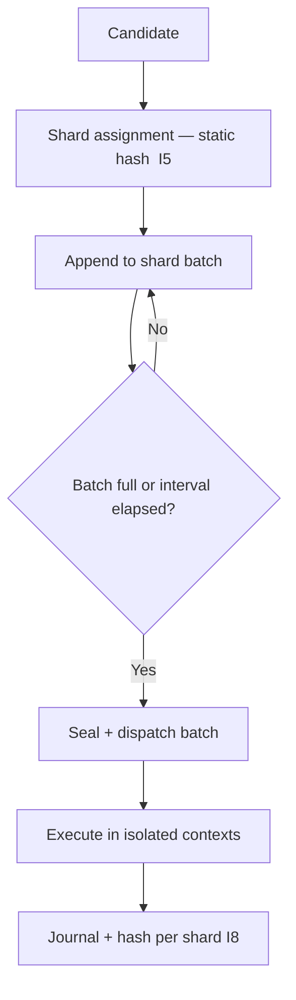

# tx_batching_and_sharding.md

## Module: Transaction Batching & Sharding

**Stands on:** I5 (determinism), I8 (append-only causality), I1 (PoT-gated origin), I6 (no speculative surface), I7 (Eye veto). See `README.md` §1.

## Overview

Batching groups candidate processes into a single execution bundle; sharding partitions processing across logical domains so bundles run in parallel. Together they are the layer's horizontal-scaling model. Both are **ordering and partitioning mechanics only** — they create no value, and the outcome of a batch or shard is identical to processing its candidates individually (I5). Emission remains gated solely on each candidate's own PoT verdict (I1).

*Because* I5 requires reproducibility, batching and sharding must be **deterministic partitions of recorded inputs**: a given queue state always yields the same batches on the same shards, on every node.

---

## Purpose (each derived)

| Purpose | Derived from |
|---|---|
| Higher throughput via parallel, isolated domains | I5 — parallelism is safe only when domains are deterministic and independent. |
| Fewer state-commit round-trips per candidate | I8 — recording is cheaper in ordered bundles, still append-only. |
| Isolation of conflicting candidates | I5 — prevents non-deterministic races. |
| Load distribution across node clusters | I5 — assignment is by a fixed hash, not discretion. |

Sharding is **not** for jurisdictional, geographic, or regulatory separation. *Because* I6 gives external-jurisdiction concepts no object in the model, a shard cannot represent a jurisdiction; shards are internal partitions of the processing namespace.

---

## Batching logic

| Rule | Description | Derived from |
|---|---|---|
| Max batch size | 512 candidates (default; bounded parameter). | I5 — a fixed bound keeps bundling reproducible. |
| Commit interval | Every 4 s or when the batch fills. | I5 — deterministic sealing point. |
| Same-domain grouping | Candidates touching the same namespace are grouped where possible. | I5 — minimizes state switching. |
| Isolation separation | `isolated` candidates are batched alone. | I5 — no concurrent state races. |
| Failure containment | One failed candidate does not invalidate the whole batch (§7). | I8 — each candidate's cause/effect is independent. |
| One process = one verdict | Batching never merges emissions; each candidate keeps its own PoT verdict. | I1 |

There is no "one emission trigger per batch" rule and no shared fee/gas accounting. *Because* I1 gives each process its own PoT-gated emission and I6 admits no fee market, a batch is purely an execution convenience — it neither pools emissions nor prices execution.

```json
{
  "batch_id": "BATCH-17432",
  "shard_id": "SH-04",
  "timestamp": 1720251001,
  "tx_count": 238,
  "tx_ids": ["TX-001", "TX-002", "…"],
  "domain": "internal_contracts"
}
```

---

## Sharding model

A **shard** is a logical partition of the processing namespace. Each shard runs its own isolated:

- state-snapshot context,
- candidate queue segment,
- batching mechanism,
- append-only audit and hash logs.

Shards are defined by **internal namespace**, never by geography or jurisdiction:

- **Token-namespace prefix** (e.g. an ARO sub-namespace → a shard),
- **Internal-contract namespace**,
- **Account-range hash partition** (`address → shard_id`).

```json
{
  "shard_id": "SH-01",
  "namespace_scope": ["internal_contracts.*"],
  "nodes": ["ND-12", "ND-15"]
}
```

A shard definition carries no `jurisdiction`, no `emission_ceiling`, and no `emission_control` field. *Because* I1 gates emission on the PoT verdict and I6 leaves no object for a supply cap, a shard cannot cap or control emission; it only partitions which candidates it processes.

---

## Shard assignment

A candidate is assigned by:

- **Static hash partitioning** (`address → shard_id`) — the primary, deterministic rule (I5), or
- **Namespace hint** from the envelope.

A candidate touches exactly one shard per execution. A candidate that would span shards is **deferred** and re-planned so that each execution is single-shard — there is no cross-shard bridge, because I6 admits no bridge of any kind and cross-shard atomicity would otherwise introduce a non-deterministic dependency.

---

## Processing flow



1. Candidate assigned to a shard by static hash.
2. Shard appends it to the active batch (if within bounds).
3. Batch seals on fill or interval.
4. Sealed batch dispatched to isolated execution contexts.
5. Results journaled and hash-mapped **per shard**, before acknowledgement (I8).
6. Each confirmed candidate independently reaches PoT; a verdict causes that candidate's emission (I1).

---

## Failure handling

If a candidate in a batch fails, only that candidate is rolled back (`tx_rollback_strategy.md`); the others proceed. *Because* I8 records each candidate's cause and effect independently, one failure cannot invalidate an unrelated candidate's already-recorded chain. The batch id and cause trace are appended to the audit log (I8).

---

## Shard synchronization

- Each shard maintains its own append-only snapshot chain (I8).
- Cross-shard consistency is verified by Merkle diffing of the recorded chains, read-only — never by a value-moving bridge (I6).
- A failed shard is quarantined and a standby node takes over its recorded segment; because state is reconstructible from NodeChain (I5), no candidate is lost.

---

## Integration points

- `tx_dispatch_engine` — routes candidates into the correct batch and shard.
- `tx_state_snapshot_hook` — supplies each shard's isolated frozen state.
- `tx_journal_writer` — records batch id and shard context (I8).
- `tx_validation_pipeline` — validates each candidate before it enters a batch.
- PoT engine — renders each candidate's verdict; a verdict causes that candidate's emission (I1).

---

## Developer notes

- The batching engine runs on an async path to avoid blocking execution; sealing points remain deterministic (I5).
- Shard definitions are bounded parameters, hot-reloadable, set by the role-based committee, recorded before effect (I8) — never by ARO holdings (I6).
- A batch is persisted before dispatch so it is reconstructible after a crash (I5).
- Per-shard hashes include the shard prefix to avoid collisions across shards (I8).
