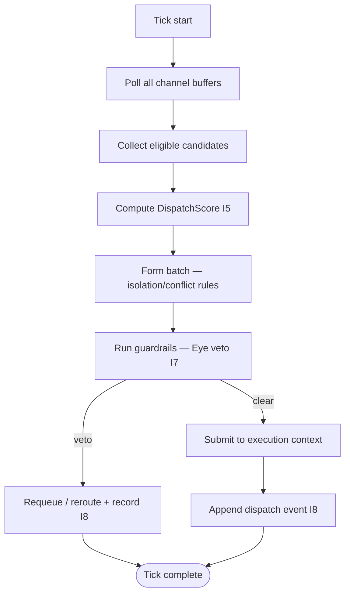

# tx_dispatch_engine.md

## Module: Transaction Dispatch Engine

**Stands on:** I5 (determinism), I7 (Eye veto), I8 (append-only causality), I1 (PoT-gated origin). See `README.md` §1.

## 1. Purpose

The dispatch engine moves ready candidate processes from the queue (`tx_queue_handler.md`) into isolated execution contexts (`tx_execution_contexts.md`). It is the central scheduler of the layer. It enforces **deterministic selection**, channel-fair ordering, and concurrency-safe hand-off. It initiates nothing economic — it schedules work so that, after execution and PoT confirmation, a verdict `verified === 1` can *cause* emission (I1).

---

## 2. Dispatch goals (each derived)

| Goal | Derived from |
|---|---|
| Reproducible selection order across nodes | I5 — the same recorded queue state must yield the same dispatch order. |
| No candidate reaches execution while it would violate I1–I6 | I7 — guardrails (the Eye) can veto before hand-off. |
| Every dispatch decision recorded before acknowledgement | I8 — the cause (selection) precedes the effect (execution). |
| No starvation | I5 — fairness is a fixed, reproducible rule, not a discretionary override. |

---

## 3. Dispatch loop

The engine runs as a scheduler in fixed **ticks** (default 50 ms). At each tick it:

1. **Polls** all channel buffers (prefetching overflow-pool entries when needed).
2. **Collects** eligible candidates (valid TTL, not held, locks available).
3. **Scores** each with the deterministic `DispatchScore` (§4).
4. **Forms** a batch honoring isolation and conflict rules (`tx_batching_and_sharding.md`).
5. **Checks** guardrails — the Eye's veto surface (I7).
6. **Submits** the batch to available execution contexts, recording the hand-off (I8).

*Because* the tick length, the score, and the fairness rule are all fixed and computed from recorded values, one node's dispatch order is reproducible by any other (I5).



---

## 4. DispatchScore (computed, reproducible)

The score is a fixed weighted composite of **recorded** factors:

| Factor | Weight | Description |
|---|---|---|
| `priority_class` | 0.40 | critical / high / medium / low (assigned by source). |
| `enqueue_age` | 0.25 | How long the candidate has waited. |
| `isolation_mode` | 0.20 | Penalized for concurrency risk. |
| `channel_domain` | 0.10 | Domain-local grouping to minimize state switching. |
| `historical_pattern` | 0.05 | Optional prior-outcome factor from recorded history. |

The weights are constants; every input is read from NodeChain or the candidate envelope. *Because* nothing in the score is discretionary or live, replaying the queue produces the identical score and therefore the identical order (I5).

---

## 5. Channel fairness (fixed rule, no discretion)

To prevent starvation, each channel has a fixed `dispatch_weight` and receives a guaranteed minimum of slots per tick via weighted round-robin:

```toml
[dispatch.weights]
normalized_tx      = 3
internal_contracts = 2
token_ops          = 2
governance         = 1

[settings]
tick_interval_ms  = 50
max_slots_per_tick = 8
```

These weights adapt over time only through the fixed decay formula, so adaptation is itself reproducible (I5). Fairness here is purely ordering: no ARO is created or paid by dispatch. Payment happens only downstream, and only for PoT-confirmed work (I3).

---

## 6. Dispatch criteria

To be dispatched, a candidate must: not be held; have a valid TTL; hold all declared locks; and clear guardrails (`tx_execution_guardrails.md`). A candidate failing any criterion is requeued or delayed and the reason recorded (I8). A candidate whose next step would violate I1–I6 is vetoed by the Eye (I7) — it is stopped, never "corrected" by a mint or payment.

---

## 7. Hand-off to execution context

Selected candidates are submitted to execution contexts, which are isolated, deterministic, resource-bounded runtimes (`tx_execution_contexts.md`). The engine performs: resource-budget assignment (a deterministic instruction/memory budget — **not** a priced fee; I6 admits no market price to meter against), lock registration, and receipt awaiting. All hand-off actions are recorded with monotonic timestamps before execution begins (I8).

Concurrency safety:

- each channel buffer has a dispatch mutex;
- the execution-context pool is bounded by a semaphore;
- isolated candidates are dispatched alone, after acquiring their locks.

---

## 8. Failure handling

If hand-off fails (e.g. a context crash mid-load), the candidate is marked `dispatch_failed`, its score temporarily decayed, and it re-enters a bounded retry-backoff window; the cause is recorded (I8). If failures exceed the threshold, the candidate is quarantined and routed to `tx_failure_modes.md`. No partial economic effect can occur: nothing was minted or paid, because emission is gated on a PoT verdict that has not been rendered (I1).

```json
{
  "tick": 438492,
  "timestamp": "2026-01-14T22:01:41.118Z",
  "dispatched": [
    { "tx_id": "0xA294…F6C1", "channel": "token_ops", "context_id": "ctx_0993f", "priority_index": 827, "result": "submitted" }
  ],
  "requeued": [
    { "tx_id": "0xFFAC…23A2", "reason": "expired_ttl" }
  ]
}
```

Dispatch event logs are system-internal and recorded before the next tick is acknowledged (I8). There is no external interface to them (`README.md` §6).

---

## 9. Advanced policies (bounded, role-based)

The engine supports overrides, each bounded so it cannot break a causal chain:

- **Channel exclusion** — temporarily pause a saturated channel; paused candidates keep their recorded order (I5).
- **Emergency drain** — force-dispatch a critical channel (e.g. `governance` halt decisions).
- **Context-affinity binding** — bind a candidate class to a context pool for locality.

These are decisions of the role-based node/oracle committee, observed by the Eye (I7), recorded before effect (I8). They are **not** decided by ARO holdings — a held balance confers no dispatch influence (I6). No override can cause an emission or a payment; only a PoT verdict can (I1).

---

## 10. Summary

The dispatch engine is the deterministic bridge from queue to execution: reproducible selection (I5), Eye-vetoed hand-off (I7), every decision recorded before acknowledgement (I8). It creates no value; it orders work so that a later PoT verdict can cause emission (I1).
