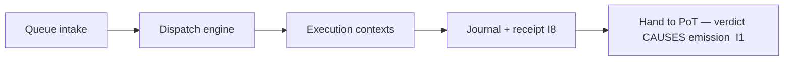
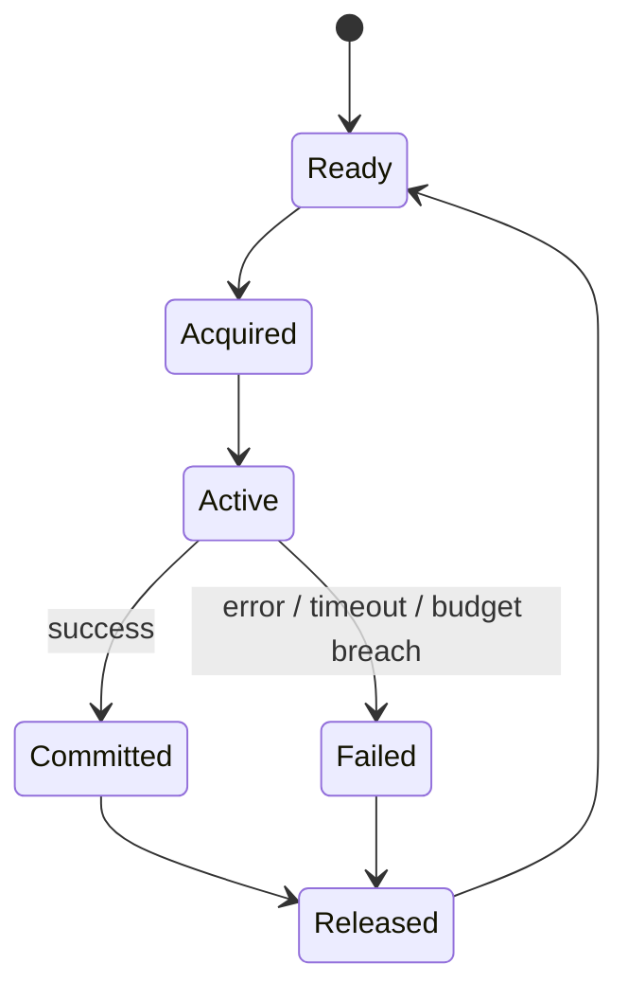

# tx_execution_contexts.md

## Module: Transaction Execution Contexts (TXEC)

**Stands on:** I5 (determinism), I8 (append-only causality), I6 (no speculative surface), I7 (Eye veto), I1 (PoT-gated origin). See `README.md` §1.

## 1. Purpose

An execution context is an **isolated, deterministic, resource-bounded runtime** that executes one candidate process after dispatch. It is the last isolation boundary before a candidate's result is journaled and handed to PoT. Its guarantees exist to satisfy I5: every execution must be reproducible from recorded inputs, on every node, every time.



An execution context computes state effects and produces a receipt; it does **not** mint, burn, or pay. Emission remains gated on the later PoT verdict (I1).

---

## 2. Context types

The context engine selects a type deterministically from the candidate's characteristics:

| Type | Runtime profile | Use case |
|---|---|---|
| `lightweight_vm` | In-process deterministic sandbox (WASM) | Fast internal contract calls |
| `native_worker` | OS thread with a restricted syscall set | System-level candidates |
| `containerized` | Isolated microkernel/WASM VM | Full-state, high-assurance candidates |

The selection function reads only recorded candidate fields, so the chosen type is reproducible (I5).

---

## 3. Context lifecycle



| Phase | Description |
|---|---|
| `Ready` | Idle context in pool. |
| `Acquired` | Locked by the dispatcher, pending candidate load. |
| `Active` | Executing in an isolated runtime. |
| `Committed` | Execution succeeded; state diff recorded (not yet applied to global state until PoT confirms). |
| `Failed` | Execution failed; all changes discarded via rollback (`tx_rollback_strategy.md`). |
| `Released` | Context reset and returned to pool. |

Each context has a unique `context_id`; every phase transition is recorded before it is acknowledged (I8).

---

## 4. Execution flow

1. **Load** — the candidate payload is loaded into the acquired context.
2. **Bootstrap** — sender, target scope, recorded balances, and nonce are initialized **from the frozen snapshot** (`tx_state_snapshot_hook.md`), never from live state (I5).
3. **Execute** — instructions run step by step under a fixed resource budget (§6).
4. **Meter** — instruction and memory consumption are counted deterministically (§6).
5. **Isolate** — all changes are sandboxed as a state diff until commit.
6. **Commit or rollback** — on success, the diff is recorded and a receipt emitted; on failure, all changes are discarded.
7. **Recycle** — the context is reset and returned to the pool.

---

## 5. Isolation rules (each enforcing determinism)

- **Memory isolation** — no memory is shared across contexts; each candidate runs in a clean space, cleared after use.
- **No external communication** — a context may not initiate or accept any network request, external I/O, or arbitrary syscall. *Because* I5 forbids inputs that are not recorded, and I6 admits no external system to talk to, a context that reached outside would introduce a non-reproducible, external cause. Any such attempt is blocked and the candidate failed.
- **Deterministic time & randomness** — time and any random values are injected from the deterministic runtime layer, seeded from recorded inputs. No system clock or hardware entropy is exposed (I5).
- **Execution timeout** — a hard cap `tx_exec_timeout_ms` bounds each candidate; an overrun triggers termination and rollback.
- **Single-threaded** — execution within a context is single-threaded, so instruction order (and therefore the result) is reproducible (I5).
- **Immutable runtime parameters** — bounded parameters (e.g. `COMMISSION_RATE`) are snapshotted at load and cannot change mid-execution (I5).

---

## 6. Resource metering (deterministic, priceless)

Each context runs under a fixed budget:

| Resource | Meaning |
|---|---|
| `cpu_time_ms` | Wall-clock ceiling per candidate. |
| `memory_mb` | Memory ceiling per candidate. |
| `instr_budget` | Maximum instruction count (bounds loops; guarantees termination). |
| `exec_units` | Deterministic count of resources consumed, computed from the recorded instruction trace. |

`exec_units` is a **count, not a price**. *Because* I6 gives ARO no market price, there is no fee market to meter against and no "gas price" to pay — execution cost is a reproducible resource count used only to enforce budgets and detect overruns (I5). The only charge that ever applies to a confirmed process is the fixed `COMMISSION_RATE`, applied by the Coin Engine at emission (I3), never inside a context.

A breach of any budget halts execution immediately, marks the context `Failed`, discards all changes (rollback), and appends a fault record (I8).

---

## 7. Execution failure modes

| Failure | Description |
|---|---|
| `budget_exhausted` | Candidate exceeded `instr_budget` or `exec_units`. |
| `timeout` | Candidate exceeded `cpu_time_ms`. |
| `invalid_opcode` | Attempted illegal instruction. |
| `memory_overflow` | Exceeded `memory_mb`. |
| `logic_exception` | Deterministic runtime error (e.g. divide-by-zero). |
| `external_call_blocked` | Forbidden external I/O or syscall attempt (I6). |

All failures trigger full rollback; isolation guarantees no partial state leaks. Failures are classified in `tx_failure_modes.md` and recorded (I8).

---

## 8. Receipts

Each context emits a **receipt**:

```json
{
  "tx_id": "0xA85F2B…",
  "context_id": "ctx_2381",
  "status": "success",
  "exec_time_ms": 19,
  "exec_units": 31482,
  "memory_peak_mb": 22.3,
  "state_diff": { "accounts": { "…": "…" } },
  "logs": [ "Transfer:0xA → 0xB : 12500000000 arx" ],
  "revert_reason": null
}
```

Amounts are recorded in `arx` (integers, `DECIMALS = 9`). The receipt is:

- written to `tx_journal_writer.md` (append-only, I8),
- indexed by `tx_hash_map_index.md`,
- the deterministic evidence PoT reads when rendering its verdict (I1, I5).

A receipt records what happened; it is not itself an emission. The state diff is applied only when the process's PoT verdict confirms it (I1).

---

## 9. Summary

Execution contexts are the layer's final isolation and determinism boundary: clean memory, no external cause, deterministic time and randomness, priceless resource metering, full rollback on any breach, and a reproducible receipt. They compute effects so that PoT can confirm the work and thereby *cause* emission (I1) — they never create value themselves, and the Eye can veto any step that would violate I1–I6 (I7).
