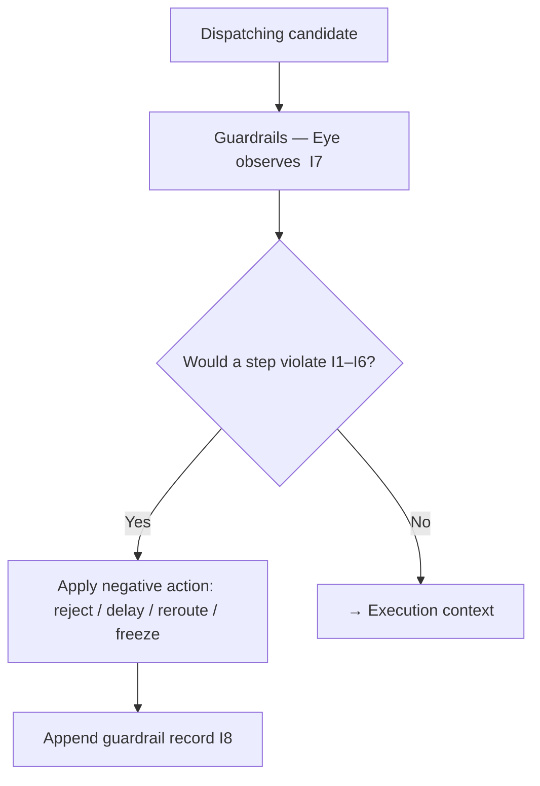

# tx_execution_guardrails.md

## Module: Transaction Execution Guardrails

**Stands on:** I7 (All-Seeing Eye — observe and veto, never initiate), I1 (PoT-gated origin), I6 (no speculative surface), I5 (determinism), I8 (append-only causality). See `README.md` §1.

## Overview

Guardrails are the **operational placement of the All-Seeing Eye inside the pipeline** (I7). They run during dispatch, immediately before state mutation, and can **halt** any candidate process whose next step would violate I1–I6. Their power is strictly negative: they reject, delay, or reroute-to-dry-run. *Because* I7 forbids the Eye from initiating anything, **a guardrail never mints, burns, pays, or substitutes a value for a failed check** — it only stops.

This is the last stop before a candidate's effects are computed; downstream, only a PoT verdict can cause emission (I1).

---

## Purpose (each derived)

| Purpose | Derived from |
|---|---|
| Halt any step that would violate I1–I6 before its effect is acknowledged | I7, I8 |
| Prevent a candidate from mutating state non-deterministically | I5 |
| Keep external causes out of execution | I6 |
| Preserve the closure "only a PoT verdict emits" | I1 |

---

## When guardrails trigger

A guardrail activates when a candidate's next step would breach an invariant. Each trigger names the invariant it defends:

| Condition | Action | Invariant defended |
|---|---|---|
| Attempt to read live/external state or perform external I/O | Reject | I6, I5 |
| Non-deterministic input detected (live clock/entropy) | Reject | I5 |
| Candidate references a non-internal / external source | Reject | I6 |
| Execution-path anomaly vs. dry-run prediction | Reroute to `tx_simulation_mode` | I5 |
| Referenced internal token state is locked/frozen | Reject / freeze target | I5, I7 |
| Node time desync beyond bound | Hold until resynced | I5 |
| Step would mint/pay without a PoT verdict | Veto (halt) | I1 |

Note what is **absent**: there is no "emission quota breach" trigger. *Because* I1 gates emission solely on the PoT verdict and I6 leaves no object for a supply cap, a quota does not exist to breach — the guardrail that protects emission is "does this step preserve I1?", not "is a quota exceeded?".

---

## Runtime architecture

1. A candidate enters `tx_dispatch_engine`.
2. The guardrail module observes on the pre-commit path (the Eye watches every step, I7).
3. A pre-commit hook evaluates the candidate's next step against I1–I6, reading only the frozen snapshot (I5).
4. If a violation is found, exactly one negative action is applied:
   - **Reject**, **Delay**, **Reroute-to-dry-run**, **Flag**, or **Freeze target**.
5. Otherwise the candidate passes to the execution context.



---

## Actions (all negative)

| Action | Description |
|---|---|
| **Reject** | Immediate halt with an error code; the candidate mutates nothing. |
| **Delay** | Candidate moved to a lower-priority window and re-evaluated. |
| **Reroute** | Candidate sent to `tx_simulation_mode` for a read-only shadow run. |
| **Flag** | Candidate marked for elevated audit retention (`tx_trace_flags.md`). |
| **Freeze target** | The affected internal state target is temporarily locked. |

Every action is a *stop* or a *defer*; none creates or moves value. This is I7 made concrete.

```json
{
  "tx_id": "TX-7743-RISK",
  "status": "rejected",
  "error": { "code": "GUARDRAIL_EXTERNAL_CALL_BLOCKED", "message": "candidate attempted external I/O" },
  "timestamp": 1720249442,
  "guardrail_trigger": true
}
```

---

## Configuration (bounded, role-based)

Guardrail rules are policy-driven and hot-reloadable, but bounded so no rule can break a causal chain:

```json
{
  "rule_id": "GR-0032",
  "match": { "source": "external", "external_io": true },
  "action": "reject",
  "invariant": "I6"
}
```

Rule changes are decisions of the role-based node/oracle committee, observed by the Eye (I7) and recorded before effect (I8). They are **not** decided by ARO holdings — a held balance confers no rule-setting power (I6). No rule can grant a candidate the ability to mint or be paid; only a PoT verdict emits (I1).

---

## Integration points

- `tx_dispatch_engine` — guardrails intercept on the pre-commit path.
- `tx_validation_pipeline` — may reinforce a rejection surfaced earlier.
- `tx_simulation_mode` — destination for reroute-to-dry-run.
- `tx_failure_modes` — maps a veto to a named failure.
- `tx_audit_log_format` — every guardrail action appended before acknowledgement (I8).

---

## Security notes

- Guardrail logic cannot be bypassed; there is no external input path (`README.md` §6).
- Rule changes are gated by the role-based committee, never by a single privileged authority (I1/I5 admit no privileged issuer).
- Every triggered guardrail records: node id, timestamp, candidate fingerprint, rule id, and the invariant defended — appended before acknowledgement (I8) and immutable thereafter.

---

## Developer notes

- Guardrails run **after validation** but **before execution**.
- No rollback is needed for a vetoed candidate: a stopped candidate never mutated state.
- Guardrails are stateless except for node-local counters used to detect anomalies; those counters are derived from recorded values so their effect is reproducible (I5).
- A guardrail's only outputs are *observations* and *vetoes* — never a mint, burn, or payment. If a guardrail record ever contained one, that would itself be an I7 violation and is rejected by audit.
