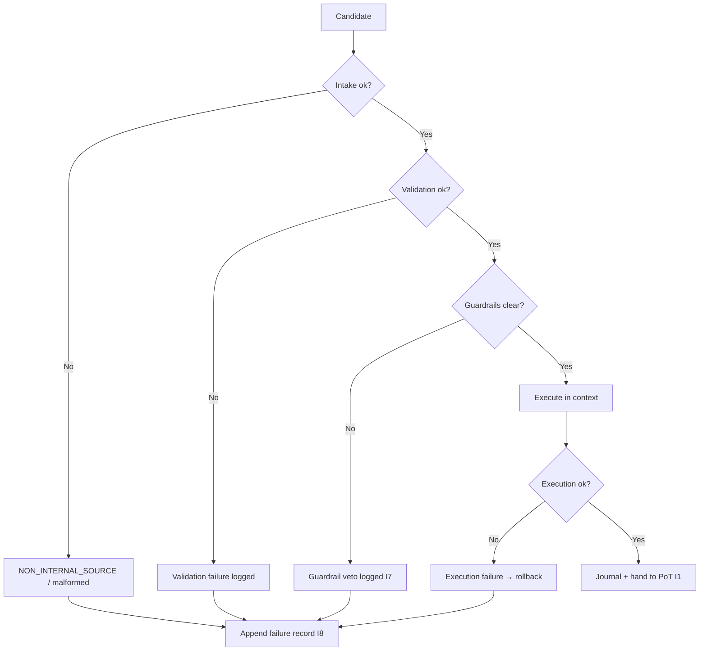

# tx_failure_modes.md

## Module: Transaction Failure Modes

**Stands on:** I5 (determinism), I8 (append-only causality), I1 (PoT-gated origin), I6 (no speculative surface), I7 (Eye veto), I3 (payment for confirmed work). See `README.md` §1.

## Overview

This module names the complete taxonomy of ways a candidate process can fail to reach PoT confirmation, and the deterministic handling of each. *Because* I8 requires every cause recorded, a failure is a cause too: naming the impossible and broken states makes them **auditable and rejectable** rather than merely improbable. Every failure code below is defined so a broken causal chain is *nameable*, which is the same discipline the Coin Engine applies to its own failure codes (`01_coin_engine/burn_and_mint_rules.md` §6).

A failed candidate produces **no economic effect**: nothing was minted, burned, or paid, because emission is gated on a PoT verdict that a failed candidate never obtains (I1), and payment follows only confirmed work (I3).

---

## Failure categories

| Category | Description | Invariant |
|---|---|---|
| **Intake** | Candidate came from a non-internal source or malformed envelope. | I6, I5 |
| **Validation** | Candidate fails schema, identity, or determinism checks. | I5 |
| **Guardrail (veto)** | The Eye halted a step that would violate I1–I6. | I7 |
| **Simulation** | Dry-run revealed an invariant-violating path. | I5, I7 |
| **Execution** | Deterministic runtime error or budget breach during isolated execution. | I5 |
| **System** | Infrastructure or snapshot fault. | I5 |

---

## Canonical error codes

| Code | Category | Description | Invariant |
|---|---|---|---|
| `NON_INTERNAL_SOURCE` | Intake | Candidate references an external/bridge/deposit origin. | I6 |
| `INVALID_FIELD_FORMAT` | Validation | Malformed field in the envelope. | I5 |
| `MISSING_REQUIRED_FIELD` | Validation | Required envelope field absent. | I5 |
| `SIGNATURE_VERIFICATION_FAILED` | Validation | Service-identity digest invalid. | I5, I8 |
| `INSUFFICIENT_BALANCE` | Validation | Referenced amount exceeds recorded balance. | I5 |
| `REPLAY_DETECTED` | Validation | Candidate re-applies an already-recorded cause. | I5, I8 |
| `TOKEN_STATE_LOCKED` | Guardrail | Referenced internal token state is frozen. | I5, I7 |
| `GUARDRAIL_EXTERNAL_CALL_BLOCKED` | Guardrail | Candidate attempted external I/O. | I6, I7 |
| `MINT_WITHOUT_VERDICT` | Guardrail | A step would emit without a PoT verdict. | I1, I7 |
| `SIMULATION_FAILED` | Simulation | Dry-run revealed an invalid path. | I5 |
| `EXEC_BUDGET_BREACH` | Execution | Candidate exceeded its instruction/resource budget. | I5 |
| `STATE_MUTATION_ERROR` | Execution | State diff could not be committed safely. | I5 |
| `SNAPSHOT_ERROR` | System | Snapshot could not be forked or validated. | I5 |
| `NODE_TIME_DESYNC` | System | Validating node time out of sync. | I5 |

Note the absence of any "emission quota" or "jurisdictional ban" code. *Because* I1 gates emission on the verdict alone and I6 leaves no object for a supply cap or a jurisdiction, those failures are not representable; the emission-protecting failure is `MINT_WITHOUT_VERDICT` (I1), and the ingestion-protecting failure is `NON_INTERNAL_SOURCE` (I6).

---

## Failure lifecycle



1. **Detected** — inside intake, validation, guardrails, or execution.
2. **Recorded** — with `tx_id`, `timestamp`, `node_id`, `failure_code`, appended before acknowledgement (I8).
3. **Mitigated** — rollback if any state was touched (`tx_rollback_strategy.md`); otherwise reject or re-queue.
4. **Traced** — flagged for audit (`tx_trace_flags.md`).

---

## Error response format

```json
{
  "tx_id": "TX-9077-FAIL",
  "status": "rejected",
  "error": {
    "code": "SIMULATION_FAILED",
    "message": "dry-run reached an invariant-violating path",
    "category": "simulation",
    "invariant": "I5",
    "node_id": "ND-04",
    "timestamp": 1720250043
  }
}
```

---

## Traceability & analytics

All failures carry `trace=true` and are classified into recorded metrics:

- per-node failure rate,
- top failure codes (7d / 30d / YTD),
- guardrail-veto counts by invariant defended,
- replay-attempt counts.

Because every failure is recorded (I8) and reproducible (I5), these metrics are computed from NodeChain, not estimated.

---

## Integration

| Module | Role |
|---|---|
| `tx_validation_pipeline` | Detects and reports validation failures. |
| `tx_execution_guardrails` | Reports guardrail vetoes (I7). |
| `tx_simulation_mode` | Reports predicted failures. |
| `tx_journal_writer` | Records failures to the per-candidate journal (I8). |
| `tx_rollback_strategy` | Engaged when a failure occurs after state was touched. |

---

## Developer guidelines

- Every new module must register its rejectable/fatal codes here, each mapped to the invariant it defends.
- Each code carries a human-readable message, a category, and a retryable/permanent indicator.
- Test coverage must include failure injection, error propagation, and audit-record creation.
- A failure code names a broken chain; it never authorizes a compensating mint or payment (I1, I3, I7) — the response to a broken chain is a **stop and a record**, never a substitution.

---

## Version history

| Version | Date | Changes |
|---|---|---|
| 2.0 | 2026-01-14 | Canon rewrite: codes derived from invariants; quota/jurisdiction codes removed as concepts with no object; `MINT_WITHOUT_VERDICT` and `NON_INTERNAL_SOURCE` added. |
