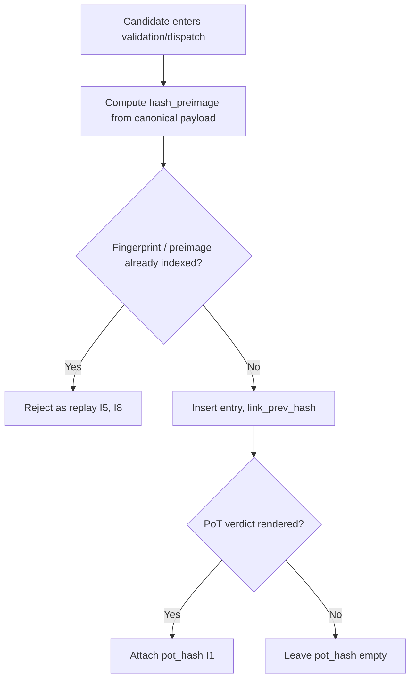

# tx_hash_map_index.md

## Module: Transaction Hash Map Index

**Stands on:** I8 (append-only causality), I5 (determinism), I1 (PoT-gated origin). See `README.md` §1.

## Overview

The hash map index is the fast, bi-directional map between a candidate process (`tx_id`), its input-payload hash (`hash_preimage`), its PoT hash anchor (`pot_hash`, present only after confirmation), and its NodeChain linkage. It is the lookup surface that lets any node verify a candidate's lineage and reconstruct its causal chain from recorded causes (I5, I8). It stores hashes only — it moves no value and gates nothing economic.

*Because* I5 requires that a recorded cause is never applied twice and I8 records each cause exactly once, the index is also the surface on which **replay defense** rests: a fingerprint or PoT hash already present names an already-recorded cause.

---

## Purpose

- Maintain a bi-directional mapping between `tx_id` and its cryptographic hashes.
- Index PoT anchors so a confirmed process's emission can be traced to its cause (I1).
- Let nodes verify cross-node hash consistency (I5).
- Support replay defense (a repeated cause is detectable, I8).
- Provide rapid lookup by hash or by candidate id.

---

## Core index fields

| Field | Description |
|---|---|
| `tx_id` | Candidate process identifier. |
| `hash_preimage` | Hash of the candidate's canonical input payload. |
| `pot_hash` | PoT anchor hash — present **only** once PoT has rendered a verdict (I1). |
| `node_id` | Node where the hash was computed. |
| `emission_epoch` | Epoch in which the candidate was sealed. |
| `chain_pos` | NodeChain append position (cause ordering, I8). |
| `snapshot_ref` | State snapshot the candidate was bound to. |
| `link_prev_hash` | Previous candidate hash in the node's linear chain. |

```json
{
  "tx_id": "TX-4513-ARC",
  "hash_preimage": "0x61f08c9a…",
  "pot_hash": "0x933abe87…",
  "node_id": "ND-11",
  "emission_epoch": 194,
  "chain_pos": 90233,
  "snapshot_ref": "SS-194-2",
  "link_prev_hash": "0xa3bbd291…"
}
```

A `pot_hash` appears **only after** a PoT verdict. *Because* I1 makes the verdict the sole cause of a unit, the presence of a PoT hash in the index is the recorded evidence that emission was caused — never the cause itself.

---

## Mapping logic



1. On entry, `hash_preimage` is computed from the canonical payload schema.
2. If the preimage/fingerprint is already present, the candidate is a replay and is rejected (I5, I8).
3. Otherwise an entry is written and linked to `link_prev_hash`.
4. If and when PoT confirms, `pot_hash` is attached to the entry.

---

## Query patterns

- `getByTxId(tx_id)`
- `getByPoTHash(pot_hash)`
- `getChainFrom(tx_id, depth=N)`
- `verifyPoT(tx_id) → boolean` (true only if a `pot_hash` is present, i.e. a verdict exists — I1)
- `compareHashLineageAcrossNodes(tx_id, node_ids[])`

---

## Integrity & synchronization

- Each entry is signed by the node that computed it.
- The full index can be checkpointed and snapshotted.
- No duplicate `tx_id` or `pot_hash` is permitted — enforced at insertion (replay defense, I5, I8).
- Mismatched hashes across nodes trigger the synchronization/fork-alert protocol; because state is reconstructible from recorded causes (I5), the discrepancy is resolved by recomputation.
- Entries are immutable once confirmed (I8).

---

## Integration points

| Module | Purpose |
|---|---|
| `tx_journal_writer` | Supplies hash preimages and processing outcomes. |
| PoT engine | Supplies confirmed PoT hashes and validator references (I1). |
| `tx_audit_log_format` | Records hash mismatches or anomalies. |
| `tx_state_snapshot_hook` | Supplies the snapshot reference per candidate. |

---

## Developer notes

- Hashes follow the canonical encoding (hash of sorted, canonicalized JSON fields), so any node recomputes them identically (I5).
- No duplicate `tx_id` or `pot_hash` is allowed — enforced by the insertion layer.
- The in-memory cache is refreshed each epoch to avoid stale references.
- Index diffs may be batch-exported for external notarization as **hash roots only** — never as a value transfer, because I6 admits no external value movement.
