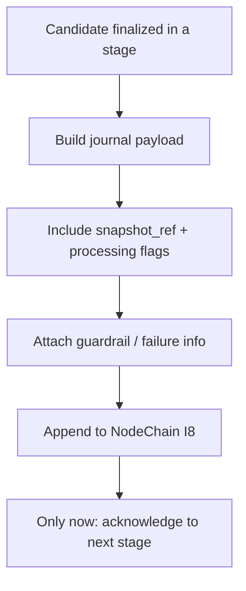

# tx_journal_writer.md

## Module: Transaction Journal Writer

**Stands on:** I8 (append-only causality), I5 (determinism), I1 (PoT-gated origin), I7 (Eye veto). See `README.md` §1.

## Overview

The journal writer creates an **append-only, per-candidate record** of every candidate process the layer touches — validated, executed, rejected, or aborted. It is the direct implementation of I8 for this layer: every cause is appended to NodeChain **before** its effect is acknowledged to the next stage. The journal is what makes each candidate's history reproducible (I5) and each broken chain visible rather than silent.

The journal is **not** the emission ledger; emission is caused by a PoT verdict in the Coin Engine (I1). The journal is the recorded, chronological trail of processing activity that the Coin Engine and the auditors read.

---

## Purpose

- Record, tamper-evident, every candidate's lifecycle step.
- Capture validation results, execution receipts, guardrail actions, and failure reasons.
- Provide the input auditors replay to confirm the invariants (I5).
- Carry the recorded causes PoT relies on to render a verdict (I1).

---

## What gets journaled

| Field | Description |
|---|---|
| `tx_id` | Candidate process identifier. |
| `chain_pos` | Append position in NodeChain (monotone; establishes cause-before-effect). |
| `timestamp` | Processing timestamp. |
| `status` | One of `validated`, `rejected`, `executed`, `rolled_back`. |
| `execution_node` | Node that handled the candidate. |
| `snapshot_ref` | The frozen state view the candidate was bound to. |
| `emission_ready` | Whether the pipeline completed its part — **not** an authorization to emit (I1). |
| `exec_units` | Deterministic resource count (not a price). |
| `flags` | Trace/processing flags (`tx_trace_flags.md`). |
| `failure_code` | Standardized failure reason, if any. |
| `guardrail_action` | Negative action taken by a guardrail, if any (I7). |
| `simulation_used` | Whether a dry-run was engaged. |
| `hash_preimage` | Canonical input from which the candidate's hash is derived. |

```json
{
  "tx_id": "TX-9183-AST",
  "chain_pos": 88192,
  "timestamp": 1720250401,
  "status": "executed",
  "execution_node": "ND-11",
  "snapshot_ref": "SS-191-0",
  "emission_ready": true,
  "exec_units": 31482,
  "flags": ["PoT_candidate"],
  "failure_code": null,
  "guardrail_action": "none",
  "simulation_used": false,
  "hash_preimage": "0x293abf…21cc"
}
```

`emission_ready: true` means the pipeline finished its work — nothing more. *Because* I1 makes the PoT verdict the sole cause of a unit, no journal field can substitute for it.

---

## Lifecycle integration (append-before-acknowledge)



1. A stage finalizes its result for the candidate.
2. The writer builds the payload and appends it to NodeChain.
3. **Only after the append is durable** is the result acknowledged to the next stage.

This ordering is I8 made literal: the effect (next stage proceeds) is never acknowledged before its cause (this stage's record) is on-chain.

---

## Failure journaling

If a candidate is rejected or aborted, a journal entry is **still** created, with `status` set to `rejected` or `rolled_back`, a `failure_code`, and a trace flag. *Because* I8 requires every cause recorded, a failure is a cause too — it is journaled before the candidate is acknowledged as failed, so failure patterns are auditable over time.

---

## Data integrity

- Every entry is **hash-chained per node** and **signed** by the node's key.
- Entries are **immutable** once appended; there is no edit or redact path.
- The journal supports Merkle proofs so any party can verify a candidate's recorded history from NodeChain (I5).

---

## Query interface (internal)

The journal is queryable by `tx_id`, `status`, date range, `failure_code`, or trace flag, for auditors and monitoring. It has no external-facing interface (`README.md` §6); queries are internal, service-to-service.

---

## Dependencies

- `tx_state_snapshot_hook` — supplies `snapshot_ref`.
- `tx_failure_modes` — supplies failure codes.
- `tx_execution_guardrails` — supplies guardrail actions (I7).
- `tx_execution_contexts` — supplies execution receipts.
- `tx_hash_map_index` — indexes each entry's hashes.
- PoT engine — reads recorded causes to render a verdict (I1).

---

## Developer notes

- Journal records are versioned; schema updates must be backward-compatible so old records remain replayable (I5).
- The journal runs on a separate I/O channel so recording never blocks processing — but a stage is **never** acknowledged before its record is durable (I8); if the append cannot complete, the stage does not proceed.
- Test suites must verify: determinism of records (I5), failure-vs-success branching, and hash-chain consistency (I8).
- A journal entry records observation, execution, rejection, or rollback — **never** a mint, burn, or payment authored by the Processing Layer, because this layer initiates no economic effect (I1, I7).
