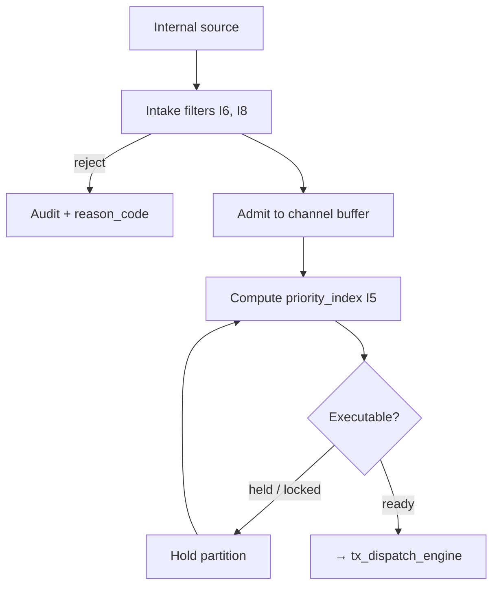

# tx_queue_handler.md

## Module: Transaction Queue Handler

**Stands on:** I6 (no speculative surface / no external ingestion), I8 (append-only causality), I5 (determinism), I1 (PoT-gated origin), I7 (Eye veto). See `README.md` §1.

## 1. Purpose and context

The queue handler is the **first gate** of the Processing Layer. It admits candidate processes from internal sources, buffers them, isolates them into channels, orders them deterministically, and hands them onward to dispatch. It initiates nothing economic: it neither mints, burns, nor pays. Its job is to make the *order* in which candidate processes are considered reproducible (I5) and every admission recorded before it is acknowledged (I8).

All queue operations are fully internal. AST has no public endpoint and no end-user submission surface (`README.md` §6); therefore the queue is never exposed externally, and there is no RPC/REST intake. *Because* I6 admits no external value, **there is no ingestion source for external crypto, no bridge entry, no cross-chain path, and no swap** — such a source would have no object in the model and cannot be registered.

---

## 2. Transaction intake

### 2.1 Accepted intake sources (internal, pre-registered)

A candidate process may enter the queue **only** from a source in the intake registry. The registry is closed and internal:

| Source | Description | Why admissible |
|---|---|---|
| `contract_emitter` | One internal contract calling another via `emit_tx()`. | Deterministic internal cause (I5). |
| `token_ops_module` | Internal ARO transfer / process-part mint-burn request tied to a process. | Emission still gated by PoT downstream (I1). |
| `governance_committee` | A bounded-parameter decision of the role-based AI oversight committee. | Recorded before effect (I8); not token-weighted voting (I6). |
| `scheduled_task` | Cron-like internal job in a tokenomics subsystem. | Deterministic, internally originated (I5). |

Each source is explicitly whitelisted. A candidate presenting any other `source` — including any external, bridge, cross-chain, or deposit-derived origin — is rejected at intake, because I6 gives it no object to represent.

### 2.2 Intake filters

Before admission, each candidate passes minimal preconditions:

- **Envelope schema check** — the candidate matches the canonical envelope (`TX STRUCTURE & METADATA.md`).
- **Source trust check** — `source` is in the registry (§2.1).
- **Channel legality** — the declared `channel` is one of the fixed internal channels (§4) and the payload type is allowed there.
- **Service-identity check** — the internal `auth_path` digest verifies.
- **Fingerprint / nonce check** — the candidate is not a replay of an already-recorded cause (I5, I8).

A candidate that fails any filter is **rejected without consuming queue resources**, recorded with a `reason_code`, and appended to the audit trail *before* the rejection is acknowledged (I8).

```json
{
  "tx_id": "e920ab1d…",
  "status": "intake_rejected",
  "reason": "unregistered_source",
  "source": "unknown",
  "rejected_at": "2026-01-14T03:15:08Z"
}
```

### 2.3 Admission

On passing all filters the candidate is admitted to the staging buffer and assigned: a **queue slot id**, an **internal timestamp**, a **hold flag** (default `false`), and an initial **priority_index** (§5). Its status becomes `received`. Admission is appended to NodeChain before the next stage sees the candidate (I8).

---

## 3. Queue buffer model

The queue uses a **two-tier** buffer:

| Tier | Medium | Purpose |
|---|---|---|
| `primary_buffer` | In-memory | High-speed short-term queue (lock-free ring buffer per channel). |
| `overflow_pool` | Durable log store | Fallback for excess or deferred candidates. |

If the primary buffer is saturated, least-recent candidates are serialized to the overflow pool. Fallback is **transparent** and preserves ordering: no candidate loses its computed priority by being spilled. Buffer contents are checkpointed so queue integrity survives a restart (I5: state must be reconstructible).

```json
{
  "tx_id": "abc…",
  "received_at": "2026-01-14T04:41:00Z",
  "channel": "internal_contracts",
  "priority_index": 88712.44,
  "ttl": 300,
  "status": "received",
  "buffer_location": "memory|overflow"
}
```

---

## 4. Channels & isolation

Each candidate is assigned exactly one **logical channel** by its source, and each channel has its own isolated buffer:

```
[ queue_root ]
 ├── normalized_tx/
 ├── internal_contracts/
 ├── token_ops/
 └── governance/
```

Cross-channel bleed is not permitted. *Because* I5 requires reproducible ordering, mixing domains would make the order depend on interleaving that is not itself recorded; separate channels keep each domain's order deterministic.

There is **no** `bridge_io`, `cross_chain`, `swap`, `vault`, or `collateral` channel — I6 leaves external value and mint-on-deposit no object, so no channel can carry them.

Some candidates are marked `isolated`: they must not co-reside in a batch or execute concurrently with others touching the same state. The queue enforces this by deferring batch formation around them, preventing state races (I5).

---

## 5. Priority ordering (computed, never asserted)

Within each channel, candidates are ordered by a computed `priority_index`. *Because* I5 requires the order to be reproducible, priority is **computed from recorded factors**, never set by the submitter:

| Factor | Source |
|---|---|
| `priority_class` | Assigned by the source module (`critical` > `high` > `medium` > `low`). |
| `enqueue_age` | Time since admission. |
| `retry_penalty` | Repeated failures lower the index. |
| `isolation_weight` | Isolated candidates wait for a clean window. |

Base scores (`critical=100`, `high=70`, `medium=50`, `low=20`) are modified by age bonus, retry penalty, and isolation weight; candidates sort descending by the resulting index. All adjustments are recomputed each dispatch cycle from recorded values, so the order is identical on every replay (I5).

**Starvation prevention:** each channel keeps a `fairness_counter`; a `low` candidate unexecuted for a bounded number of cycles has its ordering position raised by a fixed amount. This preserves progress without discretion — the rule is fixed and reproducible (I5). This is deterministic ordering only, and moves no value: payment happens solely downstream, and solely for PoT-confirmed work (I3).

---

## 6. Length limits & overflow

Each channel defines `max_in_memory` and `max_total`. On overflow the channel applies its fixed strategy:

| Strategy | Behavior |
|---|---|
| `overflow` (spill) | Move oldest candidates to the overflow pool, preserving order. |
| `drop` | Soft-drop lowest-priority candidates, **each drop recorded in the audit log** (I8). |
| `backpressure` | Pause upstream intake until space frees. |
| `reject` | Return rejection to the internal source; the candidate never enters. |

No candidate is hard-deleted silently: every drop is appended to the audit trail before it is acknowledged (I8), so the loss is auditable.

```json
{
  "event": "tx_queue_drop",
  "channel": "token_ops",
  "tx_id": "0xabc…",
  "reason": "overflow",
  "dropped_at": "2026-01-14T05:23:01Z"
}
```

---

## 7. Hold state & locking

A candidate enters **hold** when it cannot execute immediately:

- it depends on another candidate's completion (a dependency edge), or
- it needs `strong` isolation and no clean window is open, or
- it references a state target currently locked, or
- it carries `hold_before_exec`.

Held candidates are moved to a side partition and re-evaluated each dispatch cycle. Locking is fine-grained; a candidate declares its lock signature at intake (e.g. `token:ARO`, `contract:0x5c4…::slot:19`). Locks are **statically ordered** by namespace and acquired all-or-none, so cyclic waits cannot form; a real-time lock-wait graph detects any cycle and drops the offending candidate (after `max_retry`) rather than deadlock. Each lock has `max_lock_time_ms`; an expired lock forces re-evaluation of dependents and, if state was dirtied, a deterministic rollback (`tx_rollback_strategy.md`).

Lock targets are internal state only — token balances, internal contract storage, governance-proposal state. There is no `vault`, `escrow`, or `bridge` lock target, because I6 leaves those no object.

---

## 8. Duplicate filtering (replay defense)

Every candidate is fingerprinted (`TX STRUCTURE & METADATA.md` §5). The handler keys on the fingerprint:

- matches an **already-confirmed** candidate → **rejected** (a second application would produce an effect with no fresh cause — I5, I8);
- matches a **currently-queued** candidate → ignored and logged;
- matches a **pending-rollback** candidate → held until the rollback resolves.

Rejected fingerprints are retained in a rejection cache so a rejected candidate cannot be re-injected, and every collision is recorded (I8).

---

## 9. TTL tag management

Each candidate carries a `ttl` (relative seconds or an absolute expiry). A candidate that remains queued past its TTL is expired: marked `dropped_due_to_ttl`, appended to the audit trail, and **never** forwarded to dispatch or execution. *Because* I5 requires reproducible state, a candidate cannot linger unboundedly and desynchronize replay across nodes; the TTL bounds its lifespan. Full detail: `tx_ttl_expiration.md`.

---

## 10. Position in the pipeline



The queue handler is the first checkpoint: controlled intake, isolated channels, deterministic order, replay defense, bounded lifespan. It hands ready candidates to `tx_dispatch_engine.md`, which moves them into isolated execution contexts (`tx_execution_contexts.md`) under the Eye's veto (I7). No step here creates value; it only prepares candidate processes so that a later PoT verdict can cause emission (I1).
