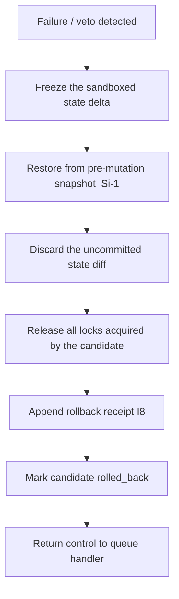

# tx_rollback_strategy.md

## Module: Transaction Rollback Strategy

**Stands on:** I5 (determinism), I8 (append-only causality), I2 (born-and-burned), I1 (PoT-gated origin), I7 (Eye veto). See `README.md` §1.

## 1. Purpose

Rollback is the **deterministic reversion** of a candidate process that fails, aborts, or is vetoed after it began touching sandboxed state. It is not optional: it is the mechanism that guarantees a failed candidate leaves **no partial effect**. *Because* I5 requires that committed state is reproducible from recorded causes, a half-applied candidate — an effect without a completed, recorded cause — cannot be allowed to persist; rollback removes it.

Rollback reverses **sandboxed processing state** inside the Processing Layer. It does not undo an emission, because no emission has occurred: emission is caused only by a PoT verdict downstream (I1), which an aborted candidate never obtains.

---

## 2. Rollback triggers

| Trigger | Description | Invariant |
|---|---|---|
| `execution_failure` | Deterministic runtime error during isolated execution. | I5 |
| `budget_breach` | Candidate exceeded its instruction/resource budget. | I5 |
| `timeout_exceeded` | Candidate exceeded `tx_exec_timeout_ms`. | I5 |
| `guardrail_veto` | The Eye halted a step that would violate I1–I6. | I7 |
| `snapshot_fault` | The bound snapshot became invalid mid-flow. | I5 |
| `commit_rejected` | The sandboxed state diff could not be committed. | I5 |
| `kill_switch` | The layer entered read-only mode (`README.md` §6). | I1, I2 |

Every trigger is recorded before the rollback effect is acknowledged (I8).

---

## 3. Rollback phases



The cycle is deterministic and side-effect free: restoring from a recorded snapshot yields exactly the pre-candidate state on every node (I5).

---

## 4. Pre-mutation snapshots (rollback stack)

Each execution context keeps a rollback-capable snapshot stack (`tx_state_snapshot_hook.md`):

- On candidate load, a base snapshot `S0` is created.
- Before any critical mutation, `Si` is pushed.
- On failure, the rollback engine restores from `Si-1`.
- On successful commit, all intermediate snapshots are discarded.

This supports nested reversion and guarantees no candidate can corrupt runtime state.

---

## 5. Scope of reversion

| Layer touched | Rollback action |
|---|---|
| Internal contract runtime | Clear the contract state cache, call stack, and temporary memory. |
| Sandboxed ledger diff | Discard the uncommitted balance/state changes (never applied to committed state). |
| Resource allocator | Free all candidate-bound allocations. |
| Dispatch layer | Reset queue priority and processing flags. |
| Audit subsystem | Append a rollback event (I8). |

Because the candidate's state diff was **sandboxed** (held, not committed, until PoT confirmation), reversion is a discard rather than an inverse-write in the common case. If any processing-side journal position was tentatively reserved, it is reverted by the same recorded delta so the chain stays consistent (I8).

Resource units already metered are **not** refunded — there is nothing to refund, because `exec_units` is a deterministic count, not a paid fee (I6: no market price; see `tx_execution_contexts.md` §6). No node is paid for an aborted candidate, because payment follows only confirmed work (I3).

---

## 6. Rollback isolation

Rollback runs in a dedicated context to avoid contaminating active channels, prevent re-entry, and guarantee serialized reversion. This keeps the reversion itself deterministic (I5).

---

## 7. Lock cleanup

All locks the candidate acquired are immediately released, logged with a `rollback_release` marker, and — if the lock was found in an unsafe state — quarantined from re-entry until re-verified. This prevents deadlock and state races (I5).

---

## 8. Rollback receipt

```json
{
  "tx_id": "0x2F7C…",
  "rollback_trigger": "execution_failure",
  "restored_from_snapshot": "S3",
  "rollback_duration_ms": 7,
  "was_partial_commit": false,
  "error_detail": "divide-by-zero in internal contract 0xA021",
  "pre_state_hash": "0x…",
  "post_rollback_hash": "0x…",
  "rolled_back_at": "2026-01-14T20:41:03Z"
}
```

The receipt is written to `tx_journal_writer.md` and indexed in `tx_hash_map_index.md`. `pre_state_hash` and `post_rollback_hash` let any node verify the reversion returned to the exact recorded pre-candidate state (I5).

---

## 9. Protection from double effects

A rolled-back candidate cannot re-enter:

- its fingerprint is moved to a **tombstone registry**,
- a replay-guard flag marks it invalid for re-entry (I5, I8),
- optional dead-letter retention preserves it for diagnostics only.

This makes failures **final**: a failed cause cannot silently produce a later effect.

---

## 10. Special cases

| Case | Behavior |
|---|---|
| Batch execution | Only the failed candidate is rolled back; the batch's other candidates proceed (their chains are independent, I8). |
| Nested calls | Inner candidates are reverted recursively with their parent. |
| Simulated runs | No rollback — dry-runs are read-only and mutate nothing (`tx_simulation_mode.md`). |
| Forced shutdown / kill-switch | All active contexts roll back; any process part minted-but-not-burned upstream is burned to satisfy I2 (`README.md` §6). |

The rollback engine is resistant to process death and interruption; recovery replays persistent delta logs, so the reverted state is reconstructible (I5).

---

## 11. Design guarantees

- Reversion is deterministic and reproducible (I5).
- Every rollback cause is recorded before its effect is acknowledged (I8).
- A failed candidate leaves no committed state and triggers no emission or payment (I1, I3).
- Under kill-switch, supply conservation is preserved (I2).
- Rollback only **removes** an incomplete effect; it never substitutes a mint or payment for the failure (I7).
