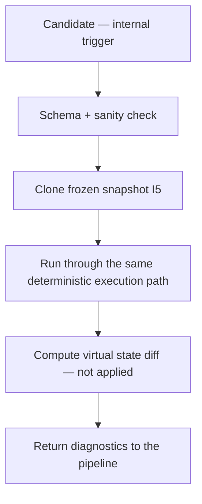

# tx_simulation_mode.md

## Module: Transaction Simulation Mode

**Stands on:** I5 (determinism), I1 (PoT-gated origin), I3 (payment for confirmed work), I6 (no speculative surface), I8 (append-only causality). See `README.md` §1.

## Overview

Simulation mode is an internal, **read-only, side-effect-free** execution path. It runs a candidate process against a cloned frozen snapshot to predict its effects — resource use, state diff, and any invariant-violating path — **without** touching state, producing a PoT verdict, or authorizing anything. *Because* I5 guarantees determinism, a dry-run predicts the real execution exactly; that is precisely why simulation is useful and why it can never stand in for the real thing.

Simulation authorizes nothing. *Because* I1 makes the PoT verdict the sole cause of a unit and I3 forbids payment before confirmed work, **a simulation result is never an authorization to emit or to pay**. It only informs the pipeline.

---

## What simulation is for (internal only)

AST has no end-user surface, wallet, or external API (`README.md` §6). Simulation is therefore an internal facility:

- **Pre-execution analysis** — predict a costly candidate's effects before committing a real execution.
- **Guardrail reroute** — a candidate flagged risky by `tx_execution_guardrails.md` is rerouted here for a shadow run.
- **Rollback confidence** — verify that a reversion will behave correctly before a real abort.
- **Internal QA / staging** — replay recorded candidates in a non-committing environment.

There is no `/simulate_tx` public endpoint, no wallet "preview," and no external requester. Triggers are internal policy logic only.

---

## Trigger conditions

- Internal policy marks a candidate as costly or state-sensitive.
- A candidate fails a preliminary check and is redirected to the dry-run path.
- A guardrail reroutes a risky candidate for a shadow run.
- Rollback logic requests a pre-abort verification.

---

## Simulation characteristics

| Property | Value |
|---|---|
| Commits to state | No |
| Mutates state | No |
| Deterministic | Yes (I5) |
| Produces resource estimate | Yes (`exec_units`, a count — not a price) |
| Emits events | Simulated only |
| Produces a PoT verdict | No (I1) |
| Authorizes emission or payment | No (I1, I3) |
| Logs stored | Yes, marked `simulated: true` |

---

## Workflow



1. Candidate submitted to the internal simulation path.
2. Schema and sanity checks applied.
3. State context **cloned** from `tx_state_snapshot_hook.md` (read-only).
4. The candidate runs through the same deterministic execution path used for real execution.
5. A virtual state diff is computed but **not applied**.
6. Diagnostics are returned to the pipeline; the result is recorded as `simulated: true` (I8).

*Because* the real and simulated paths are the same deterministic code over the same recorded inputs (I5), the prediction is exact.

---

## Input (internal)

```json
{
  "simulate": true,
  "candidate": {
    "tx_id": "TX-SIM-9138",
    "channel": "token_ops",
    "source": "token_ops_module",
    "payload": { "type": "transfer", "amount": "40500000000", "token": "ARO" },
    "snapshot_ref": "SS-191-0"
  }
}
```

## Output (success)

```json
{
  "tx_id": "TX-SIM-9138",
  "simulated": true,
  "status": "success",
  "exec_units_estimate": 2910,
  "state_diff": { "sender_balance_delta": "-40500000000", "recipient_balance_delta": "+40500000000" },
  "events_emitted": ["Transfer"]
}
```

## Output (failure)

```json
{
  "tx_id": "TX-SIM-9138",
  "simulated": true,
  "status": "error",
  "error": { "code": "INSUFFICIENT_BALANCE", "message": "recorded balance < transfer amount" }
}
```

Amounts are in `arx` (integers, `DECIMALS = 9`). The estimate is `exec_units` — a deterministic resource count, not a priced fee, because I6 admits no market price to charge (see `tx_execution_contexts.md` §6).

---

## Internal dependencies

- `tx_state_snapshot_hook.md` — supplies the cloned read-only state.
- `tx_execution_contexts.md` — the same deterministic execution path is used, in non-committing mode.
- `tx_execution_guardrails.md` — reroutes risky candidates here.
- `tx_audit_log_format.md` — records simulation outputs, marked `simulated: true` (I8).
- `tx_failure_modes.md` — classifies any predicted failure.

---

## Security considerations

- Simulated candidates are tagged in logs and **cannot** be promoted to a real execution or a PoT verdict (I1). To take effect, a candidate must run the real path and be confirmed by PoT.
- Simulation operates on an ephemeral cloned snapshot — read-only (I5). It cannot mutate committed state.
- A simulation result must **never** be treated as authorization for execution, emission, or payment (I1, I3).
- No external identity, IP, or key participates: simulation is internal, service-to-service (`README.md` §6).

---

## Audit tags

Every simulation output carries:

```json
{ "metadata": { "simulated": true, "timestamp": 1720248901, "validator_node": "ND-11" } }
```

These tags make it impossible to mistake a prediction for a confirmed effect: a `simulated: true` record can never satisfy the PoT gate that alone causes emission (I1).
