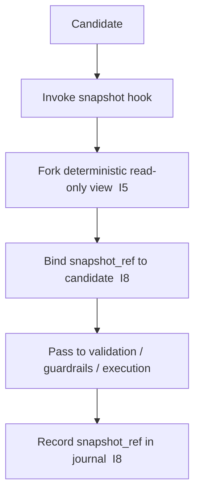

# tx_state_snapshot_hook.md

## Module: Transaction State Snapshot Hook

**Stands on:** I5 (determinism), I8 (append-only causality), I1 (PoT-gated origin), I7 (Eye veto). See `README.md` §1.

## Overview

The snapshot hook captures a **read-only, immutable view of state** at the moment a candidate process enters validation or execution preparation. Every downstream stage — validation, guardrails, simulation, execution — reads this one frozen view rather than live state. It is the mechanism that makes I5 achievable: *because* determinism requires that the same recorded inputs produce the same effects on every node, evaluation must occur against a **fixed baseline**, not against state that other candidates are concurrently mutating.

The snapshot is the recorded "state cause" that a candidate's effect stands on; binding a candidate to a snapshot and recording that binding is a direct application of append-before-acknowledge (I8).

---

## Purpose

- Lock a **read-only clone** of the relevant ledger and token state.
- Provide one consistent baseline for validation, guardrails, simulation, and execution.
- Enable rollback comparison (before/after diffs).
- Make each candidate's evaluation reproducible and node-consistent (I5).

---

## How it works



1. The candidate enters validation.
2. The hook forks a deterministic, immutable view of the relevant subset of state.
3. The candidate is bound to a `snapshot_ref`, and the binding is appended to NodeChain (I8).
4. All downstream modules read only this snapshot.

---

## Snapshot schema

```json
{
  "snapshot_id": "SS-191-0",
  "timestamp": 1720249900,
  "node_id": "ND-11",
  "emission_epoch": 191,
  "accounts": {
    "0xA1B3…": { "balance_arx": "190250000000", "locked": false },
    "0xB3E9…": { "balance_arx": "422000000000", "locked": true }
  },
  "tokens": {
    "ARO": { "process_minted_arx": "…", "process_burned_arx": "…", "earned_retained_arx": "…" }
  },
  "params": {
    "commission_rate": 0.005,
    "node_share": 0.75,
    "reserve_share": 0.25,
    "execution_mode": "deterministic"
  }
}
```

Balances are in `arx` (integers). The token record tracks `process_minted`, `process_burned`, and `earned_retained` — the Coin Engine's supply identity (`01_coin_engine/burn_and_mint_rules.md` §3). There is **no** `emission_limit` or `supply_ceiling` field. *Because* I1 gates emission on the PoT verdict and I6 leaves no object for a cap, there is no ceiling to snapshot; the snapshot records confirmed state, not a quota.

---

## Key guarantees

| Guarantee | Description | Derived from |
|---|---|---|
| **Read-only** | No downstream module can mutate the snapshot. | I5 |
| **Node-consistent** | The same snapshot hashes identically across validating nodes. | I5, I8 |
| **Epoch-stable** | The snapshot is pinned to the current emission epoch for the candidate's flow. | I5 |
| **Rollback-usable** | Stored to support before/after diffs on abort. | I8 |

---

## Integration flow

- `tx_validation_pipeline` evaluates rules against the snapshot only.
- `tx_simulation_mode` runs its dry-run on a clone of the snapshot.
- `tx_execution_guardrails` reads the snapshot when deciding a veto (I7).
- `tx_execution_contexts` bootstraps the candidate's runtime from the snapshot, never from live state.
- `tx_journal_writer` records the `snapshot_ref` for each candidate (I8).

---

## Snapshot lifespan

- The snapshot is **ephemeral** unless the candidate is confirmed (then its hash is retained) or fails and triggers forensic retention.
- Snapshots live in ephemeral storage with a bounded TTL (default ~10 minutes), consistent with `POT_EPOCH_SECS = 600`.
- The TTL and storage thresholds are bounded parameters set by the role-based committee, recorded before effect (I8) — never by ARO holdings (I6).

---

## Failure modes

| Condition | Response | Code |
|---|---|---|
| Snapshot fork fails | Reject the candidate | `SNAPSHOT_ERROR` |
| Snapshot hash mismatch across nodes | Invalidate the node's view / raise fork alert | `SNAPSHOT_DESYNC` |
| Memory pressure exceeds limit | Delay the fork or trigger cleanup | `SNAPSHOT_PRESSURE` |

```json
{
  "tx_id": "TX-1037-EX",
  "status": "rejected",
  "error": { "code": "SNAPSHOT_ERROR", "message": "unable to fork deterministic snapshot at ND-11" }
}
```

A snapshot failure **stops** the candidate; it never causes a mint or payment to compensate (I7).

---

## Security considerations

- Each snapshot hash is signed by the local node and folded into the candidate's final hash tree, so the state a candidate was evaluated against is itself recorded and reproducible (I5, I8).
- Snapshots are forked under a locked mutex to avoid concurrency, preserving determinism (I5).
- Any node may recompute a snapshot hash from NodeChain and verify it, because state is reconstructible from recorded causes (I5).
