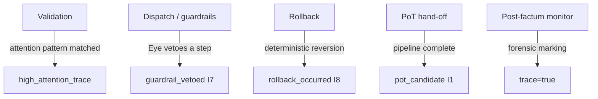

# tx_trace_flags.md

## Module: Transaction Trace Flags

**Stands on:** I8 (append-only causality), I5 (determinism), I7 (Eye veto), I1 (PoT-gated origin). See `README.md` §1.

## Overview

Trace flags are **additive metadata markers** attached to candidate-process records and audit entries to mark, classify, and prioritize them for audit and monitoring. They are non-authoritative: a flag records that something was observed, it never changes what a candidate is permitted to do. *Because* the Eye observes every step and can only veto (I7), and *because* every cause is recorded before its effect (I8), trace flags are the observational surface that makes selective, reproducible review possible without altering the causal chain.

A trace flag can raise attention; it can never raise permission. In particular, no flag can authorize a mint or a payment — only a PoT verdict emits (I1), and only confirmed work is paid (I3).

---

## Purpose

- Mark candidates for elevated audit retention.
- Enable selective logging without full-journal overhead on every candidate.
- Assist post-factum reconstruction and forensic review.
- Let auditors filter high-impact candidates from recorded history (I5).

---

## Trace flags

| Flag | Meaning | Derived from |
|---|---|---|
| `trace=true` | General audit trace — retain for review. | I8 |
| `high_attention_trace` | Candidate matched a heightened-attention pattern. | I5 |
| `guardrail_vetoed` | A guardrail halted a step (the Eye vetoed). | I7 |
| `rollback_occurred` | The candidate was deterministically reverted. | I8 |
| `snapshot_desync_detected` | Snapshot hash mismatch or late injection. | I5 |
| `pot_candidate` | The candidate completed the pipeline and was handed to PoT. | I1 |
| `validator_divergence` | Different validating nodes recorded different outcomes for the same candidate. | I5 |

`pot_candidate` marks that the pipeline finished its part and forwarded the candidate to PoT. It does **not** mean "emitted": emission follows only from the verdict `verified === 1` (I1).

```json
{
  "tx_id": "TX-7291-AROS",
  "status": "executed",
  "trace_flags": ["trace=true", "high_attention_trace", "pot_candidate"]
}
```

---

## Flag application lifecycle



1. **During validation** — a candidate matching a heightened-attention pattern gets `high_attention_trace`.
2. **During dispatch/guardrails** — a vetoed candidate gets `guardrail_vetoed` (I7).
3. **During rollback** — a reverted candidate gets `rollback_occurred` (I8).
4. **At PoT hand-off** — a completed candidate gets `pot_candidate` (I1).
5. **Post-factum** — a monitor may add `trace=true` for retained review.

Each flag application is appended to the record before the record is acknowledged downstream (I8).

---

## Query & filtering

- `getAll(trace=true)`
- `filterBy(trace_flags contains "guardrail_vetoed")`
- `listWhere(high_attention_trace AND trace=true)`
- `auditBy(epoch, flag="validator_divergence")`

These let auditors triage large recorded datasets reproducibly (I5).

---

## Integration

| Module | Use of trace flags |
|---|---|
| `tx_journal_writer` | Embeds flags in journal entries (I8). |
| `tx_failure_modes` | Adds classification to rejected candidates. |
| `tx_audit_log_format` | Flags critical integrity events (I7). |
| `tx_rollback_strategy` | Marks reverted candidates. |
| PoT engine | May attach `pot_candidate` at hand-off (I1). |

---

## Design considerations

- Flags are **additive and cumulative**; none is exclusive.
- Flags are stored as string sets in candidate/audit metadata.
- All flags are documented and versioned so historical records remain interpretable (I5).
- A flag is an observation, never an authorization: it cannot cause a mint, burn, or payment (I1, I7). Flag injection, whether real-time or post-factum, changes only what is *retained for review*, never what *happened*.
