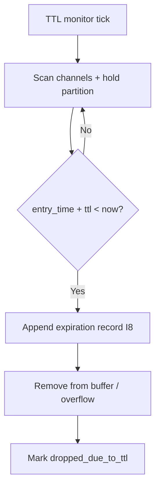

# tx_ttl_expiration.md

## Module: Transaction TTL Expiration

**Stands on:** I5 (determinism), I8 (append-only causality), I1 (PoT-gated origin), I6 (no speculative surface). See `README.md` §1.

## 1. Purpose

This document defines the **bounded lifespan** of a queued candidate process and the deterministic cleanup that enforces it. A candidate that is not dispatched within its TTL (Time-to-Live) is expired: removed, recorded, and never forwarded to execution or PoT.

*Because* I5 requires state to be reproducible across nodes, a candidate cannot linger in the queue indefinitely — an unbounded lifespan would let different nodes hold different pending sets and diverge on replay. Therefore every candidate carries a bounded TTL, and expiration is a fixed, reproducible rule (not a discretionary purge). Expiration produces **no economic effect**: an expired candidate never obtained a PoT verdict, so nothing was minted, burned, or paid (I1).

> This is the single canonical TTL document for the Processing Layer. The rollback of an *aborted* (as opposed to *expired*) candidate is a distinct mechanism, specified in full in `tx_rollback_strategy.md`; the two are cross-referenced in §5.

---

## 2. What TTL is

Each candidate may carry a TTL in its header, expressed as either a relative duration or an absolute expiry:

```json
{ "ttl_seconds": 300 }
```
```json
{ "ttl_expire_at": "2026-01-14T08:30:00Z" }
```

If both are present, `ttl_expire_at` takes precedence. If neither is present, the candidate's channel supplies a fallback default (§4). The TTL bounds how long the candidate may remain in the queue before automatic expiration.

---

## 3. The TTL management loop

A background routine runs every `ttl_monitor_interval_ms` and, for each channel:

1. iterates over active and hold-state entries;
2. compares the current deterministic time reference with each candidate's `entry_time + ttl`;
3. flags expired entries;
4. appends an expiration record to the audit trail **before** removal is acknowledged (I8);
5. removes expired entries from the primary buffer or overflow pool.



The loop runs asynchronously from the dispatch scheduler, so it never blocks dispatch; but a removal is never acknowledged before its record is durable (I8).

---

## 4. Expiration effects & defaults

An expired candidate is:

- marked `status: dropped_due_to_ttl`,
- archived to the transaction journal (`tx_journal_writer.md`),
- made inaccessible to all downstream processors,
- **never** forwarded to dispatch, execution, or PoT.

The system guarantees an expired candidate produces no side effect and no partial state change.

**Fallback defaults** — every candidate has a bounded lifespan even if its source omitted a TTL:

```toml
[queue.ttl_defaults.token_ops]
default_ttl_secs = 600

[queue.ttl_defaults.governance]
default_ttl_secs = 1800
```

These defaults are bounded parameters set by the role-based committee and recorded before effect (I8) — never by ARO holdings (I6).

---

## 5. Grace, protection, and the relation to rollback

**Grace period.** A candidate tagged `ttl_grace_period_ms` remains in a *grace hold* for that duration before hard removal, allowing a final recorded inspection. The grace window is fixed and reproducible (I5).

**Protection.** A candidate tagged `ttl_protected: true` bypasses automatic expiration until explicitly force-expired by system logic. Protection is reserved for a small set of internally-originated, long-lived candidates (e.g. a pending governance-committee decision); the protected set is itself a bounded, recorded parameter. There is no external or bridge candidate to protect, because I6 admits no such candidate.

**Expiration vs. rollback.** These are different causes with different effects:

| | Expiration (this doc) | Rollback (`tx_rollback_strategy.md`) |
|---|---|---|
| Cause | Candidate sat in queue past its TTL. | Candidate began executing, then failed or was vetoed. |
| State touched | None (never dispatched). | Sandboxed state was touched; must be reverted. |
| Effect | Clean discard + record. | Deterministic reversion + record. |
| Economic effect | None (I1). | None (I1); no payment (I3). |

An expired candidate is discarded cleanly and is **never** sent to rollback or simulation; it never executed, so there is nothing to revert.

---

## 6. Expiration audit record

```json
{
  "event": "tx_expired",
  "tx_id": "0x123…",
  "channel": "token_ops",
  "ttl_seconds": 300,
  "grace_period_used": false,
  "was_protected": false,
  "expired_at": "2026-01-14T06:32:11Z"
}
```

Every expiration is appended before removal is acknowledged (I8), so the loss of a candidate is auditable, not silent.

---

## 7. Protection from re-entry

An expired candidate's fingerprint is retained in the queue handler's rejection cache (`tx_queue_handler.md` §8), so an expired candidate cannot be silently re-injected as if fresh. If the same work is genuinely still needed, its internal source raises a **new** candidate with a fresh nonce — a new cause, recorded anew (I5, I8).

---

## 8. Design guarantees

- TTL enforcement is idempotent and reproducible (I5).
- It runs asynchronously and never interferes with the execution layer.
- It keeps the queue bounded without manual intervention.
- Every expiration is recorded before acknowledgement (I8).
- An expired candidate causes no emission and no payment (I1, I3).

---

## 9. Summary

TTL expiration bounds the lifespan of a queued candidate process so the pending set stays reproducible across nodes (I5) and the queue stays hygienic under load. It is a clean, recorded discard of work that was never confirmed — distinct from rollback, which reverts work that was executed and then failed. Neither produces an economic effect, because only a PoT verdict causes emission (I1).
