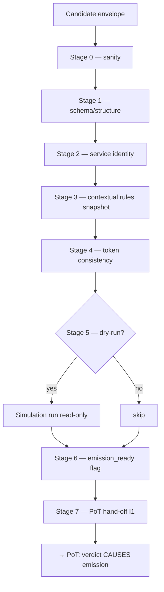

# tx_validation_pipeline.md

## Module: Transaction Validation Pipeline

**Stands on:** I5 (determinism), I1 (PoT-gated origin), I8 (append-only causality), I7 (Eye veto), I6 (no speculative surface). See `README.md` §1.

## Overview

The validation pipeline proves a candidate process well-formed, deterministic, and free of any step that would violate I1–I6, **before** it is handed to PoT. Its terminal act is to set `emission_ready` and forward the candidate to PoT — where a verdict `verified === 1` *causes* emission (I1). The pipeline itself mints, burns, and pays nothing; setting `emission_ready` is not an authorization to emit — only the PoT verdict is (I1).

*Because* determinism (I5) requires that the same candidate produce the same effect on every node, validation is a fixed, ordered sequence of proofs, each reading only recorded inputs, each recorded before its result is acknowledged (I8).

---

## Pipeline stages



### Stage 0 — Input sanity
The envelope is non-null, canonically encoded, and meets base entry criteria. Malformed input is rejected immediately (defense against nullified or oversized payloads).

### Stage 1 — Schema & structure
The envelope matches `TX STRUCTURE & METADATA.md`: required fields present, types and ranges correct, exactly one legal `channel`. *Because* I5 requires one unambiguous representation, any structural deviation is rejected.

```json
{ "error": "INVALID_FIELD_FORMAT", "field": "channel" }
```

### Stage 2 — Service identity
The internal `auth_path` digest is verified against the service identity registry (mutual-TLS service identity, not an end-user key — AST has no end-user surface, `README.md` §6). A mismatch is rejected with `SIGNATURE_VERIFICATION_FAILED`.

### Stage 3 — Contextual rule evaluation (snapshot-bound)
The pipeline loads the frozen state view (`tx_state_snapshot_hook.md`) and evaluates the candidate against it only: nonce/replay window, dependency readiness, lock availability, and the bounded parameters in force. *Because* I5 forbids reading live mutable state, evaluation reads the snapshot exclusively. A high-risk condition here invokes `tx_execution_guardrails.md` — the Eye's veto surface (I7).

There is **no** jurisdictional or regulatory rule at this stage: I6 gives external-jurisdiction concepts no object in the model. The rules evaluated are internal, invariant-derived constraints.

### Stage 4 — Token consistency
Validates that the ARO amounts referenced are internally consistent: sufficient recorded balance for a transfer, no reference to a frozen internal token state, amounts expressible in `arx` (integer, `DECIMALS = 9`). *Because* I1 gives emission one cause and I6 leaves no supply cap, there is **no "supply ceiling" or "emission quota" check** — a candidate is never rejected for "minting beyond a quota," because no quota exists; emission is gated solely by the later PoT verdict (I1).

```json
{ "error": "INSUFFICIENT_BALANCE", "detail": "recorded balance < transfer amount" }
```

### Stage 5 — Internal dry-run (optional)
For costly or state-sensitive candidates, `tx_simulation_mode.md` runs the candidate read-only against a cloned snapshot. *Because* I5 guarantees determinism, the dry-run predicts real execution exactly. A dry-run that reveals an invariant-violating path flags or rejects the candidate. The dry-run touches no state and yields no PoT verdict (I1).

### Stage 6 — Emission-ready flagging
On passing all prior stages the candidate is marked:

```json
{ "meta_flags": { "validated": true, "emission_ready": true } }
```

This is a **precondition** for PoT hand-off, not an emission. *Because* I1 makes the verdict the sole cause of a unit, `emission_ready` means only "the pipeline has done its part."

### Stage 7 — PoT hand-off & sealing
The validated candidate, its `snapshot_ref`, its fingerprint, and the validating node id are sealed and forwarded to PoT. The seal is appended to NodeChain before hand-off is acknowledged (I8). PoT then renders the verdict; `verified === 1` causes emission in the Coin Engine (I1). The pipeline authors no mint, burn, or payment.

---

## Error codes

| Code | Meaning | Invariant defended |
|---|---|---|
| `INVALID_FIELD_FORMAT` | Field malformed or wrong type. | I5 |
| `MISSING_REQUIRED_FIELD` | Required envelope field absent. | I5 |
| `SIGNATURE_VERIFICATION_FAILED` | Service-identity digest invalid. | I5, I8 |
| `INSUFFICIENT_BALANCE` | Referenced amount exceeds recorded balance. | I5 |
| `TOKEN_STATE_LOCKED` | Referenced internal token state is frozen. | I5, I7 |
| `REPLAY_DETECTED` | Candidate re-applies an already-recorded cause. | I5, I8 |
| `SIMULATION_FAILED` | Dry-run revealed an invariant-violating path. | I5, I7 |
| `NON_INTERNAL_SOURCE` | Candidate references a non-internal / external origin. | I6 |

Each impossible state is **named and rejected**, so it is auditable rather than merely improbable.

---

## Interfaces

**Input** (internal candidate envelope):
```json
{
  "tx_id": "TX-9137-A",
  "channel": "token_ops",
  "source": "token_ops_module",
  "payload": { "type": "transfer", "amount": "120500000000", "token": "ARO" },
  "auth_path": { "type": "internal_digest", "digest": "…" },
  "snapshot_ref": "SS-191-0",
  "nonce": 4412
}
```

**Output (pass):**
```json
{ "tx_id": "TX-9137-A", "validated": true, "meta_flags": { "emission_ready": true } }
```

**Output (fail):**
```json
{ "tx_id": "TX-9137-A", "validated": false, "error": { "code": "REPLAY_DETECTED", "message": "cause already recorded at chain position 88192" } }
```

Amounts are expressed in `arx` (integers), never in decimal ARO, so validation is exact and reproducible (I5).

---

## Dependencies

- `TX STRUCTURE & METADATA.md` — the envelope schema validated here.
- `tx_state_snapshot_hook.md` — the frozen state view Stage 3–5 read.
- `tx_execution_guardrails.md` — the Eye's veto surface invoked on high-risk conditions (I7).
- `tx_simulation_mode.md` — optional dry-run in Stage 5.
- `tx_audit_log_format.md` — every stage result appended before acknowledgement (I8).
- PoT engine (downstream) — renders the verdict that *causes* emission (I1).

---

## Security considerations

- Each stage is recorded before its result is acknowledged (I8); a validated candidate's full proof trail is reproducible (I5).
- All failures are named, logged, and hash-linked (`tx_audit_log_format.md`).
- Validation can only **stop** a candidate; it never substitutes a mint or payment for a failed check (I7).
