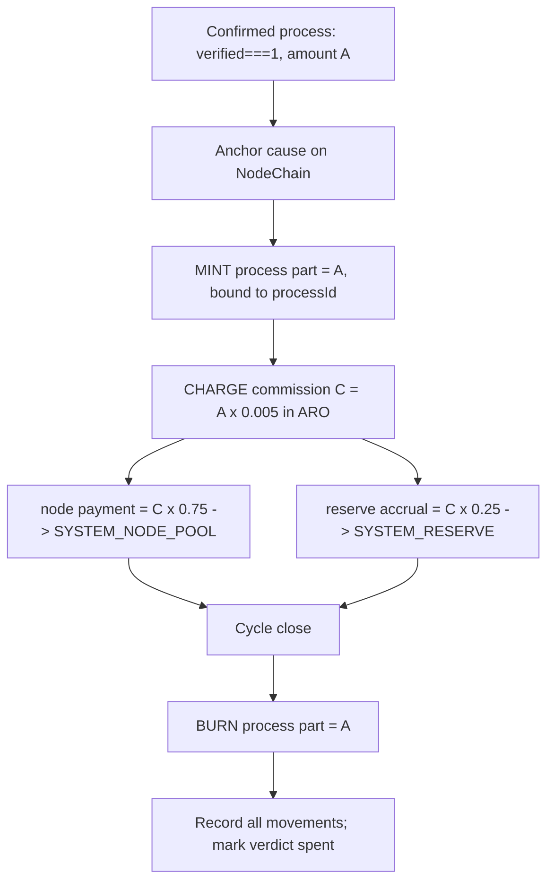

# emission_flow_pipeline.md

## Module: Emission Flow Pipeline

- **Layer**: Fee / Commission Layer — AST (Aros Studio Tokenomics)
- **Stands on**: I1 (PoT-gated origin), I2 (born-and-burned), I3 (payment for confirmed work), I4 (reserve is AST's own), I5 (determinism), I7 (Eye veto), I8 (append-only causality)

---

## Overview

This module defines the full lifecycle of one emission event, from the confirmed cause to the cycle-close burn. The pipeline is deterministic: given the same recorded causes it produces the same effects on every node (I5). It has no branch that depends on discretion, risk weighting, or market state — the amounts are fixed by the invariants, so there is nothing to tune per event.

Under Commission Variant A, the commission is charged and credited **in ArosCoin** (I3). No stage converts, bridges, or externalizes value.

---

## Stages of the pipeline

| Stage | Name | Description | Derived from |
|---|---|---|---|
| 1 | Cause confirmation | The recorded PoT verdict `verified === 1` for the process is read and confirmed. | I1, I8 |
| 2 | Anchor before effect | The cause is confirmed present on NodeChain before any effect is acknowledged. | I8 |
| 3 | Mint process part | Mint `= A`, bound to `processId`. Amount is exactly `A` (1:1). | I1, I2 |
| 4 | Charge commission | Compute `C = A × COMMISSION_RATE` in ARO. | I3 |
| 5 | Split commission | `node payment = C × 0.75 → SYSTEM_NODE_POOL`; `reserve accrual = C × 0.25 → SYSTEM_RESERVE`. | I3, I4 |
| 6 | Cycle-close burn | At the close of the same cycle, burn the process part `= A`. | I2 |
| 7 | Finalize & record | Append every movement to NodeChain; mark the verdict as having caused its mint. | I5, I8 |

---

## Detailed flow

### 1. Cause confirmation

The process arrives already carrying a `verified === 1` verdict recorded by PoT (see `emission_trigger_conditions.md`). The executor reads that recorded verdict; it does not create it. No verdict ⇒ the pipeline never starts (I1).

### 2. Anchor before effect

The cause must already be on NodeChain (I8). An effect whose cause is not yet recorded is not acknowledged — the write of the cause strictly precedes the write of the effect.

### 3. Mint the process part

The process part is minted equal to the process amount `A` — no multiplier, no discount, no risk scaling. The amount is `A` precisely so it can be mirrored by an equal burn at cycle close (I2). The mint is bound to `processId`; it is never free supply.

### 4. Charge commission (in ARO)

Commission is `C = A × COMMISSION_RATE`, computed in `arx` and denominated in ARO (Variant A). `COMMISSION_RATE = 0.005`, adjustable only within `[0, 0.01]` by the role-based committee and only with the change recorded on-chain before effect (I8) — never by ARO holdings (I6). A rate outside bounds could let commission exceed the process amount, contradicting I3, which is why the bound exists.

### 5. Split the commission

The commission divides into exactly two internal destinations:

- **`SYSTEM_NODE_POOL` — 75%** — payment to the nodes that did the confirmed work (I3). The pool is sub-distributed per node by PoT-normalized weight (see `01_coin_engine/payment_distribution.md`).
- **`SYSTEM_RESERVE` — 25%** — accrual to AST's own reserve (I4). It funds no external obligation and is owned by no external party.

There is no third slice. A governance pool, ecosystem reserve, or risk buffer would be a destination with no confirmed-work cause behind it (I3, I4) and is therefore absent by construction.

### 6. Cycle-close burn

At the close of the same cycle, the process part `= A` is burned (I2). Completion does not *permit* a burn to be decided; it is the cause that *necessitates* it. After the burn, `processMinted == processBurned` for the process, and net process supply change is zero. The earned commission is **never** burned — burning payment would contradict I3.

### 7. Finalize & record

Every movement — mint, commission charge, both split legs, burn — is appended to NodeChain (I8), and the verdict is marked as having caused its mint so it cannot cause a second (I5). The full event is now reproducible from the record alone.

---

## Amounts (fixed, not tuned)

```
process part minted = A                         (1:1)                       [I1, I2]
commission C        = A × 0.005                  (in ARO, Variant A)        [I3]
  node payment      = C × 0.75  → SYSTEM_NODE_POOL                          [I3]
  reserve accrual   = C × 0.25  → SYSTEM_RESERVE                            [I4]
process part burned = A          at cycle close                            [I2]

net process supply Δ = 0                          (mint A, burn A)          [I2]
lasting supply Δ     = + C                        (only retained C survives)[I3]
```

---

## Mermaid diagram



The Eye observes every arrow and vetoes any step that would violate I1–I6 (I7). It authors none of them.

---

## Example record (post-emission)

```json
{
  "emission_id": "EM-10299",
  "process_id": "P-90384",
  "epoch_id": 195,
  "process_part_minted_arx": 125000000000,
  "commission_arx": 625000000,
  "split": {
    "node_pool_arx": 468750000,
    "system_reserve_arx": 156250000
  },
  "process_part_burned_arx": 125000000000,
  "net_process_supply_delta_arx": 0,
  "recorded_at": 1720251225,
  "status": "finalized"
}
```

---

## Dependencies

- `emission_trigger_conditions.md` — the one cause and its guards
- `epoch_allocation_model.md` — how per-process commissions are batched and settled per epoch
- `emission_reporting_and_traceability.md` — how the record is made reproducible
- `01_coin_engine/payment_distribution.md` — per-node sub-distribution of the node pool

---

## Next

→ See [`epoch_allocation_model.md`](./epoch_allocation_model.md) for how per-process commissions are settled across epochs — a batching of *when*, never a cap on *how much*.
