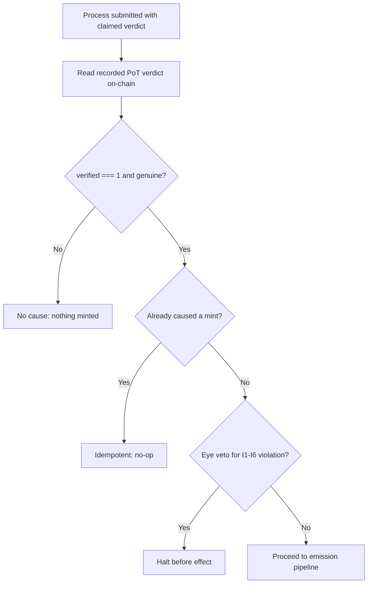

# emission_fraud_prevention.md

## Module: Fraud Prevention

- **Layer**: Fee / Commission Layer — AST (Aros Studio Tokenomics)
- **Stands on**: I1 (PoT-gated origin), I3 (payment for confirmed work), I5 (determinism), I7 (Eye veto), I8 (append-only causality)

---

## Overview

Emission and commission are caused by a single thing: a PoT verdict `verified === 1` for genuine confirmed work (I1). Fraud prevention is therefore not a bolt-on control; it is the set of guards that keep a **fabricated cause** from ever reaching `verified === 1`. If no fabricated input can become a valid cause, no fabricated input can produce a mint, a commission, or a payment (I1, I3).

Two consequences follow from the invariants and shape everything below:

- **Suspicion never scales an amount.** The minted process part is always exactly `A`, and commission is always `A × COMMISSION_RATE` (I2, I3). Fraud detection decides *whether a cause is valid*, never *how much* is emitted — there is no risk multiplier on emission.
- **Prevention is upstream of payment.** Because payment is retained for confirmed work (I3), integrity must be enforced *before* a verdict confirms, not recovered afterward. The Eye can veto any step before its effect is acknowledged (I7).

---

## Attack vectors and the guard that defeats each

### 1. Replay of a cause

| Vector | Re-submitting a verdict that already caused a mint, to mint again. |
|---|---|
| Guard | Each `verdict_ref` is marked as having caused its mint; a second application is idempotent and produces no effect. Defends I5, I8. |

### 2. Fabricated process loops

| Vector | Circular transactions between wallets to simulate confirmed work. |
|---|---|
| Guard | A loop produces no genuine `verified === 1` verdict from PoT; without the verdict there is no cause, so no mint (I1). The Eye vetoes any step whose cause is not a genuine verdict (I7). |

### 3. Multi-node collusion

| Vector | Coordinated false confirmation across a cluster of nodes. |
|---|---|
| Guard | PoT confirmation requires independent, cross-node agreement; correlated confirmations without independent work do not yield a valid verdict. A node whose confirmations are not backed by genuine work produces no confirmed work and is therefore paid nothing — exclusion by absence of cause, not confiscation (I3). |

### 4. Shard flooding

| Vector | Flooding a shard with tiny transactions to inflate apparent activity. |
|---|---|
| Guard | Each process still requires its own `verified === 1` verdict to cause emission; volume without confirmed work causes nothing (I1). There is no per-shard emission budget to exhaust (see `epoch_allocation_model.md`), so flooding gains nothing to capture. |

### 5. Metadata manipulation to appear legitimate

| Vector | Altering metadata so a fabricated process looks like confirmed work. |
|---|---|
| Guard | The cause read by the executor is the recorded PoT verdict itself (I8), not the submitter's claims. Determinism means the same recorded causes reproduce the same result on every node (I5); a node cannot privately alter what the verdict says. The Eye vetoes any inconsistency between claimed and recorded cause (I7). |

---

## Guards in the pipeline (each defends an invariant)

| Checkpoint | Guard | Defends |
|---|---|---|
| Cause read | Emission reads the recorded `verified === 1` verdict, never the submitter's assertion. | I1, I8 |
| Idempotency | A `verdict_ref` causes at most one emission. | I5, I8 |
| Anchor-before-effect | No effect is acknowledged before its cause is on-chain. | I8 |
| Eye veto | Any step that would violate I1–I6 is halted before effect. | I7 |
| Payment by confirmed work | The node pool sub-distributes by PoT-confirmed work only, never by stake or holdings. | I3, I6 |

---

## Suspicion accumulation (informs veto, never scales emission)

A node or address accumulates a **suspicion signal** from repeated patterns inconsistent with genuine confirmed work (loops, correlated confirmations, metadata mismatches). This signal is an **input to oversight**, not to arithmetic:

- It **informs the Eye's veto** and the confirmation process: a node under strong suspicion may have its confirmations discounted, so its putative work does not reach a valid `verified === 1` verdict.
- With no valid verdict, the node produces **no confirmed work**, and therefore is **paid nothing** — exclusion by absence of cause (I3). There is no separate penalty pool, no stake to slash, and no buffer to forfeit; those have no object in the model (I6).
- The signal never changes any emission amount, because amounts are fixed by I2 and I3.

Every suspicion event and every discounted confirmation is appended to NodeChain (I8) and is reproducible (I5).

---

## Detection flow

Every branch that stops a fabricated cause does so by finding **no valid cause** — the model has no way to emit without one.

---

## Dependencies

- `emission_trigger_conditions.md` — the one cause and its guards
- `emission_flow_pipeline.md` — the pipeline these guards protect
- `emission_rollbacks_and_freeze_rules.md` — halt semantics when a violation is caught
- `emission_reporting_and_traceability.md` — where suspicion events and vetoes are recorded

---

## Next

→ See [`emission_reporting_and_traceability.md`](./emission_reporting_and_traceability.md) for how every emission, veto, and suspicion event is recorded and made reproducible from NodeChain.
