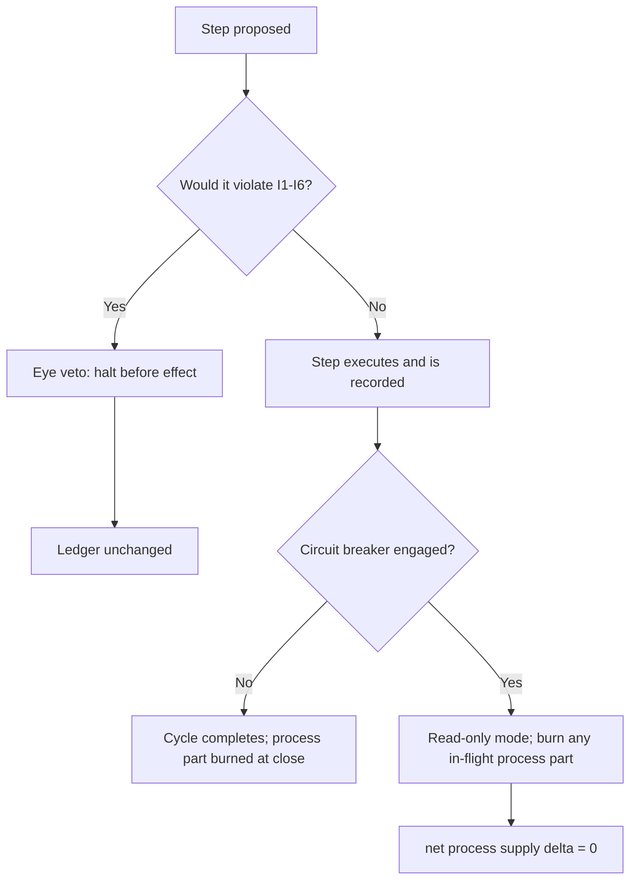

# emission_rollbacks_and_freeze_rules.md

## Module: Rollback & Freeze Rules

- **Layer**: Fee / Commission Layer — AST (Aros Studio Tokenomics)
- **Stands on**: I7 (Eye veto), I2 (born-and-burned), I8 (append-only causality), I1 (PoT-gated origin), I3 (payment for confirmed work), I5 (determinism)

---

## Overview

This module defines how a bad step is prevented from producing a lasting effect. The design principle is **prevention before reversal**: because every cause is appended before its effect (I8) and the All-Seeing Eye can veto any step before that effect is acknowledged (I7), the ordinary way an illegitimate emission is "undone" is that it is stopped *before it happens*. A vetoed step leaves the ledger unchanged; there is nothing to reverse.

The two remaining instruments — the circuit breaker, and the born-and-burned symmetry — are not discretionary reversals of settled value. They are consequences of the invariants applied to a halted cycle.

---

## The order of defense

| Order | Instrument | What it does | Derived from |
|---|---|---|---|
| 1 | Eye veto | Halts any step that would violate I1–I6, before its effect is acknowledged. | I7, I8 |
| 2 | Cause gate | A cause not recorded on NodeChain never produces an effect; a replayed cause is idempotent. | I5, I8 |
| 3 | Circuit breaker | `KILL_SWITCH=true` puts the layer in read-only mode; no new cause is accepted. | I7 |
| 4 | Born-and-burned closure | An in-flight process part that was minted but not yet burned is burned, so `minted == burned`. | I2 |

The Eye and the cause gate together mean the common case has no "rollback" at all: the illegitimate emission never occurs.

---

## Freeze (the circuit breaker)

A freeze is the circuit breaker, not a per-token quarantine authored by discretion.

- **Engaged by** the Eye veto or the role-based committee — never by a single privileged authority, because I1/I5 admit no privileged issuer.
- **Effect:** the layer enters read-only mode. No new cause is accepted; no new mint, commission, or burn is authored.
- **In-flight closure:** a process part already minted but not yet burned is **burned** to satisfy I2. The commission's earned part, if already credited, is retained — burning payment would contradict I3.
- **Cleared by** the same role-based authority, with the clear recorded on-chain before effect (I8).

A freeze **stops**; it never **substitutes**. The Eye does not "correct" a frozen state by minting or paying (I7).

---

## "Rollback" is the born-and-burned mirror, not a reversal of payment

When a cycle is halted mid-flight, the only thing to unwind is the **transient process part** — and unwinding it is exactly the burn that I2 already requires. This is the entire meaning of "rollback" in this layer:

```
minted process part = A     (born)
   ... cycle halted before legitimate completion ...
burned process part = A     (burned — I2)
net process supply Δ = 0
```

There is deliberately **no** mechanism to claw back retained commission from a node after the fact, and none is needed. Payment is the effect of a `verified === 1` verdict (I3); if that verdict was legitimately recorded, the payment is legitimately owed, and confiscating it would contradict I3. If the "verdict" was fabricated, it should never have reached `verified === 1` in the first place — which is the job of the Eye and the fraud guards, upstream (see `emission_fraud_prevention.md`). Integrity is enforced **before** payment, not recovered after it. There is likewise no staking to slash and no deposit to forfeit — those have no object in the model (I6).

---

## What can and cannot be reversed

| Object | Reversible? | Why |
|---|---|---|
| A step that would violate I1–I6 | Yes — it is vetoed before effect (never occurs). | I7, I8 |
| A minted-but-unburned process part | Yes — it is burned; net Δ = 0. | I2 |
| A recorded PoT verdict | No — it is an appended cause; it cannot be un-caused. | I8 |
| Retained node payment | No — it is owed for confirmed work; confiscation contradicts I3. | I3 |
| Accrual to `SYSTEM_RESERVE` | No — it belongs to AST's own reserve, caused by the same verdict. | I4 |

---

## Halt / closure example

```json
{
  "event": "circuit_breaker",
  "process_id": "P-8722",
  "reason": "Eye veto: cause not anchored before effect",
  "action": "burn_inflight_process_part",
  "process_part_burned_arx": 100000000000,
  "net_process_supply_delta_arx": 0,
  "recorded_at": 1720251400
}
```

---

## Freeze / closure flow



---

## Dependencies

- `emission_fraud_prevention.md` — the upstream guards that keep a fabricated cause from confirming
- `emission_reporting_and_traceability.md` — where every veto, halt, and burn is recorded
- `01_coin_engine/burn_and_mint_rules.md` — the burn semantics and failure codes
- `emission_flow_pipeline.md` — the cycle a halt interrupts

---

## Final notes

- Halts are rare and are always the result of a violated invariant, never of preference.
- Every veto, freeze, and in-flight burn is appended to NodeChain (I8) and is reproducible (I5).
- The layer has no path that fabricates, reissues, or reinstates supply — integrity is a property of the reachable state space, enforced before effect.
