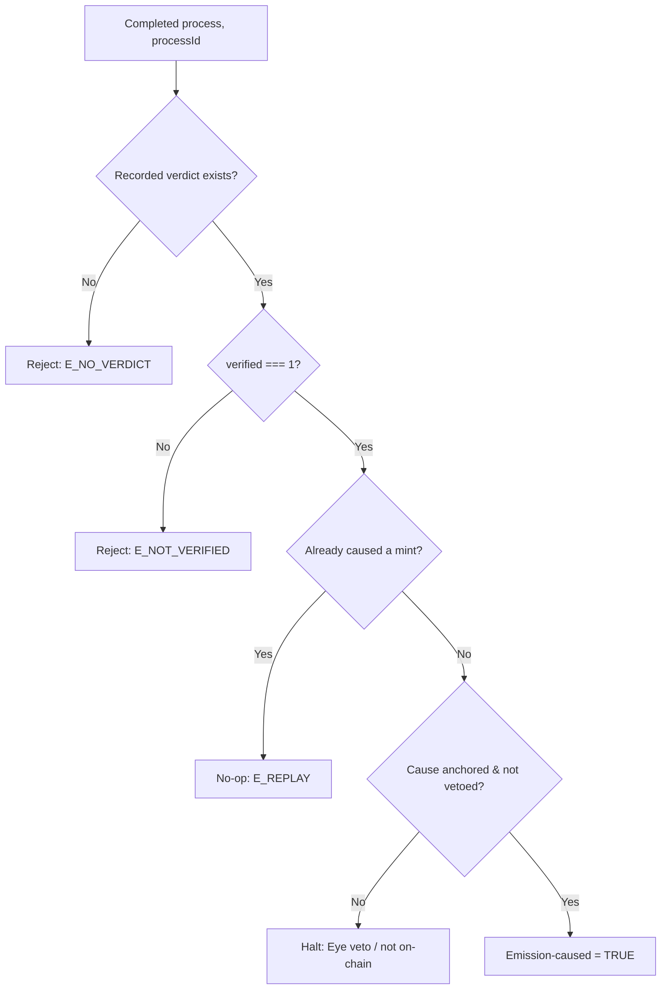

# emission_trigger_conditions.md

## Module: Emission Trigger Conditions

- **Layer**: Fee / Commission Layer — AST (Aros Studio Tokenomics)
- **Stands on**: I1 (PoT-gated origin), I5 (determinism), I7 (Eye veto), I8 (append-only causality)

---

## Overview

Emission has exactly **one** trigger: a recorded PoT verdict `verified === 1` for one specific process (I1). This module states that single cause and the guards that confirm it. The guards do not *grant* emission; they *confirm the cause already exists*. If the cause is absent, there is nothing to grant — a unit with no verdict behind it is a state the model cannot represent (I1).

*Because* I1 gives emission one and only one cause, this module has no "list of ways to trigger emission." It has one way, and a set of checks that the one way genuinely occurred.

---

## The one trigger

A mint is authorized **iff** PoT has recorded a verdict `verified === 1` for a specific `processId`. The emission executor reads that recorded verdict *before* it mints (I8: the cause is already on-chain). If no verdict exists, or `verified ≠ 1`, the call throws and the ledger is unchanged.

| Field of the cause | Meaning |
|---|---|
| `processId` | The specific process the verdict confirms; the mint is bound to it. |
| `verified` | Must equal `1`. Any other value is not a cause. |
| `amount A` | The process amount; the mint equals `A`, forced by I2. |

---

## Guards on the one trigger

Every guard below is a re-statement of an invariant as a precondition. All must hold; any failure halts the step before its effect is acknowledged (I7, I8).

| Guard | Rule | Defends |
|---|---|---|
| PoT verdict present | A recorded `verified === 1` verdict for this `processId` exists on-chain. | I1 |
| Cause precedes effect | The verdict is appended to NodeChain before the mint is acknowledged. | I8 |
| Single application | The verdict has not already caused a mint; a replayed cause produces no second effect. | I5, I8 |
| Amount symmetry | The mint amount equals `A`, so the born process part can be exactly burned at cycle close. | I2 |
| Not vetoed | The All-Seeing Eye has not vetoed this step for violating I1–I6. | I7 |

---

## There are no governance or emergency exceptions

An earlier draft of this module named "Treasury Re-activation," "Emergency Liquidity," and "Post-Audit Reinstatement" as governance-controlled ways to permit emission. **These are removed, and their removal is derived, not stylistic.** Each names a cause of emission other than a PoT verdict; I1 admits no such cause. A committee cannot vote a unit into existence, an emergency flag cannot mint, and a post-audit process cannot reinstate a unit that no verdict caused — because in each case the unit would exist with no cause, which the model has no representation for (I1). The All-Seeing Eye, the apex of oversight, cannot create the exception either: its power is strictly negative (observe and veto), never generative (I7).

Where a genuine operational need exists — e.g. re-running a settlement after a halt — it is served by **replaying the recorded causes** (deterministically, I5), which produces the same effects and no new units, not by injecting supply.

---

## Disqualification (absence of a valid cause)

Certain inputs are simply not causes, so they never reach a mint. This is exclusion by absence of cause, not confiscation:

- A **simulated** transaction (`simulated = true`) carries no `verified === 1` verdict — it is a dry run, not confirmed work (I1).
- A transaction with **no anchored NodeChain lineage** has no recorded cause to read (I8).
- A **replayed** verdict that already caused a mint is idempotent — its second application is a no-op (I5, I8).
- A transaction under **circuit-breaker halt** (`KILL_SWITCH=true`) accepts no new cause until the breaker is cleared (see `emission_rollbacks_and_freeze_rules.md`).

---

## Trigger evaluation pipeline

1. Receive a completed process with its `processId`.
2. Read the recorded PoT verdict for that `processId` from NodeChain.
3. Confirm `verified === 1`; otherwise reject (`E_NO_VERDICT` / `E_NOT_VERIFIED`).
4. Confirm the verdict has not already caused a mint (idempotency; else `E_REPLAY`).
5. Confirm the cause is anchored before effect (I8) and not under Eye veto (I7).
6. If all hold → the process is emission-caused; proceed to `emission_flow_pipeline.md`.



---

## Output example

Accepted (the cause exists):

```json
{
  "process_id": "P-90384",
  "emission_caused": true,
  "verdict": { "verified": 1, "amount_arx": 125000000000 },
  "evaluated_by": "AST-ND-07",
  "recorded_at": 1720251225
}
```

Rejected (no cause):

```json
{
  "process_id": "P-90384",
  "emission_caused": false,
  "reason": "E_NO_VERDICT: no verified===1 verdict recorded for process",
  "evaluated_by": "AST-ND-07"
}
```

---

## Dependencies

- `01_coin_engine/burn_and_mint_rules.md` — the mint guard and failure codes
- `emission_flow_pipeline.md` — how a caused emission executes
- `emission_rollbacks_and_freeze_rules.md` — halt and born-and-burned reversal

---

## Next

→ See [`emission_flow_pipeline.md`](./emission_flow_pipeline.md) for how an emission-caused process is executed into a minted process part, a commission split, and a cycle-close burn.
