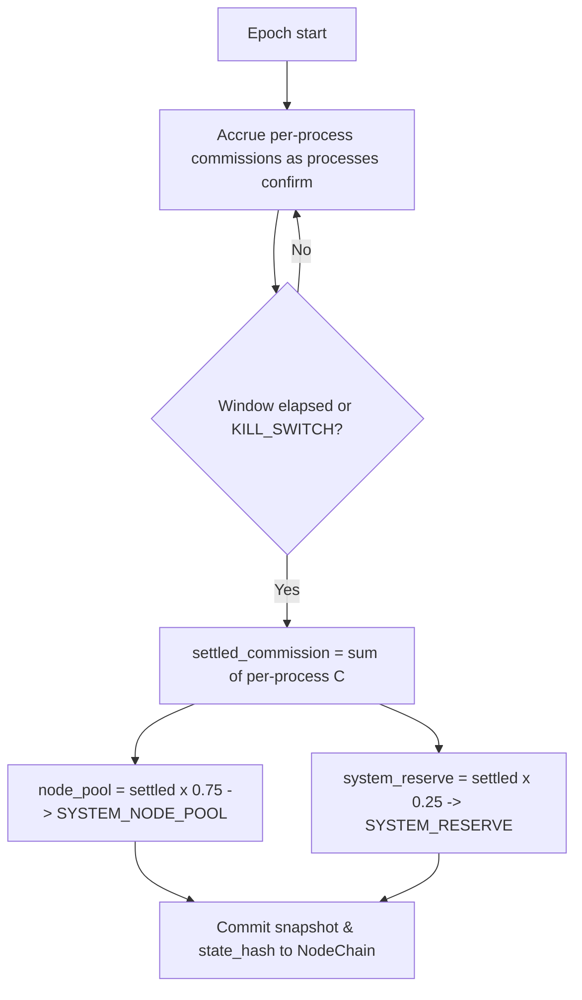

# epoch_allocation_model.md

## Module: Epoch Settlement Model

- **Layer**: Fee / Commission Layer — AST (Aros Studio Tokenomics)
- **Stands on**: I1 (PoT-gated origin), I2 (born-and-burned), I3 (payment for confirmed work), I4 (reserve is AST's own), I5 (determinism), I6 (no speculative surface), I8 (append-only causality)

---

## Overview

An **epoch** is a settlement window: a batching of the per-process commissions that confirmed work has already caused. `POT_EPOCH_SECS = 600` is the reference window length, and it is **operational, not economic** — batching changes *when* value settles, never *how much* or *why* (I5). The epoch total is exactly the sum of the per-process commissions it settles; it introduces no new cause and no new amount.

*Because* every per-process commission is already fixed by the invariants (`C = A × COMMISSION_RATE`, split 75/25), the epoch cannot alter any of them. It aggregates and records; it does not allocate a budget.

---

## Epoch structure

| Field | Description |
|---|---|
| `epoch_id` | Unique identifier for the settlement window. |
| `start_timestamp` | Beginning of the window (UTC). |
| `end_timestamp` | End of the window (UTC). |
| `settled_commission_arx` | Sum of per-process commissions settled in this window (an outcome, not a budget). |
| `node_pool_arx` | 75% of `settled_commission_arx` → `SYSTEM_NODE_POOL` (I3). |
| `system_reserve_arx` | 25% of `settled_commission_arx` → `SYSTEM_RESERVE` (I4). |
| `state_hash` | Hash committed to NodeChain at window close (I8). |

Note there is no `max_emission_cap` field. Its absence is derived below.

---

## Settlement rules

### 1. The epoch total is a sum, not a budget

For every process confirmed in the window, its commission `C = A × COMMISSION_RATE` was already caused per-process (see `emission_flow_pipeline.md`). The epoch total is `Σ C` over those processes. It cannot exceed or fall short of that sum, because the sum is its definition (I5).

### 2. The split is identical at every scale

Whether settled per process or per epoch, the division is the same: **75% → `SYSTEM_NODE_POOL`**, **25% → `SYSTEM_RESERVE`**. Batching cannot change the ratio, because the ratio is fixed by I3 and I4, not by the window.

```
node_pool_arx      = settled_commission_arx × 0.75      → SYSTEM_NODE_POOL   [I3]
system_reserve_arx = settled_commission_arx × 0.25      → SYSTEM_RESERVE     [I4]
```

### 3. The node pool sub-distributes by confirmed work

`SYSTEM_NODE_POOL` is paid out to individual nodes by PoT-normalized weight — a measure of work actually confirmed, never of stake, holdings, or tenure (I3, I6). See `01_coin_engine/payment_distribution.md`.

---

## Why there is no per-epoch emission cap

A "maximum emission capacity" is named here only to show that it has **no object** in this model. A cap presupposes that emission is a free quantity the system chooses within a budget. But:

- Emission is exactly the consequence of confirmed work (I1) — not a quantity the epoch grants.
- The process part is minted then burned each cycle (I2), so it contributes nothing lasting to bound.
- Lasting supply is only retained commission (I3), which is already proportional to confirmed work.

Therefore a ceiling would either sit above all reachable settlement and never bind, or sit below it and **refuse to pay for work that PoT already confirmed** — which contradicts I3. A model whose supply is defined as the consequence of confirmed work has no free quantity for a cap to act on (I6). Likewise there are no per-shard emission quotas acting as economic gates: a shard settles exactly the commissions its confirmed processes caused.

---

## Epoch transition conditions

An epoch closes on:

- **Time expiry** — the reference window (`POT_EPOCH_SECS`) elapses.
- **Circuit-breaker halt** — `KILL_SWITCH=true` freezes new causes and closes the window in read-only state (see `emission_rollbacks_and_freeze_rules.md`).

An epoch never closes because a "cap" is reached — there is no cap (§ above). A new epoch inherits the canonical constants unchanged; only `COMMISSION_RATE` can differ, and only within `[0, 0.01]`, set by the role-based committee and recorded before effect (I8).

---

## Snapshot & audit

At close, the epoch commits a snapshot to NodeChain (I8) containing:

- `settled_commission_arx` (the sum of per-process commissions);
- `node_pool_arx` and `system_reserve_arx` (the 75/25 split of that sum);
- the set of `processId`s whose verdicts caused the settled commissions;
- the nodes paid and their PoT-normalized weights;
- the `state_hash`.

Because every input is a recorded cause, the whole snapshot is reproducible on any node (I5). This data is published via `emission_reporting_and_traceability.md`.

---

## Mermaid diagram



There is no "quota available?" branch, because there is no quota — only accrual of causes already confirmed.

---

## Dependencies

- `emission_flow_pipeline.md` — the per-process commission this module sums
- `emission_reporting_and_traceability.md` — where the snapshot is published
- `01_coin_engine/payment_distribution.md` — per-node sub-distribution of the node pool

---

## Next

→ See [`emission_reporting_and_traceability.md`](./emission_reporting_and_traceability.md) for how every settled amount is made reproducible and auditable from NodeChain.
