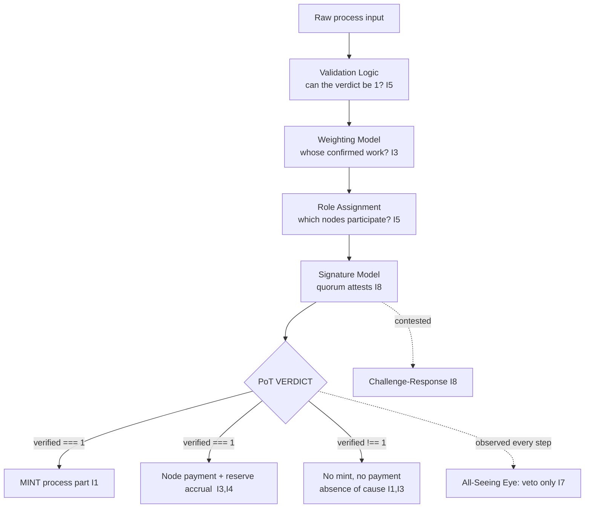

# Proof of Transaction Engine (PoT)

**Path: AROS-PARADIGM-AST/10_proof_of_transaction_engine/README.md**

Core documentation for the Proof of Transaction Engine — the subsystem of AST (Aros Studio Tokenomics) that produces the single fact on which the whole economy turns: the PoT verdict `verified === 1` for one specific process. This layer is described entirely on AST's own terms: NodeChain, PoT, nodes, ArosCoin (ARO), commission, reserve, and the All-Seeing Eye. It depends on no external system and names none.

⸻

## 0) How to read this layer

Every rule in the PoT Engine is a **consequence**, not a preference. The layer rests on the eight invariants of the Coin Engine (see `01_coin_engine/README.md` §1), restated below as the ones this layer stands on. Each document states which invariants it stands on and derives its mechanics from them by an explicit *because → therefore* chain. If a rule cannot be traced back to an invariant, it does not belong here. Start from any mechanic in this layer and you can walk the causal chain back to an axiom.

⸻

## 1) The one fact this layer exists to produce

Everything in AST that creates or moves lasting value is caused by a single event, and this layer is the machinery that produces it:

> **A PoT verdict `verified === 1` for one specific process P.**

That verdict is:

- the **sole cause of emission** — a unit of ARO comes into existence *only* as its consequence (I1). No verdict ⇒ no mint. There is no schedule, pre-mine, mint-on-deposit, or discretionary issuance anywhere in AST; the only door to emission is this verdict, and this layer is the door.
- the **sole cause of payment** — a node is paid *only* for work this verdict confirms (I3). No verdict ⇒ no payment. Payment never precedes the work and never occurs without its confirmation.

Because the verdict is the sole cause of both, **the integrity of AST's entire supply reduces to the integrity of this verdict.** Every other document in this layer exists to make the verdict trustworthy: validation logic decides *whether* the verdict may be `1`; the weighting model decides *whose* confirmed work it credits; role assignment decides *which* nodes may participate in reaching it; the signature model records *who attested* to it; challenge-response is how a false verdict is contested before it settles; payment distribution is how the confirmed work the verdict names becomes payment. The verdict is the hinge; the layer is everything that guarantees the hinge cannot be turned without cause.



The Eye observes every step and can **veto** (halt) any step that would let a verdict be `1` without cause (I7); it never authors a verdict, a mint, or a payment.

⸻

## 2) Invariants this layer stands on

Cited by id throughout. These are the first causes; nothing below is true "by policy."

- **I1 — PoT-gated origin.** A unit of ARO exists only as the consequence of a PoT verdict `verified === 1` for one specific process. No verdict ⇒ no unit. This layer *is* the producer of that verdict.
- **I2 — Born-and-burned.** The process part minted on a verdict is burned atomically at the close of that same cycle. Net process supply change per completed cycle = 0.
- **I3 — Payment for confirmed work.** Nodes are paid, post-factum, for PoT-confirmed work; the earned part is retained. No payment without a verdict.
- **I4 — Reserve is AST's own.** The reserve share of commission accrues to AST's own reserve; it belongs to no external party.
- **I5 — Determinism.** Every verdict and every movement it causes is reproducible from canonical inputs recorded in NodeChain.
- **I6 — No speculative surface.** ARO has no market price; the model has no held speculative supply, no staking-for-yield, no security-deposit-to-participate, no governance-by-holding, no held stake to slash.
- **I7 — All-Seeing Eye: observe and veto, never initiate.** The Eye observes every step and can veto any step that would violate I1–I6; it initiates nothing.
- **I8 — Append-only causality.** Every cause is appended to NodeChain before its effect is acknowledged.

⸻

## 3) Directory layout (skeleton)

```
10_proof_of_transaction_engine/
├── README.md                         # This file — the verdict, the invariants, the map
├── pot_engine_overview.md            # The engine end to end, as one causal chain
├── pot_tx_validation_logic.md        # Whether a verdict may be 1 (the admissibility test)
├── pot_tx_weighting_model.md         # Whose confirmed work a verdict credits
├── pot_node_role_assignment.md       # Which nodes participate in reaching a verdict
├── pot_tx_signature_model.md         # Who attested to the verdict (quorum, recorded)
├── pot_challenge_response.md         # How a false verdict is contested before it settles
├── pot_tx_payment_distribution.md    # How the confirmed work a verdict names becomes payment
└── pot_slashing_conditions.md        # Why there is no held stake to slash, and what removes a bad node instead
```

⸻

## 4) Canonical constants

Fixed in `01_coin_engine/README.md` §3; cited here so the chains resolve to one set of numbers.

| Constant | Value | Meaning |
|---|---|---|
| `SYMBOL` | `ARO` | Ticker of ArosCoin. |
| `DECIMALS` | `9` | Amount precision. |
| `BASE_UNIT` | `arx` | `1 ARO = 10^9 arx`, fixed. |
| `COMMISSION_RATE` | `0.005` (0.5%) | Earned share of the process amount; adjustable only within bounds `[0, 0.01]`. |
| `NODE_SHARE` | `0.75` | Fraction of commission paid to nodes for confirmed work (I3). |
| `RESERVE_SHARE` | `0.25` | Fraction of commission accrued to AST's own reserve (I4). |
| `POT_EPOCH_SECS` | `600` | Reference epoch length for batched settlement (operational, not economic). |

There is no stake, no deposit-to-participate, no `maxSupply`, and no `mintOn` other than a confirmed verdict — because I1 admits no other cause of a unit and I6 leaves no object for the rest.

⸻

## 5) Governance of this layer (bounded, role-based)

The tunable quantities of PoT — the validation acceptance threshold, the weighting coefficients, the signature quorum fraction — are set by **role-based AI committees**, not by a vote and not by holdings:

- A change may move a parameter only within protocol-defined bounds, so no change can let a verdict be `1` without cause.
- The decision is a role-based committee decision, observed by the Eye. It is **not** decided by ARO holdings; a held balance confers no vote here (I6).
- Every change is recorded in NodeChain before it takes effect (I8) and is reproducible (I5).

The verdict rule itself — that `verified === 1` requires confirmed, attested work — is not a parameter and cannot be tuned, because it is I1/I3 expressed directly.

⸻

## 6) What auditing checks

Auditing is the restatement of the invariants as tests over the NodeChain record:

- **Verdict causality (I1, I3):** every mint and every payment is preceded by a recorded `verified === 1` verdict for the same process.
- **No verdict without quorum (I8):** every `verified === 1` is preceded by a recorded quorum of node attestations for that process.
- **Weighting integrity (I3):** every per-node payment weight is a pure function of confirmed work — never of stake or holdings (there are none).
- **Determinism (I5):** replaying the recorded inputs reproduces the same verdict, the same weights, the same split.
- **Eye discipline (I7):** the Eye's log contains only observations and vetoes — never a verdict, mint, or payment authored by the Eye.
