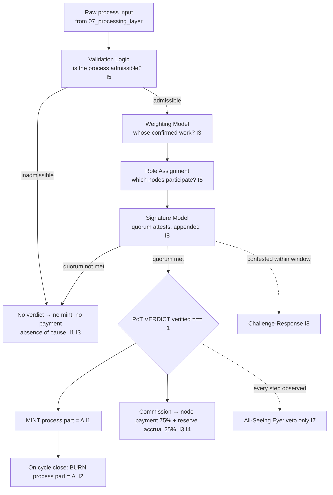

# Proof of Transaction Engine — Full Overview

**Stands on:** I1 (PoT-gated origin), I3 (payment for confirmed work), I5 (determinism), I7 (Eye veto), I8 (append-only causality). See `README.md` §2.

## 1. Purpose of the module

The Proof of Transaction Engine is the machinery that produces one fact and one fact only: a **PoT verdict `verified === 1` for a specific process P**. AST is built so that this verdict is the *sole cause* of emission (I1) and the *sole cause* of payment (I3). Nothing else mints an ARO; nothing else pays a node. Therefore the soundness of every unit of lasting supply in AST reduces to the soundness of this verdict, and the sole job of this engine is to make the verdict impossible to reach without cause.

Unlike Proof of Work or Proof of Stake, PoT derives the *right to confirm* not from expended energy and not from a held stake (there is no stake — I6), but from **confirmed transactional work recorded in NodeChain**. A node earns standing by doing work that PoT has already confirmed; that standing is measured, never purchased.

The engine is responsible for:

- deciding whether a process is *admissible* for confirmation — whether the verdict may be `1` (validation logic);
- measuring *whose confirmed work* a positive verdict credits (weighting model);
- selecting *which nodes* participate in reaching the verdict (role assignment);
- recording *who attested* to it as an append-only quorum (signature model);
- letting a false verdict be *contested before it settles* (challenge-response);
- turning the confirmed work the verdict names into *payment* (payment distribution).

## 2. Core principles (each derived)

### 2.1 The verdict is the only cause (I1, I3)

*Because* I1 gives emission exactly one cause and I3 gives payment exactly one cause — and both are the same PoT verdict — this engine has no side effects other than producing that verdict. It does not mint; it does not pay; it *causes* mint and payment by returning `verified === 1`. The EmissionService and the distribution path read the recorded verdict and act; they never act without it.

### 2.2 Standing comes from confirmed work, not from stake (I3, I6)

A node's influence over future verdicts is its **PoT weight**, a function of work PoT has already confirmed. *Because* I6 leaves no object for a held stake or a security deposit, no node can buy standing, and no standing can be seized. Standing rises only by confirmed contribution and lapses only by its absence. This is the canonical replacement for stake-weighting.

### 2.3 Deterministic and reproducible (I5, I8)

Every input to a verdict — the process record, the participating node set, the weights, the attestations — is appended to NodeChain before the verdict is acknowledged (I8). Given the same recorded inputs, the same verdict follows on every node, every time (I5). A verdict is never a matter of who ran the check; it is a matter of what the record says.

### 2.4 Observed and vetoable, never initiated (I7)

The All-Seeing Eye observes every step and can **veto** (halt) any step that would let a verdict be `1` without cause — an unconfirmed process, a sub-quorum attestation set, a weighting that credits unconfirmed work. Its power is strictly negative: it stops a wrong verdict; it never authors a right one.

## 3. High-level flow

The flow has exactly one exit that produces value — a verdict of `1`, quorum-attested, backed by an admissible process. Every other path produces **no mint and no payment**, and that is not a penalty but the plain absence of the one cause (I1, I3).

## 4. Where this engine sits

| Neighbour | Relation | Why |
|---|---|---|
| `07_processing_layer/` | upstream | supplies the raw process to be judged; PoT judges, it does not originate the process |
| `01_coin_engine/` | downstream (emission) | reads the verdict and mints/burns; the verdict is its only mint trigger (I1) |
| `01_coin_engine/payment_distribution.md` | downstream (payment) | turns the confirmed work into the 75/25 split (I3, I4) |
| `02_nodechain_engine/` | ledger | records every input and effect append-only (I8) |
| `06_governance_layer/` | oversight | role-based committees set bounded parameters; no holder vote (I6) |

The engine emits nothing to these layers except a recorded verdict and the inputs that justify it; each downstream effect is *their* consequence of *this* cause.

## 5. Key operational metrics (not economic)

- **Verdict latency:** reference target < 100 ms per process in NodeChain. Operational only — it changes *when* a verdict is reached, never *whether* it may be `1`.
- **Reproducibility rate:** replaying recorded inputs must reproduce the verdict 100% of the time (I5); any divergence is a defect, not a tolerance.

## 6. Failure surface (what a broken verdict looks like)

| Code | Condition | Invariant defended |
|---|---|---|
| `E_NO_ADMISSIBLE_PROCESS` | verdict attempted for an inadmissible process | I1 |
| `E_NO_QUORUM` | verdict `1` without a recorded quorum of attestations | I8 |
| `E_WEIGHT_FROM_POSSESSION` | weighting input references stake/holdings (none exist) | I3, I6 |
| `E_VERDICT_NOT_REPRODUCIBLE` | replay of recorded inputs yields a different verdict | I5 |
| `E_EYE_AUTHORED` | a verdict/mint/payment attributed to the Eye | I7 |

Each impossible state is *named and rejected*, not merely improbable.

## 7. Notes

- This engine is internal to the AST NodeChain and has no external dependency; it names no external system.
- The verdict rule (`verified === 1` requires confirmed, attested work) is I1/I3 expressed directly and is not a tunable parameter.
