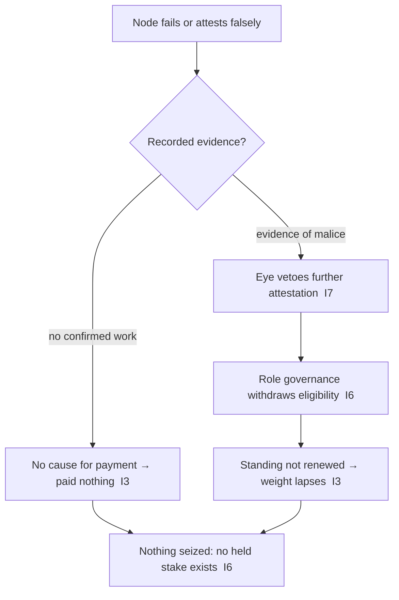

# PoT Node Failure and Removal — Why There Is No Stake to Slash

**Stands on:** I6 (no speculative surface), I3 (payment for confirmed work), I1 (PoT-gated origin), I7 (Eye veto), I8 (append-only causality). See `README.md` §2.

## I. Purpose

State the canonical position on a node that fails or acts maliciously in PoT. A file with this name exists in the skeleton because the question "what happens to a bad node?" is natural. The honest answer is not a stake slash but a **structural absence of the thing a slash would act on**, plus two consequences that follow directly from the invariants:

1. a failing or malicious node produces **no confirmed work**, and therefore — by I3 — is **paid nothing** (consequence by absence of cause); and
2. a node shown by evidence to have acted maliciously is **removed from future participation** by the Eye's veto (I7) and role governance (I6) — its standing withdrawn, not a balance seized.

This is a stronger guarantee than slashing: not "we confiscate a deposit after the fact," but "a bad node was never owed anything, and its ability to harm the verdict is withdrawn on evidence."

## II. Why there is no stake to slash

A slash presupposes a **held stake** — a security deposit a node locks up to participate, which the system can burn on misbehavior. Trace whether such a stake exists in AST:

1. **Participation is not bought (I6).** A node's right to participate in reaching a verdict is its PoT weight — a measure of confirmed work (`pot_tx_weighting_model.md`), earned, not deposited. I6 leaves no object for a security-deposit-to-participate.
2. **Standing is earned, not held (I3).** Lasting ARO is earned, retained payment for confirmed work; there is no separate locked balance a node posts as collateral. I6 leaves no held speculative supply to lock.
3. **Therefore there is nothing to slash.** With no deposit and no locked stake, the quantity a slash would burn — a node's posted collateral — has no referent in the model.

**Conclusion:** "slashing" is undefined for a PoT node. A slash would burn a balance that does not exist.

## III. What replaces a slash (derived, positive)

The integrity a slash *reaches for* — that misbehavior does not profit and does not persist — is delivered here by construction:

- **Misbehavior earns nothing (I3).** A node that fails to attest, attests falsely, or produces no valid work produces **no confirmed work**. By I3, payment is the causal effect of confirmed work; with no confirmed work there is no cause, so there is nothing to pay. The node is not being penalized a payment it was owed; it was never owed one. (No concept of a withheld payment-for-nothing exists — I3 gives it no object.)
- **A false verdict never settles (I1).** If a node's attestation would set a verdict without cause, the challenge-response path (`pot_challenge_response.md`) corrects the verdict to `verified !== 1` *before* it mints, and the Eye vetoes any attempt to settle it (I7). The harm — an unfounded unit — never comes into existence.
- **A malicious node is removed on evidence (I6, I7).** A node shown by recorded evidence to have attested falsely is withdrawn from eligible roles by role governance (`pot_node_role_assignment.md`) and vetoed from further attestation by the Eye. Removal withdraws *future participation*; it seizes no balance, because there is none.

## IV. The old conditions, mapped to their canonical consequence

The situations a slash schedule enumerated still matter; each maps to a consequence derived from an invariant, none of which is a stake burn:

| Situation | Old (excluded) mechanism | Canonical consequence | Derived from |
|---|---|---|---|
| Invalid attestation | slash a % of stake | attestation yields no confirmed work → no payment; evidence → removal from roles | I3, I6, I7 |
| No response to challenge | slash a larger % | non-response contributes nothing to quorum → no payment; standing not renewed → eligibility lapses | I3, I6 |
| Repeated failures | slash 100% of stake | repeated absence of confirmed work → standing decays to zero; evidence → sustained removal | I3, I6, I7 |
| Attempted false verdict | burn stake | verdict corrected before it settles → no unit exists to have been gained | I1, I7 |

Reintroducing a stake slash would first require inventing a security deposit the model is defined to exclude (I6) — which would break the closure of the whole layer.

## V. Removal flow (withdraw participation, seize nothing)

There is no "slash" branch, because there is no stake input. The **absence of the branch is the guarantee**: a system that holds no deposit cannot confiscate one, and a node that did no confirmed work was never owed anything to lose.

## VI. Oversight and appeal

- **Eye veto (I7).** The Eye observes every attestation and vetoes any that would settle a false verdict; it removes no node by fiat and authors no payment. Its power is strictly negative.
- **Role governance (I6).** Removal from eligible roles is a role-based committee decision on recorded evidence, appended before effect (I8), reproducible (I5). It is not a holder vote; a held balance confers no say (I6).
- **Appeal.** A removed node may appeal to the role-based governance committee (`06_governance_layer/`), which re-derives the decision from the recorded evidence. Because there was no seizure, a successful appeal simply restores eligibility to earn standing again by confirmed work; there is no balance to return.

## VII. Failure codes

| Code | Condition | Invariant defended |
|---|---|---|
| `E_STAKE_SLASH_ATTEMPT` | any attempt to burn a node's "stake" (no such object exists) | I6 |
| `E_PAY_FOR_UNCONFIRMED` | a failing/malicious node paid despite no confirmed work | I3 |
| `E_REMOVAL_NO_EVIDENCE` | a node removed without recorded evidence | I5, I8 |
| `E_REMOVAL_BY_HOLDING` | removal or reinstatement decided by ARO holdings | I6 |
| `E_EYE_INITIATED_REMOVAL` | the Eye removing a node by fiat rather than veto | I7 |

## VIII. Dependencies

- `pot_challenge_response.md` — how a false verdict is corrected before it settles.
- `pot_node_role_assignment.md` — how eligibility is withdrawn and rotated.
- `06_governance_layer/` — the role-based committee for removal decisions and appeals (not a holder vote — I6).

## IX. Notes

- This behaviour is internal to the AST NodeChain and names no external system.
- The guarantee is structural: misbehavior cannot profit (I3), cannot settle a false unit (I1, I7), and cannot be met with confiscation (there is nothing held to confiscate — I6). What replaces slashing is non-payment by absence of cause plus evidence-based withdrawal of future participation.
