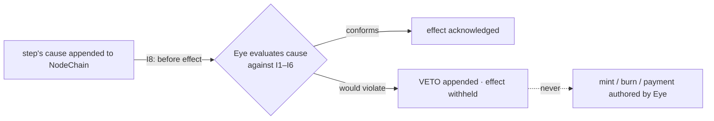

# The All-Seeing Eye — Extra Supervisory Layer (13)

**Path: AROS-PARADIGM-AST/13_extra_supervisory_layer/README.md**

This layer documents **The All-Seeing Eye**, the apex of AST oversight. The Eye **observes every step of every cycle and CAN VETO (halt) any step that would violate an invariant — but it never initiates a mint, a burn, or a payment.** Its power is real and strictly *negative*: it can stop what is wrong before that step takes effect; it can create nothing. Everything in this layer is a consequence of that one fact (I7), read against the append-only causal ledger (I8).

The layer is described entirely on AST's own terms: NodeChain, PoT (Proof-of-Transaction), nodes, ArosCoin (ARO), commission, reserve. It depends on no external system and names none.

⸻

## 0) How to read this layer

Every rule here is a **consequence**, not a preference. Each document states which invariants it stands on and derives its mechanics from them by an explicit *because → therefore* chain, labelled with the invariant id, e.g. `(I7)`. If a rule cannot be traced back to an invariant, it does not belong in this layer.

The single question this layer answers is: *how does a system that admits no privileged issuer (I1, I5) still guarantee that no step ever violates an invariant?* The answer is the Eye — an observer with a veto and nothing else.

⸻

## 1) Invariants this layer stands on

The Eye is defined by I7 and operates through I8. It enforces all of I1–I6. See `01_coin_engine/README.md` §1 for the full spine; the ones load-bearing here are:

- **I1 — PoT-gated origin.** A unit of ARO exists only as the consequence of a PoT verdict `verified === 1` for one specific process. The Eye vetoes any mint whose cause is absent.
- **I2 — Born-and-burned.** The process part minted for a process is burned atomically at the close of that same cycle. The Eye vetoes any close that would leave `processMinted ≠ processBurned`.
- **I3 — Payment for confirmed work.** Nodes are paid, post-factum, for PoT-confirmed work. The Eye vetoes any payment whose confirmation is not already recorded.
- **I4 — Reserve is AST's own.** The reserve share accrues to `SYSTEM_RESERVE`; `reserveIndex` derives only from confirmed process volume. The Eye vetoes any reserve movement outside that derivation.
- **I5 — Determinism.** Every token movement is reproducible from canonical inputs in NodeChain. The Eye vetoes any step whose effect is not reproducible from its recorded cause.
- **I6 — No speculative surface.** ARO has no market price and no speculative object (no cap, staking-for-yield, external-crypto ingestion, governance-by-holding). The Eye vetoes any step that would introduce such an object.
- **I7 — All-Seeing Eye: observe and VETO, never initiate.** The Eye observes every step and can halt (veto) any step that would violate I1–I6. It never initiates a mint, a burn, or a payment. Its power is strictly negative.
- **I8 — Append-only causality.** Every cause is appended to NodeChain *before* its effect is acknowledged. This ordering is precisely what gives the Eye a place to stand: it evaluates a recorded cause *before* the effect is acknowledged, and a veto simply withholds that acknowledgement.

⸻

## 2) Why the veto is possible, and why it is only ever negative

The Eye's power comes from one structural fact and is bounded by another.

- **Possible — because of I8.** Every step exists first as a *cause appended to NodeChain*, and only afterward as an *acknowledged effect*. Between those two moments there is a window. In that window the Eye evaluates the recorded cause against I1–I6. *Therefore* the Eye can prevent an effect from ever being acknowledged simply by refusing acknowledgement — without touching state, and without needing to author anything.
- **Only negative — because of I1 and I5.** A unit of ARO has exactly one cause (a PoT verdict, I1) and every movement is reproducible from recorded causes (I5). If the Eye could *initiate* a mint, a burn, or a payment, it would be a second, discretionary cause — contradicting I1 and I5. *Therefore* the Eye is constructed so that it has no primitive that appends an economic cause. It can only assert a **veto**, which is a cause whose sole effect is "the vetoed step's effect is not acknowledged."



The dotted edge is impossible by construction: the Eye has no minting, burning, or paying primitive.

⸻

## 3) Directory layout (skeleton)

```
13_extra_supervisory_layer/
├── README.md                       # This file — the Eye's premise and map
├── the_all_seeing_eye_overview.md  # What the Eye is, its position, its veto
├── observation_scope_and_limits.md # Exactly what the Eye sees and what has no object for it
├── anomaly_detection_patterns.md   # The recognition function: which causes it vetoes
├── meta_event_logging_protocol.md  # How observations and vetoes are appended (I8)
├── integrity_signal_emission.md    # The Eye's outputs: veto assertions and integrity signals
└── observer_node_interface.md      # Read-only observer nodes that verify the Eye's record
```

⸻

## 4) The Eye against the one cycle

The whole Coin Engine is one causal chain (`01_coin_engine/README.md` §4). The Eye is a check applied at every link of it:

```
confirmed work (verdict verified===1, process P, amount A)   [cause — I1]
  │  ── Eye: is the verdict recorded for this exact P? no ⇒ VETO       (I1)
  ├─▶ MINT process part = A, bound to P                       [I1, I8]
  │  ── Eye: does minted amount == A and name P? no ⇒ VETO             (I1,I2)
  ├─▶ CHARGE commission C = A × COMMISSION_RATE               [I3]
  │  ── Eye: node payment retained, reserve→SYSTEM_RESERVE? no ⇒ VETO  (I3,I4)
  └─▶ on completion: BURN process part = A                    [I2, I8]
     ── Eye: processMinted == processBurned for P? no ⇒ VETO          (I2)
```

Every observation the Eye makes is the same test: *did this link execute exactly as its invariant requires?* Any deviation is vetoed **before** its effect is acknowledged (I7, I8).

⸻

## 5) Where the Eye sits in governance

Governance in AST is a **role-based hierarchy of AI oversight**, not a vote. Bounded parameters (e.g. `COMMISSION_RATE` within its bounds) are set by role-based AI committees; every decision is appended to NodeChain before effect (I8) and is reproducible (I5). A held ARO balance confers no governance power (I6).

The Eye sits at the **apex** of that hierarchy — but its apex position is not a power to decide; it is a power to *stop*. A committee proposes a bounded parameter change; the Eye vetoes it if the change would violate an invariant (e.g. a rate above bounds that would let commission exceed the process amount, contradicting I3). The Eye never proposes a change, never casts a vote, and never sets a parameter (I7).

⸻

## 6) What this layer guarantees

- **No unlawful effect is ever acknowledged.** Because I8 records the cause first and the Eye evaluates it in the pre-acknowledgement window, a step that would violate I1–I6 is halted before it can take effect (I7).
- **The Eye adds no discretion.** Because the Eye has no economic primitive, its presence introduces no new cause of a unit (I1) and no non-reproducible movement (I5). Auditing the Eye's own log confirms it: the log contains only observations and vetoes — never a mint, burn, or payment authored by the Eye.
- **The record is complete.** Every observation, every veto, and every integrity signal is appended to NodeChain (I8), so the supervisory history is as reproducible as the economic history it guards (I5).
</content>
</invoke>
