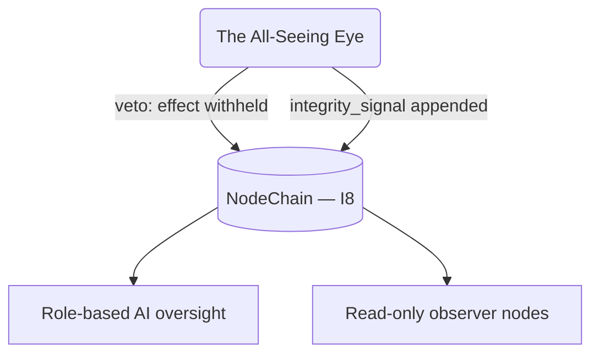

# Integrity Signal Emission

**Stands on:** I7 (observe and VETO, never initiate), I8 (append-only causality), I5 (determinism), and enforces I1–I6. See `README.md` §1.

## 1. Purpose

This document defines the Eye's two outputs and their relationship:

1. The **veto** — the Eye's decisive act, which withholds acknowledgement of a step that would violate I1–I6 (I7). Covered mechanically in `README.md` §2 and `anomaly_detection_patterns.md`; summarized here to contrast it with the signal.
2. The **integrity signal** — a recorded, non-halting notice that a drift was observed *after* an effect was acknowledged, surfaced for role-based AI oversight.

*Because* I8 lets the Eye catch most violations in the pre-acknowledgement window, the veto is the primary output. The signal exists for the residual case where a drift is only reconstructable after the fact — and for that case the Eye still authors nothing: it stops (if the step is still live) or it informs (if the effect is already acknowledged).

---

## 2. Veto vs. signal — the same certainty, different timing

Both outputs rest on the same recognition function (`anomaly_detection_patterns.md`) — a match is the exact negation of an invariant. What differs is *when* the match is seen relative to I8's acknowledgement point.

| Output | When the match is seen | Effect | Invariant |
| --- | --- | --- | --- |
| `veto` | In the I8 window: cause recorded, effect **not yet** acknowledged | Effect withheld — the step never takes effect | I7, I8 |
| `integrity_signal` | After acknowledgement (reconstructed drift) | No halt; recorded notice to oversight; candidate for the circuit breaker | I7 |

Neither output is a command to any subsystem to *do* something. A veto removes an effect; a signal records a fact. Neither creates a unit, a payment, or a parameter change (I7).

---

## 3. Signal format

An integrity signal is a meta-event (see `meta_event_logging_protocol.md`), appended to NodeChain and signed.

```json
{
  "signal_id": "SIG-9382",
  "seq": 918511,
  "timestamp": 1731943327,
  "type": "integrity_signal",
  "invariant": "I4",
  "pattern_id": "RES-302",
  "cause_ref": "0xdeadbeef...",
  "detail": "reserveIndex input not confirmed process volume",
  "signature": "0x9a1c..."
}
```

Every field points at an already-recorded cause (`cause_ref`) and names the invariant it defends. A signal that named no invariant would have no place in this layer (see `README.md` §0).

---

## 4. What a signal is and is not

- **Is:** an append-only, reproducible notice (I5, I8) that a recorded effect drifted from an invariant, routed to role-based AI oversight and to read-only observer nodes.
- **Is not a command.** A signal cannot force a halt, a revert, or a state change — those effects belong to the veto (which the Eye applies itself in the I8 window) or to the circuit breaker (engaged by the Eye or a role-based committee, see `01_coin_engine/README.md` §6). The signal only *informs*.
- **Is not a payment or a fee.** The Eye distributes nothing. There is **no object** here for a signal-linked fee or payout: AST has only payment for PoT-confirmed work (I3), and the Eye performs no work that mints or pays. Emitting a signal earns nothing and costs nothing on the ledger.

---

## 5. When a signal is emitted

A signal is emitted exactly when the recognition function matches a pattern **after** the guarded effect was already acknowledged — i.e. the I8 window closed before the match was recognized. Concretely:

- A drift reconstructed from historical NodeChain records (e.g. a reserve movement later shown to violate I4).
- A persistent divergence visible only across many cycles (e.g. a monotonicity break in `reserveIndex`, RES-303).
- A boundary approached by a role-based committee parameter change that, while within bounds now, trends toward violating an invariant.

In each case the still-live version of the step, if any, is a candidate for veto; the already-acknowledged version is recorded as a signal for oversight to act within the invariants.

---

## 6. Recipients

A signal, once appended to NodeChain, is visible to:

- **Role-based AI oversight committees** — which may respond only within the invariants (e.g. engage the circuit breaker, or adjust a bounded parameter, each recorded before effect, I8).
- **Read-only observer nodes** (see `observer_node_interface.md`) — which verify and store it for redundancy.

There is no privileged command interface among the recipients. A held ARO balance grants no recipient any additional power (I6).



Every edge is a read from, or an append to, NodeChain — never a direct command from the Eye to a subsystem.

---

## 7. Ordering, not throttling

The obsolete design rate-limited and bucketed signals. That has **no object** here: because a signal is a recorded cause (I8) and the history must reproduce (I5), a suppressed or aggregated-away signal would break reproducibility. *Therefore* every signal is appended, in `seq` order, exactly once per match. Volume is bounded by the drifts that actually occur, so there is nothing to throttle.

---

## 8. Summary

The Eye's outputs are the **veto** (its decisive, negative act, applied in the I8 window) and the **integrity signal** (a recorded, non-halting notice of a post-acknowledgement drift). Both rest on the same invariant-exact recognition; neither authors a mint, burn, payment, or parameter change (I7). The Eye stops, or it informs — and the record of both is append-only and reproducible (I5, I8).
</content>
